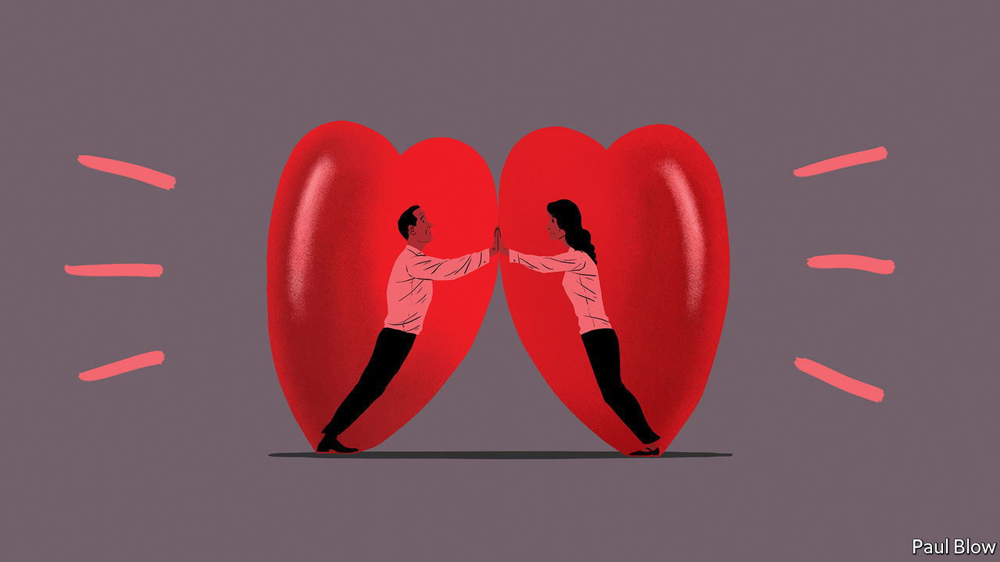

## Bartleby

# The decline of the office romance

> Fewer romantic relationships will be forged at the water cooler. That is a shame

> Aug 15th 2020

Editor’s note: Some of our covid-19 coverage is free for readers of The Economist Today, our daily [newsletter](https://www.economist.com/https://my.economist.com/user#newsletter). For more stories and our pandemic tracker, see our [hub](https://www.economist.com//news/2020/03/11/the-economists-coverage-of-the-coronavirus)

THEIR EYES met across the office photocopier. At long last, each of them had found someone who could push their buttons. Eventually, they settled down and decided to reproduce. Read more in “Fifty Sheets of Grey Paper”, out soon in paperback.

Romance is a long-established side-effect of office life. After all, people may spend almost half their waking hours at work, and their colleagues will frequently have something in common with them, even if it is only complaining about the manager. Some relationships are inevitably bound to result.

But the lockdown has made the forming of new romances much more difficult. Although online dating has thrived in the pandemic, the number of people who have met their soulmate via a work Zoom meeting must be vanishingly small. It is hard to flirt while your facial expressions are being observed by a dozen colleagues. And how private is company videoconferencing software’s private-chat function, really?

Even before the pandemic, however, office romances were in decline. In 1995, 19% of (heterosexual) people met their partner at work, according to a study by Stanford University. By 2017 this had fallen to 11%. It will be even lower now. As white-collar employees toil more hours at home and fewer at the office—which seems likely even after the virus recedes—opportunities for workplace romantic connections will dwindle.

One reason for the decline is that companies have realised that work relationships give rise to all kinds of ethical questions. The idea of a boss marrying his secretary (or a doctor dating a nurse) is one of the oldest clichés around. Sadly, the trope is so well established that secretaries and nurses have spent decades fending off the unwanted attentions of their superiors. As the #MeToo movement has demonstrated, some men use their positions of power to harass women who work for them.

Consensual relationships can cause problems as well. A relationship with a subordinate makes it hard for a manager to be objective about their performance. Colleagues may understandably suspect the manager of favouritism. Things may be as bad if the romance breaks down. Hurt feelings may make it hard for the ex-partners to work together and will also make it awkward for everyone else in the office.

The result of this is that many companies have policies that discourage or forbid managers from flings with someone who works for them. Office relationships were blamed for the departure of Steve Easterbrook from his role as chief executive of McDonald’s last year; the fast-food company launched a lawsuit against Mr Easterbrook this week.

Some companies ban all office romances outright. Others issue guidelines such as the stipulation that employees should not allow a relationship with a colleague to influence their behaviour at work, and that they should disclose any relationship that might give rise to a conflict of interest. These rules seem perfectly sensible, although they do involve a sacrifice of privacy.

Some of these problems can be avoided if the relationship is at one remove: if people meet their partners through work, rather than at the same office. Clearly there could still be problems if, for example, a purchasing manager was dating the salesperson at a supplier. But in most circumstances these romances avoid the potential problems of favouritism or abuse of power. Bartleby was fortunate enough to meet his spouse through his job 24 years ago (a period that proves Mrs Bartleby’s infinite reserves of patience).

For that reason, this columnist can perhaps be forgiven for hoping that the office romance does not disappear completely. Millions of happy couples have probably met by their desks or the coffee machine. Perhaps couples will get a buzz from defying company rules. But they may have to be subtle about it: “Speak low if you speak love,” as William Shakespeare wrote in “Much Ado About Nothing”. That said, romance novels may need a bit of updating to cope with the post-pandemic era.

Their eyes met across the bottle of hand sanitiser. “Would you like to break the social-distance rules and join my bubble?” he whispered. “Sorry, I can’t hear you through the mask,” she replied. He searched for inspiration. How could he convey his feelings? As creative director of Tomkins & Tomkins, surely there was an answer? A brainwave came: he raised his hands. Her eyes widened in understanding. “First word,” she said. “Sounds like ...”

## URL

https://www.economist.com/business/2020/08/15/the-decline-of-the-office-romance
