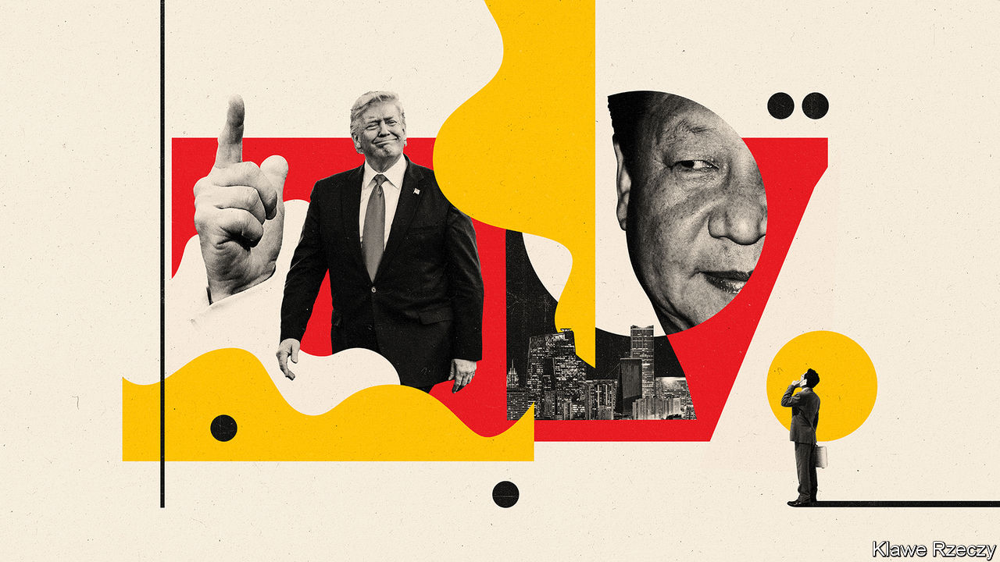
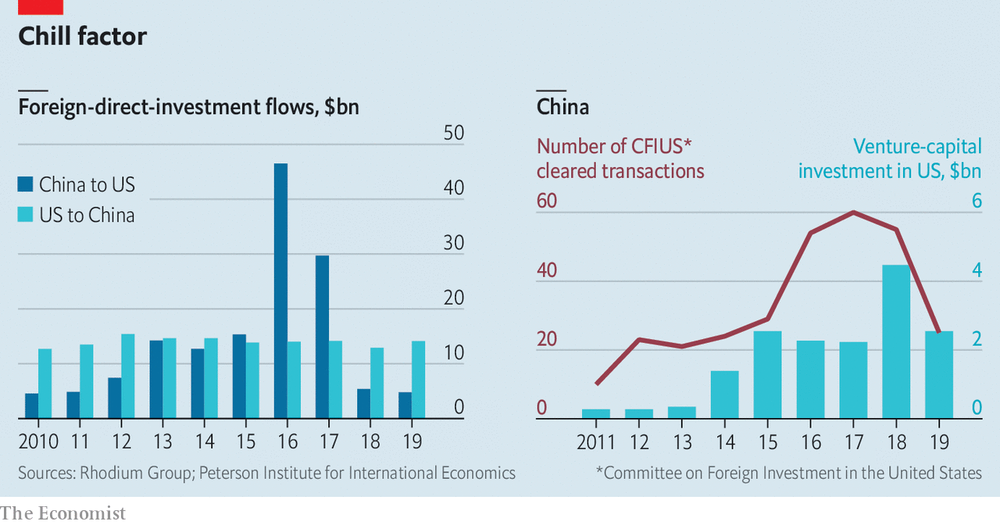
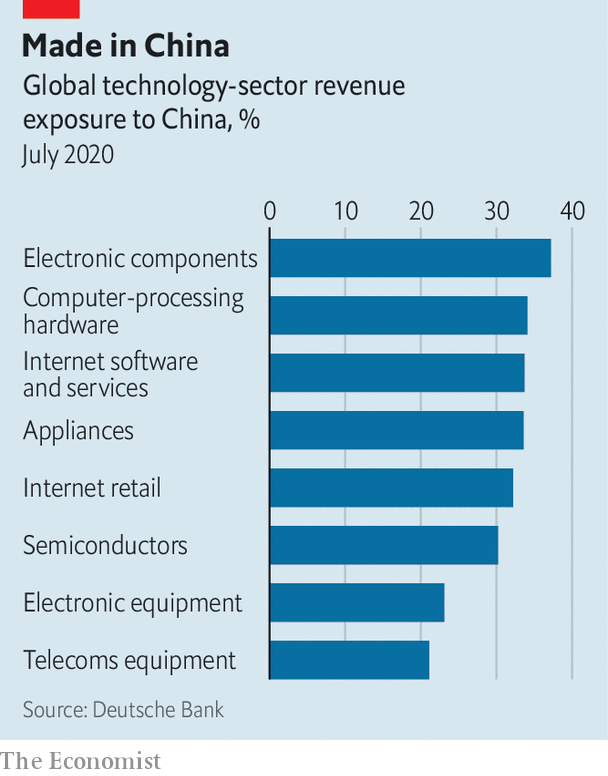

## The great decoupling

# The Trump administration wants a US-China commercial split

> Wrenching Chinese and American corporate worlds apart would hurt everyone

> Aug 15th 2020NEW YORK AND SHANGHAI

DURING HIS term in office, Donald Trump has often bashed China while occasionally praising its leader, Xi Jinping. Similar two-mindedness characterises his administration. China hawks, led by Robert Lighthizer, his trade representative, and Mike Pompeo, the secretary of state, have tussled for influence with more dovish figures such as Steven Mnuchin, the treasury secretary, who have tried to prevent a rupture between the two giants. Companies and investors from both countries have watched the contest closely.

In the past 18 months the hawks have been ascendant. Now, blaming China for spreading the covid-19 virus that has pushed America and the rest of the world into recession, thus helping to dent the president’s chances of re-election in November, they have prevailed.

On August 6th Mr Trump issued two startling executive orders giving American firms 45 days to unwind all commercial relations with ByteDance, the Chinese owner of TikTok, a video-sharing app popular with youngsters, and with WeChat, a Chinese messaging and payments super-app widely used by Chinese around the world to communicate with those back home (see China section). The previous day Mr Pompeo unveiled a “Clean Network” policy to protect America’s telecoms infrastructure and services against “aggressive intrusions by malign actors, such as the Chinese Communist Party”. This would extend to other Chinese firms, including mobile providers, the sanctions with which America has tried to cripple Huawei, China’s telecoms-equipment giant. In response to a harsh new security law in Hong Kong Mr Trump has stripped the Chinese territory of its special status on immigration and trade. And a presidential working group has declared that in order to trade on an American stock exchange, Chinese companies must give American regulators unfettered access to their books.

All this marks an escalation in the economic war between the two countries. The fallout could be gargantuan. Deutsche Bank reckons that lost revenues in China, the expense of moving factories out of the country and compliance with the Chinese and American technospheres’ diverging standards could cost global technology firms $3.5trn over the next five years. A large chunk of that burden would fall on American firms. The question is, how bad can things get?

It is tempting to dismiss it all as pre-election theatre. Tom Wheeler, a former regulator and venture capitalist now at the Brookings Institution, a think-tank, calls Mr Trump’s moves “showbiz in lieu of substance”. Mr Wheeler has a point. But rhetoric can have real-world consequences. And in some ways Mr Trump is going beyond mere play-acting.

First, explains an American lawyer involved in federal trade and security cases, the International Emergency Economic Powers Act grants the president powers to protect America against an “unusual and extraordinary threat”. These powers are largely undefined but extremely broad. Hardliners sense that a window of opportunity for action will close soon and so have decided, in the lawyer’s words, to “advance their agenda before November”.

Second, many of the Trump administration’s anti-Chinese actions may be hard to unwind, even if president’s challenger, Joe Biden, wins the White House for the Democrats in November. As facts on the ground have changed, Sino-American commercial relations have undergone fundamental change in the past two years, says Edward Tse of Gao Feng, a consultancy.

If the hardline efforts to wrench the two economies further apart succeed, Chinese firms will suffer. A mainland tech entrepreneur stranded in America by covid-19 says his American partners remain keen to do business, but his lawyers warn of two to three years of tension. The TikTok case is so arbitrary, he says, that “no foreign entity in America is fully safe.”

The flows of Chinese foreign direct investment (FDI) and venture capital into America have declined (see chart). The Committee on Foreign Investment in the United States, a federal body, has come under increasing pressure to scupper Chinese takeovers. A tougher audit regime for American-listed firms—which enjoys rare bipartisan support in Congress—would mean that about $1trn in Chinese companies’ market capitalisation “will have to start thinking about a new home”, says Arthur Kroeber of GaveKal, an advisory firm.

The Chinese would not be the only victims. American firms have robust and growing businesses in China, where they generate about 5% of global sales. Despite trade tensions American FDI in China actually rose in 2019. Before the pandemic Nike’s Chinese sales of sporting goods had grown by double digits for 22 straight quarters. GM sells more cars in China than in America. Tesla may make between 25% and 40% of its electric cars in China next year, reckons Bernstein, a research firm.

Mr Kroeber estimates American firms have over $700bn in assets in China and book about $500bn a year in domestic sales there. A new survey of members by the US-China Business Council, which represents big American firms, reveals that more now consider China a top strategic priority (16%) and top-five priority (83%) than did in 2019. Few plan to decamp from China.

America Inc, in other words, has a lot on the line. James McGregor of APCO, a consulting firm, says that Americans risk forsaking a market to European, South Korean or Japanese rivals. Wall Street could get squeezed by the push to delist Chinese firms. So far this year American banks raked in $414m in fees helping Chinese firms with initial public offerings and follow-on share sales, up by nearly a quarter from a year ago.

The biggest victim of decoupling would be America’s tech giants, many of which rely heavily on Chinese demand, as well as on Chinese suppliers. China represents over a quarter of global sales in sectors ranging from electronic components to internet software to semiconductors (see chart). Qualcomm, a chip giant, earns about two-thirds of its worldwide revenues in China and is lobbying furiously to soften sanctions against Huawei, a big client. Greater China (which includes Taiwan) makes up around 15% of Apple’s global revenues. If Mr Trump’s executive order forces American firms to halt all dealings with WeChat’s parent, Tencent, then Apple will be forced to block Weixin, WeChat’s local version. If that happens, Chinese smartphone users would choose Weixin over iPhones. Ming-Chi Kuo, a seasoned Apple-watcher, warns that a harsh ban could lead to a global decline in iPhone sales of as much as 25-30%.

The new troubles reported by one executive at a big American chemicals firm may be a straw in the wind. China has been a great market for his company, he says, and the government at the national and provincial level remains solicitous and supportive. But local rivals have started making appeals to his Chinese clients. “Why would you buy products from an American firm at this time?” they ask. Why indeed.■

## URL

https://www.economist.com/business/2020/08/15/the-trump-administration-wants-a-us-china-commercial-split
