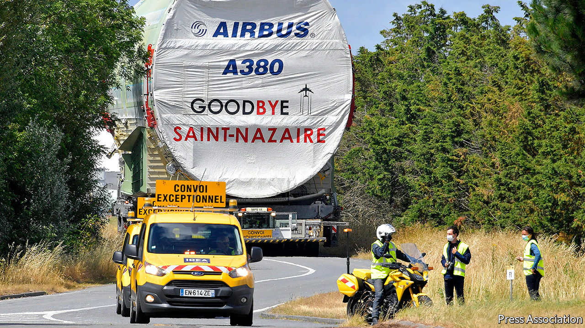

## Superjumbo problems

# What’s an A380 worth?

> The world’s biggest passenger aeroplane is going cheap

> Aug 15th 2020

HOW MUCH is an airliner worth if it is languishing on the tarmac, and may never fly passengers again? In the age of covid-19 that is the fate of many double-decker A380 superjumbos built by Airbus, Europe’s aerospace giant. Once seen by airlines as the future of commercial aviation, many are being retired early as covid-19 has cast a pall on the future of globe-trotting. Those still in service could be yours for a few million dollars.

The A380 was in trouble before the pandemic. Delays meant that by the time it at last flew it had to compete with smaller, more efficient jets. Only 14 airlines ever ordered the 500-plus seater, with Emirates, based in Dubai, operating nearly half the 242 planes delivered. After Emirates cancelled orders for 39 in February 2019, Airbus announced it was winding down production of the plane.

All aircraft have lost value as a result of covid-19. But the fall has been unusually steep for A380s. The model’s main attraction for airlines was to relieve congested runways at global hub airports. Now these are empty. Fewer than one in ten working A380s are plying the skies, according to Flightradar24, which tracks air traffic. Smaller craft are faring somewhat better.

The aviation industry may not recover until 2024, according to the International Air Transport Association, a trade group. That is a long time to maintain aeroplanes, so some airlines have thrown in the towel. Air France has announced its nine A380s will never fly again, and booked a €500m ($588m) write-down in the value of its fleet. Germany’s Lufthansa has cut its 14-strong squadron by six. Singapore Airlines, the second-biggest operator with 19 planes, plans an ominous-sounding “review”.

Valuations of A380s have tumbled accordingly. The oldest models have been flying for 12 years or so. At that age, aircraft have typically lost half their value. Given each costs $250m-300m to buy when kitted out, airline accountants might have hoped for $125m. But even before covid-19 appraisers suggested between $75m and $100m. Now some A380s are fetching half what they used to be worth, says Usman Ahmed of Aircore Aviation, a consultancy. The slump is borne out by the accounts of investment funds that own planes and lease them to airlines. A fund called Doric Nimrod Air One recently cut the accounting value of its sole asset, an A380 leased to Emirates, by 51% in dollar terms.

The share prices of listed A380-owning funds suggests the residual values of the planes once the leases expire are between $10m and $15m, says Matthew Hose of Jefferies, an investment bank. Given regular maintenance overhauls of each of the A380’s four engines can cost $6m, existing motors in decent nick are, in principle, worth at least that much. Add the landing gear, also in principle reusable, and that would make the airframe itself worthless. It also signals that even the spares—which in modern planemaking are always aircraft-specific and useless for other models—may not have much value.

Struggling operators sometimes convert unwanted passenger jets into cargo planes. But Airbus never launched a freight version of the A380, so the conversion would be tricky. No scheduled carrier that flies the aircraft already is keen on more, even at knock-down prices. The first A380 to fly, which came into service in 2007, has already been sent to the scrapheap. More are headed that way. ■

## URL

https://www.economist.com/business/2020/08/15/whats-an-a380-worth
