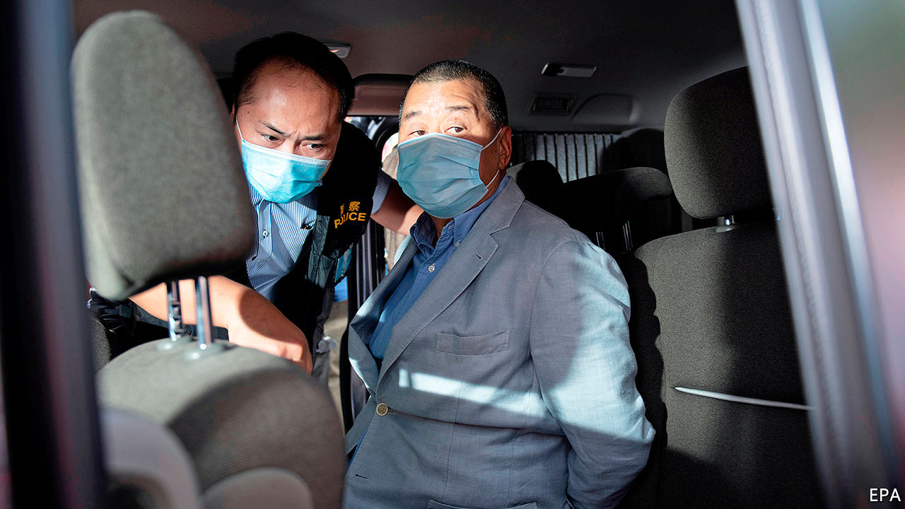

## In the party’s sights

# Jimmy Lai’s arrest is a blow to press freedom in Hong Kong

> To the Chinese Communist Party, the newspaper tycoon is the territory’s most reviled democrat

> Aug 15th 2020

THE SYMBOLISM of the spectacle was lost on few Hong Kongers. On August 10th, amid the city’s third wave of covid-19, which has resulted in restrictions on public gatherings of more than two people, 200 police raided the offices of Apple Daily, a local tabloid, bound the wrists of its owner Jimmy Lai, paraded him around the newsroom and marched him away. Employees live-streamed the show on Facebook.

When Carrie Lam, Hong Kong’s chief executive, endorsed the suffocating national-security law that was imposed on the territory by the central authorities on June 30th, she promised that Hong Kongers would “continue to enjoy the freedom of speech, freedom of press, of publication, protest, assembly and so on.” Implementation of the law, which was not referred to Hong Kong’s legislature, has called those promises into question.

Mr Lai, who arrived in Hong Kong from mainland China as a 12-year-old stowaway and worked his way up from factory hand to media tycoon, is the most high-profile of 25 people arrested so far under the new law. His scalp is one the party had been itching for—its media often call Mr Lai the principal figure among a “gang of four” pro-democracy veterans bent on “causing chaos”. The others are Anson Chan, a former head of the civil service; Martin Lee, a barrister; and Albert Ho, another lawyer.

Details of Mr Lai’s alleged crimes have not been released, save that he “colluded with foreign forces”, a crime that carries a potential life sentence. The charge may relate to his frequent calls for America to “save Hong Kong”. Global Times, a newspaper in Beijing, said Apple Daily had been “instigating hatred, spreading rumours and smearing Hong Kong authorities and the mainland for years”.

The tycoon was among ten people arrested that day on similar charges, including Mr Lai’s two sons; four executives of Next Digital, a company owned by Mr Lai which publishes Apple Daily; and Agnes Chow of Demosisto, a pro-democracy group, which disbanded itself hours after the national-security law was enacted.

The street protests that rocked Hong Kong last year have all but ceased. But public fury over the new law and the way it is being applied is evident. Shares in Next Digital rose more than tenfold in the two days following Mr Lai’s arrest, as activists used online forums to urge people to buy shares in companies such as his that sided with the demonstrators. On the morning after Mr Lai’s arrest, people joined lengthy queues outside shops to buy Apple Daily. The pro-democracy tabloid, which critics dismiss as sensationalist, had increased its print run to more than half a million. Normal daily sales are about 70,000.

The arrests are a sign that China is determined to crush opposition in Hong Kong, ignoring global outrage. Three days earlier, America had imposed sanctions on 11 Hong Kong and Chinese officials, including Mrs Lam, whom President Donald Trump accused of “implementing Beijing’s policies of suppression of freedom”.

China may be trying to keep tensions with America under control. It declared retaliatory sanctions against 11 Americans, but not members of the Trump administration. On August 11th China’s parliament extended the mandate of Hong Kong’s legislature by one year. Mrs Lam had announced that elections due in September would be delayed that long because of covid-19 (and maybe because democrats had been expected to do well in the polls). But to the surprise of some observers, it did not announce that four lawmakers, who had been declared ineligible to run for re-election for political reasons such as opposition to the security law, would be barred from serving during the extended term.

But there is no doubt that the party has the media in its sights. Its targets include foreign journalists—the new law calls for strengthened “management” of them. Some are experiencing unusual delays in their applications for work visas. At least one such request has been denied. Local reports say a national-security unit has been set up in the Immigration Department to handle their cases. A place once renowned for its vibrant press is changing fast. ■

## URL

https://www.economist.com/china/2020/08/15/jimmy-lais-arrest-is-a-blow-to-press-freedom-in-hong-kong
