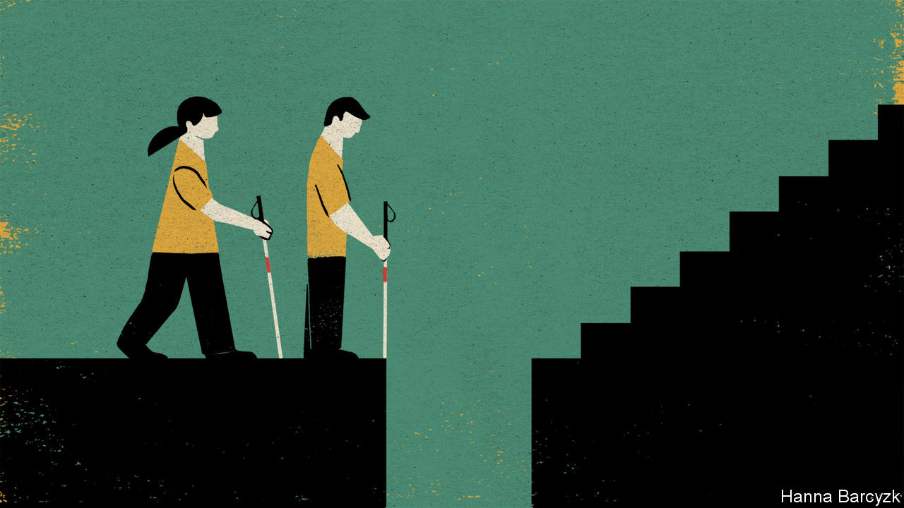

## Chaguan

# Only five blind people sat China’s university entrance exam this year

> China is squandering an ocean of talent

> Aug 15th 2020

SEVERAL STARTLING things awaited 20 blind Chinese youngsters attending a residential course that began in Shanghai this week, designed to prepare them for university. Adult instructors, many of them also blind, broached topics that protective parents rarely raise, from the rules of raucous student party-games to the perils of falling in love. Learning to navigate a campus alone is not just about finding libraries or canteens, noted Yang Qingfeng of Golden Cane, the charity organising the course. It is pretty vital if teenagers ever hope to go on unchaperoned dates.

In pep talks, students were urged to think beyond the few careers traditionally offered to blind Chinese. Since the 1950s, when China opened vocational schools for disabled war veterans, the visually impaired have typically been pushed to become musicians or, above all, to work as masseurs in state-run clinics or private parlours. People may say there is nothing wrong with being a masseur, a rapt audience heard from Cai Cong, who attended a blind-massage college a decade ago before persuading his parents to let him work as a radio journalist. Well that is fine, said Mr Cai—as long as it is your choice.

Several students, all neatly clad in black trousers and yellow polo shirts, admitted to nerves about the final test of the course. It will involve leaving the hotel alone to find a place to eat in central Shanghai, trailed by sighted volunteers who will intervene only if danger looms. Yet the real novelty of the course is arguably simpler. For this small group of youngsters—at once unusually brave and at the same time awkward and quick to dissolve in nervous giggling—the course promises seven days focused on what they can do, not on things deemed unwise, unsafe or beyond them.

This is almost certainly the best moment to be blind in Chinese history. The past was often exceedingly grim. Chinese literature is filled with stories of blind people who survive by begging or telling fortunes. As modern China grew more prosperous and opened to the world, it built special schools for the handicapped and, by ratifying such agreements as the UN Convention on the Rights of Persons with Disabilities, gave domestic reformers new, albeit limited leverage to press for change. In 2014 China announced that blind students would be allowed to take the national university entrance examination, the fearsome gaokao. This breakthrough followed years of official foot-dragging. In 2015 almost 9.5m candidates took the exam. Just eight students took a special version in Braille or large print. No official count of blind school-pupils exists in China. But if the proportion of American youngsters with legally registered visual handicaps is taken as a guide, as many as 80,000 of those taking the gaokao each year should be blind.

Alas, this also remains a frustrating moment to be blind and Chinese. Of 10.7m students who sat the gaokao this summer, just five took the Braille papers for the blind. Since 2015 candidate numbers have never exceeded ten in a single year, leading some Chinese to grumble about “wasting national resources” on the Braille gaokao, says Mr Cai. That ignores other hurdles still to be dismantled, he argues, noting that only about 30 Chinese universities admit blind students, and that even some of those fail to offer accessible tests and textbooks on a systematic basis. Other universities exclude the blind with medical tests and other gambits. Education officials do see a need to look after the disabled, he says. The problem is low expectations, and an attitude towards the blind and others that “what we give you is what’s best for you”. Doctors play a role in making families timid, too, says Mr Cai, who lost his sight at ten. Once they decide a progressive disability cannot be cured, they too often abandon hope and counsel risk-avoidance.

Nonetheless a handful of blind students manage to stay in the mainstream school system and achieve gaokao scores that entitle them to apply for elite colleges, a feat that reflects luck, talent but also years of grinding toil. One such student, Ang Ziyu, a serious youth from the inland city of Hefei, is attending the Shanghai training course. He must wait until late August to learn if his score of 635 is enough to enter Beijing Normal University, a teacher-training school. He expects no special allowance to be made for years of having schoolwork read to him by his parents, or the trickiness of taking the gaokao in Braille, a tactile form of printing that is ill-suited to transliterating Chinese characters. Mr Ang currently leans towards teaching at a blind school after graduation. But he has heard that attending college often leaves students eager to explore new possibilities. “I feel like that, too,” he says shyly.

Each year a few hundred blind students take simplified admissions tests set by special disabled colleges or sections of ordinary universities. That is the path taken by Zhang Shuxin and Huang Kan, two teenage girls from the southern province of Guangdong. Speaking at the Shanghai training camp, they volunteer that the education they received at high schools for the blind was “vastly different” from that of a normal senior school. Ms Zhang plans to be a music teacher. Already her father has offered to buy her a flat so she need not worry about earning a living—an offer not open to her two younger brothers. Indeed, her mother was reluctant even to let her attend the course in Shanghai, thinking it risky.

Ms Huang’s parents would not let her attend an ordinary high school. “They worried I would get in danger or impair my vision further,” she says, conceding: “A lot of us have lived a very closed-off life since we were young.” She credits the internet and screen-reading software with connecting her to the world. She hopes to become a psychotherapist, and to help other Chinese know that the blind are as capable as others. “I have a lot of dreams,” she says. Unexpectedly, the thought brings on tears, but she wants no sympathy, instead apologising for her loss of control. These stubborn, impressive students know what they need: equal chances to show what they can do. Pity is of no use to them.■

## URL

https://www.economist.com/china/2020/08/15/only-five-blind-people-sat-chinas-university-entrance-exam-this-year
