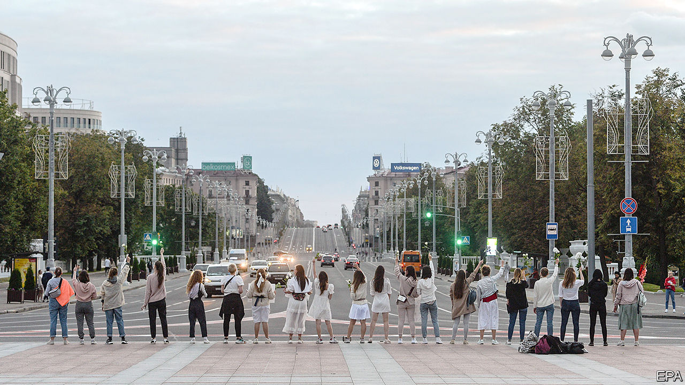

## A despot wobbles

# After rigging an election, Belarus’s regime beats protesters

> The probable true winner has fled. Belarusians are furious

> Aug 15th 2020

OF ALL THE disturbing sounds and images streaming out of Belarus, it was the broken voice of Svetlana Tikhanovskaya that spoke loudest. If the election on August 9th had been remotely free or fair, Ms Tikhanovskaya, a former English teacher with no political experience, might now be president-elect of her country. During the campaign, she attracted vast, cheering crowds. In the few polling stations where votes were properly observed and counted, she won more than 70% of them.

But Alexander Lukashenko, the dictator who has ruled Belarus since 1994, only three years after it ceased being a Soviet republic, does not give up power easily. The official count proclaimed him the winner, with an implausible 80% of the vote. And it was his 37-year-old rival who ended up making a “concession speech”.

She had gone into the central election commission to lodge a complaint about the obviously bogus result. While inside its walls, she was apparently persuaded to change her mind. She appeared in a short video, recorded inside the commission. Seated on a sofa, her eyes lowered, she read from a piece of paper handed to her by invisible interrogators: “Dear citizens of Belarus, I, Svetlana Tikhanovskaya, thank you for taking part in the presidential elections. The people of Belarus have made their choice…I ask you not to confront the police and not come out onto the streets.”

According to an ally, the video was recorded after she had spent three hours behind closed doors with Mr Lukashenko’s security chiefs. It was released a few hours later, after Ms Tikhanovskaya was driven out of the country by Belarusian security to Lithuania, whose president, Gitanas Nauseda, confirmed that she was now safe. “Not a single person in their right mind would believe that this video was recorded voluntarily,” he noted.

It is not hard to imagine how pressure might have been applied. Her husband, a popular vlogger, was already behind bars. (He was locked up for trying to run against Mr Lukashenko in the election; Ms Tikhanovskaya took his place on the ballot.) Several members of her staff have in effect been taken hostage, too, and her children are in hiding in Lithuania. “God forbid any of you are faced with the choice that I was…No one life is worth what is happening right now. Children are the most important things in our lives,” she said, her eyes welling with tears, in another video she posted on her husband’s website.

If Mr Lukashenko hoped that driving Ms Tikhanovskaya into exile would dampen the protests that greeted his electoral fraud, he was wrong. She was a symbol of resistance, not its leader. Indeed, the only reason she was allowed to register as a candidate instead of her jailed husband was that Mr Lukashenko did not see her as a threat, dismissing her as “poor little thing”.

Repression and hostage-taking have long been among Mr Lukashenko’s favourite methods for keeping a grip on his country. Until recently, there were others. A former collective-farm boss, Mr Lukashenko was swept to power in 1994 promising an end to post-Soviet chaos. Whereas the other former Soviet vassal states rejected the Soviet legacy, he retained Soviet symbols and institutions, including the KGB. He did not privatise large enterprises, and he used Russian subsidies to maintain low, but fairly equal, living standards. That gave him a degree of popularity. In recent years, however, his relationship with Russia has soured, the subsidies have started to dry up, the economy has choked and civil activism has grown, not least because of his bungling response to covid-19. On election day queues to vote against him stretched for several kilometres in places.

So when the electoral commission declared Mr Lukashenko the runaway winner (and gave Ms Tikhanovskaya a ridiculous 9.9% of the vote), gigantic crowds came out to make their true views known. Mr Lukashenko greeted them with stun grenades, tear-gas, rubber bullets and a total internet blackout.

His black-uniformed thugs randomly grabbed protesters and viciously kicked them as they squirmed on the ground. Demonstrators, who communicated by phone, adopted Hong Kong-style tactics of dispersing and regrouping in different parts of the cities, flowing like water. Riot police chased after them, followed them into shops and apartment blocks and pummelled them with batons. They smashed up cars that hooted their horns in solidarity with protesters and dragged their drivers onto the streets. Scores were injured, at least one killed and at least 6,000 were detained. Their relatives gathered outside prisons where they were audibly being beaten up, chanting “Hang in there!” Belarusian women, dressed in white and carrying flowers, marched through Minsk to confront the black-clad goons.

Protesters are calling for a general strike. If they succeed, it will bring the country’s economy to a halt. But this does not mean that Mr Lukashenko’s fall is imminent. In neighbouring Ukraine, scene of revolutions in 2004 and 2014, multiple oligarchic groups jostle for influence. Belarus is far more centralised. Mr Lukashenko so far retains control of the security services and the army, though there have been some reports of police and soldiers refusing to carry out repressive orders. However, terror is of limited use in running the country.

The dictator, who has survived by exploiting rivalry between Russia and the West, is in a weak position now. Liberalising would certainly cost him his job. Cracking down even harder, with Russia’s blessing, would turn him into Moscow’s supplicant. And although Vladimir Putin, Russia’s president, has covered up for him so far, there is no love lost between the two. Mr Lukashenko may hope for a rescue line from China’s Xi Jinping, an old patron who was the first to congratulate him on his victory. But there is one constituency Mr Lukashenko can no longer turn to: the Belarusian people. They have not yet lost him, but he has lost them. ■

## URL

https://www.economist.com/europe/2020/08/15/after-rigging-an-election-belaruss-regime-beats-protesters
