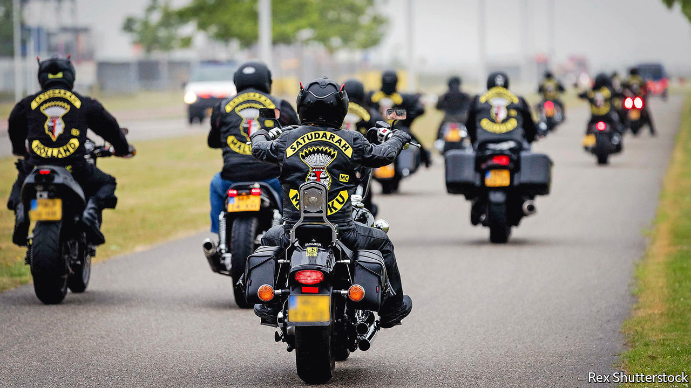

## Sleazy riders

# Drugs, torture and turf war: Europe’s biker gangs turn nasty

> Some 99% of bikers are law-abiding, say the “one-percenters”

> Aug 15th 2020AMSTERDAM

IN JUNE DUTCH police cracked open a shipping container on a farm and found it had been converted into a torture chamber, with walls covered in sound insulation and a dentist’s chair equipped with arm and leg restraints, as well as handcuffs, hacksaws and pliers. They were tipped off by an informant inside Caloh Wagoh, a Dutch motorcycle gang whose leader, “Keylow”, had been arrested and charged with running a murder-for-hire scheme. Prosecutors say a Moroccan-Dutch drug kingpin hired Caloh Wagoh to carry out 11 hits, five of which were executed. Keylow denies any involvement. When police asked him why hundreds of texts on his mobile phone referred to hit jobs, he said he was making a film on the subject.

The European drug trade has long-standing connections to outlaw motorcycle gangs. (These often call themselves “one-percenters”, a wry reference to an apocryphal statement that 99% of motorcycle club members are law-abiding citizens.) The Hells Angels and Bandidos gangs, formed in America, began opening chapters in Europe in the 1970s. They soon controlled much of the drug trade in cities like Copenhagen and Malmo.

In the so-called Great Nordic Biker War of the 1990s, these gangs and their allies went after each other with assault rifles, grenades and anti-tank weapons stolen from army bases. From the late 2000s, northern European one-percenters came into conflict with a new rival: street gangs with ethnic-immigrant backgrounds. In Copenhagen, the Hells Angels and Bandidos ceded territory to gangs like Brothas and Loyal to Familia.

In the Netherlands the government has attempted to ban the Hells Angels and Bandidos as criminal organisations. But they already faced competition from new biker gangs with a multicultural flavour, such as Satudarah, which started in the Moluccan community, and No Surrender, a largely Moroccan-Dutch crew. Caloh Wagoh, which has many Surinamese-Dutch members, is a fusion between members of a motorcycle gang called Trailer Trash and a Dutch branch of the Crips, a Los Angeles gang.

One-percenters are involved in the Dutch drug trade, though they do not dominate it. That honour, say police, goes to Ridouan Tagih, the man accused of hiring Keylow. After Panorama, a Dutch men’s magazine, published articles about Caloh Wagoh in 2018, its office was hit by an anti-tank missile.

## URL

https://www.economist.com/europe/2020/08/15/drugs-torture-and-turf-war-europes-biker-gangs-turn-nasty
