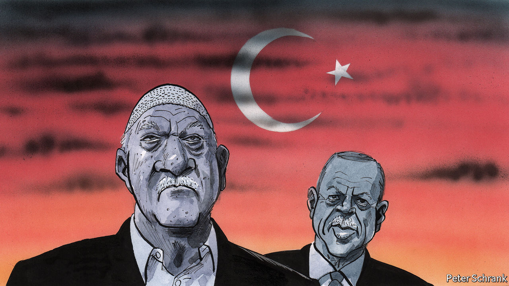

## Charlemagne

# Fethullah Gulen shares blame for Turkey’s plight

> The exiled imam did much to cripple democracy

> Aug 15th 2020

YOU MIGHT think that by now Turkey had run out of handcuffs. But although the wave of arrests related to the bizarre coup attempt that rocked the country in the summer of 2016 has certainly slowed, it has not stopped. Every week seems to bring a new round-up of suspected members of the Gulen community, or cemaat, the Islamist movement that President Recep Tayyip Erdogan blames for the coup. At least 41 people, many of them soldiers, were detained on July 27th. Warrants for over two dozen others were issued last week.

Nearly 600,000 people, most of them suspected Gulenists, have been investigated since the coup; nearly 100,000 have been arrested. Most had only tenuous links to the movement, such as having an account at a Gulenist bank. Some appear to have been tortured in captivity. But while there is sympathy among Turks for individual victims of Mr Erdogan’s purges, there is practically none for the cemaat as a whole, and even less for its leader, Fethullah Gulen, an ageing imam living in exile in Pennsylvania. Ask almost anyone in Turkey, including Mr Erdogan’s most bitter foes, and you will hear that compared with Mr Gulen, Turkey’s leader is the lesser of two evils. Mr Erdogan is an autocrat and a bully. But no one helped him cripple Turkey’s democracy more than Mr Gulen and his sect.

The movement is a tough nut to crack. From the 1970s onwards, it attracted hundreds of thousands of followers, drawn mostly from among the poor and devout students who gravitated to its prep schools and dorms. After the end of the cold war, it began to market itself as the torchbearer of an enlightened Islam, setting up foundations abroad and winning a circle of Western well-wishers. But it was only when Mr Erdogan and his Justice and Development party came to power in 2002 that it started to flourish. Its sympathisers had previously trickled into Turkey’s bureaucracy. With Mr Erdogan’s encouragement, they took over entire institutions. (By one estimate, Gulenists held 30% of top jobs in the judiciary and 50% in the police.) With his approval, they orchestrated the arrests of thousands of Kurdish activists, army officers, secular types and journalists. “The Gulenists played a decisive role in enabling Erdogan to consolidate power,” says Gareth Jenkins, a security analyst.

The Gulenists’ success was their undoing. By the early 2010s, they had amassed enough power to pose a threat to Mr Erdogan. “There was a time when they virtually ruled Turkey,” says Gokhan Bacik, an academic formerly close to the movement, now living in exile. They overreached by trying to torpedo peace talks with Kurdish insurgents, going after Turkey’s intelligence chief in 2012, and implicating Mr Erdogan in a corruption scandal the year after. Turkey’s strongman responded by declaring war on the cemaat and removing its loyalists from the bureaucracy. The purges went into overdrive after the coup attempt.

Much about the night of the putsch remains unclear. Some 250 people died in what resembled an army mutiny accompanied by a series of terror attacks more than a traditional coup. The official version, in which Gulenist sleeper cells in the armed forces awoke to take over the country all on their own, seems as watertight as a teabag. To this day, Turkey’s government has not produced evidence of what the plotters planned to do once they seized power. The coup itself appears to have been the work of a small but diverse coalition. Yet there is no doubt that the Gulenists played a big part. At least some of the officers who directed the violence turned out to be graduates of the Gulen system. Two of the civilians involved appear to have seen Mr Gulen in America only days earlier. Analysts agree there is no chance Gulenist operatives would have acted without their leader’s approval. Mr Gulen denies involvement.

Mr Erdogan and his ministers fume that foreigners do not appreciate the damage the Gulenists inflicted on Turkey. They are partly right. “In many European countries, people think that because Mr Erdogan is a dictator, anyone opposed to him must be a democrat,” says Bayram Balci, head of the French Institute of Anatolian Studies in Istanbul. That kind of logic plays into Mr Gulen’s hands and lets him masquerade as a dissident.

No one, however, is worse placed to preach about the dangers of Gulenism than Mr Erdogan, whose government was once joined at the hip with the movement. By locking up everyone linked to it, including lawyers, teachers and charity workers, Mr Erdogan has ditched the rule of law in favour of a vendetta. He has not helped his case by accusing nearly all of his other opponents of treason or terror. “People [in America] might be more receptive to Erdogan’s side of the story if he had more credibility,” says Gonul Tol of the Middle East Institute, a Washington think-tank. “But he has none.”

Today the cemaat seems to be a spent force. Inside Turkey, it has no room to breathe. Because it alienated almost every part of Turkish society, there is no one left to defend it, aside from a handful of human-rights activists. Abroad, the Gulenists are better off, but still on the back foot. Mr Erdogan has successfully pressed a few countries in Africa and Central Asia to sever links with Gulen schools and businesses. Funding has begun to dry up. Long-standing followers are leaving in droves and new ones are almost impossible to recruit. Mr Gulen commands blind obedience. His deputies, says Mr Bacik, are all theologians with no experience outside the group. There are no women in positions of power. For a movement that portrays itself as a modernising force in Islam, this is not a good look. Mr Gulen himself is approaching 80 and in poor health. When he dies, what remains of the cemaat is likely to crumble.

Its legacy in Turkey has been grim. “They have as much responsibility as Erdogan for the state of the country,” says Ms Tol. Much of the outside world seems to think there is only one villain in the story of Turkey’s descent into autocracy. Turks will tell you there is room for more. ■

## URL

https://www.economist.com/europe/2020/08/15/fethullah-gulen-shares-blame-for-turkeys-plight
