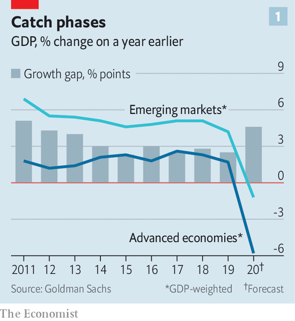
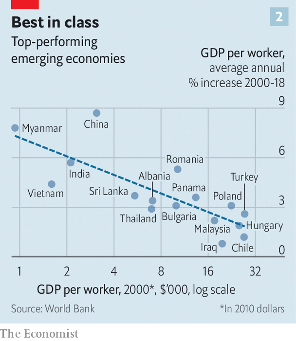

## Club class

# A new study shows emerging economies are catching up

> It also sheds light on some of the mysteries of economic growth

> Aug 15th 2020HONG KONG

THIS AWFUL year could, paradoxically, be a good one for what economists call convergence. This normally takes place when poor economies grow faster than rich ones, narrowing the income gap between them. This year will be a bit different. Few emerging markets will grow at all—perhaps China, Egypt and Vietnam. But because advanced economies will probably retreat even faster, the gap between them will narrow. In the pandemic, like a 400m race, the laurels go to whoever slows down least.

The last time there was such a decisive growth gap between advanced and emerging economies was in 2013 (see chart 1). That was year of the “taper tantrum”, an emerging-market sell-off prompted by fears that America would slow its pace of monetary easing. It marked the end of a decade of heady emerging-market optimism best symbolised by the enthusiasm for the “BRICs”, an acronym coined by Goldman Sachs, which helped sell many investors on four of the most populous emerging markets: Brazil, Russia, India and China.

The idea that “backward” economies could grow faster than mature ones was first spelled out by economic historians like Alexander Gerschenkron in the 1950s and Moses Abramovitz in the 1970s. It rests on the assumption that imitation is easier than innovation and returns to investment are high where capital is scarce. The evidence for faster growth was weak between the 1970s and the early 1990s, but has become stronger since, as Dev Patel of Harvard University, Justin Sandefur of the Centre for Global Development and Arvind Subramanian of Ashoka University have pointed out most forcefully.

In making their projections for the BRICs, Goldman drew on a cautious version of the thesis, called “conditional” convergence. Simply put, this says that poor countries will grow faster than rich ones, other things equal. Those other things, for Goldman, included a country’s level of education, its openness to trade, its internet penetration and ten other characteristics. Academics have ranged even more widely. According to Steven Durlauf of the University of Chicago, Paul Johnson of Vassar College and Jonathan Temple, a freelance economist, researchers have identified 145 plausible factors that must be accounted for. The list includes everything from inflation and foreign direct investment to religion, frosty weather and newspaper readership.

Goldman assumed that emerging economies would catch up with a productivity frontier exemplified by America. But many economies seem to converge not towards a global leader but with their neighbours or peers. Indeed, some of the best examples of convergence come from within countries or economic blocs. Poor Japanese prefectures have tended to catch up with richer ones, as have Canadian provinces, Indian states and the regions of Europe.

If the forces of convergence operate within these blocs, it is reasonable to wonder if other such groupings exist. Are there any other convergence “clubs”, rich or poor, the members of which are bunching up?

In a new book, “Global Productivity: Trends, Drivers, and Policies”, the World Bank uses an algorithm to sort through many combinations of countries, looking for groups that seem to be converging with each other. Based on the productivity performance of 97 economies since 2000, the bank identifies five clubs. The three gloomiest groups comprise fairly poor countries. A fourth contains some big ones of unfulfilled potential, such as Argentina, Brazil, Indonesia, Mexico and South Africa.

The most successful club spans all today’s advanced economies as well as 16 emerging markets, such as China, India, Malaysia, Thailand and Vietnam (see chart 2). Poorer members tend to grow faster than the rich ones, at a pace that would halve the productivity gap between them every 48 years.

What explains the centripetal forces at work? It is not proximity: the countries range from Myanmar and Canada to Finland and Chile. Many members have impressive levels of investment and trade, but so do others in the clubs below them. Higher levels of education and government effectiveness make a bigger difference, at least at the start of their catch-up phases.

Most members of the top club also do well on a measure of economic “complexity” developed by Ricardo Hausmann of Harvard and César Hidalgo of the Massachusetts Institute of Technology. Countries score highly if their exports are both eclectic and exclusive, spanning a diverse range of products that few other countries also export. But there are exceptions. Chile is in the top club, but appears economically uncomplicated. That may be because its exports (copper, salmon, fruit) look simple but are produced, differentiated and packaged in sophisticated ways. Its round, red cherries, for example, are carefully selected for export to China as symbols of luxury.

The authors of the World Bank’s book worry that the covid-19 pandemic will inhibit investment, shorten supply chains and breed insularity, all of which could hamper convergence. But they also note some potential silver linings. Crises, for instance, can encourage structural reforms; the lack of upkeep of outdated capital during dark times can hasten its replacement with newer technologies in the recovery.

Pioneers of convergence theory understood that a country cannot fully exploit industrial advances if it clings to customary patterns of production and consumption: what Thorstein Veblen, a sociologist, called “the received scheme of use and wont”. For this reason Abramovitz believed that war and political convulsion can serve as a “ground-clearing experience opening the way for new men, new organisations and new modes of operation”. Optimists, who pray that convergence will outlast this convulsive year, must hope that the received scheme of use and wont is one of the pandemic’s many casualties. ■

## URL

https://www.economist.com/finance-and-economics/2020/08/15/a-new-study-shows-emerging-economies-are-catching-up
