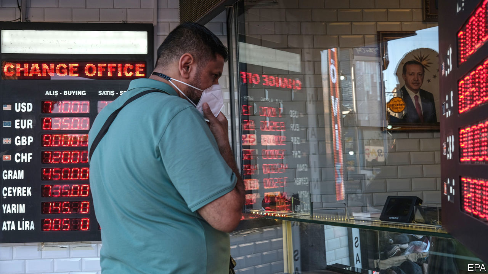
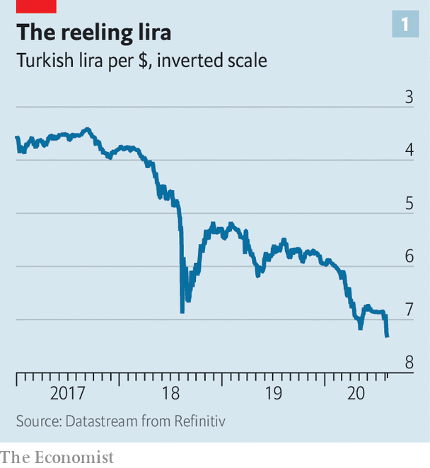
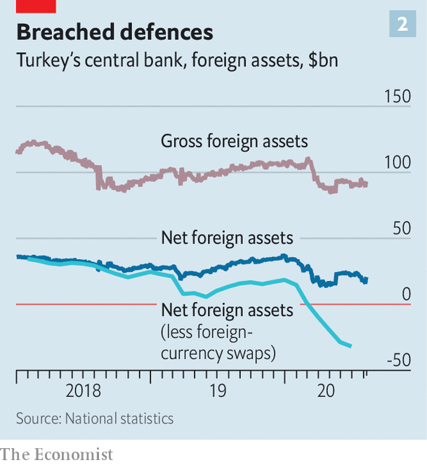

## Not at this rate

# As the lira slides, what will Turkey’s central bank do?

> The authorities are desperately trying to avoid rate rises

> Aug 15th 2020ISTANBUL

THERE SEEMED to be no end to the unusual measures Turkey would take to shore up the lira. The government had made it prohibitively hard for foreigners to bet against the battered currency. By the end of June the central bank had burned through $65bn in foreign reserves to protect it, in effect pegging it to the dollar for the past couple of months. On August 6th, however, the bank gave up and allowed the lira to float. It promptly sank (see chart 1). The currency fell by more than 3% during the day, reaching a record low.

Turkey may now be facing a repeat of the crisis of 2018, when a standoff with America, a credit boom and a bulging current-account deficit forced the central bank to impose towering interest rates in order to prevent a currency meltdown. Its monetary-policy board meets on August 20th. But the bank is even less independent than it was in 2018. Turkey’s president, Recep Tayyip Erdogan, sacked its previous governor for refusing to slash rates. His successor is highly unlikely to raise them without Mr Erdogan’s permission.

Another complication is that the bank’s foreign-currency assets are depleted. Gross assets dipped to $90bn in July (see chart 2). Net assets, which deduct foreign liabilities and borrowing through currency swaps with local banks, stand at -$41bn. “They have run out of ammunition,” says Ozlem Derici Sengul of Spinn Consulting, an advisory group. “If they continue like this, they may have no hard currency left.”

Turkey can still try to restore investors’ confidence in its management of the lira and the economy. But no one is certain it is willing to do so. For now, the government has begun cutting the money supply through the back door. Earlier this year, in an attempt to soften the blow from the covid-19 pandemic, state-run banks had flooded the market with cheap loans. The ensuing credit boom, the biggest in a decade, put renewed pressure on the lira and pushed inflation up. Days after the latest run on the currency, however, the banking regulator relaxed its rules on asset ratios, which had required lenders to pump out loans or face heavy fines. The central bank, meanwhile, has reverted to using a baffling system of policy rates, through which it can raise borrowing costs indirectly.

The combination of smoke and mirrors will not do. With the central bank’s benchmark policy rate at 8.25% and inflation at nearly 12%, Turkey has one of the lowest real rates among big emerging economies. Since the start of the year, the lira has shed nearly a fifth of its value against the dollar. Foreign investors have pulled $11bn from Turkish shares and bonds. Local depositors are running to the greenback for safety.

Analysts warn that the central bank’s failure to win back some of its credibility with a moderate interest-rate increase now may force a massive one later. Even this may not be enough. The right response, says Hakan Kara, a former chief economist at the central bank, would be to give the bank the freedom to raise the main policy rate. State banks must also take their foot off the gas, urges Mr Kara, and the authorities should let the financial system price risks freely.

Consistency would also help Turkey win back foreign investors. One day, regulators are punishing the banks for not handing out cheap loans, complains Gizem Oztok Altinsac, an economist; the next, they ask them to turn off the taps.

The problem is that Mr Erdogan is deaf to all this advice. On August 10th he called for rate cuts. “God willing”, he said, “they will go down further.” God help the lira. ■

## URL

https://www.economist.com/finance-and-economics/2020/08/15/as-the-lira-slides-what-will-turkeys-central-bank-do
