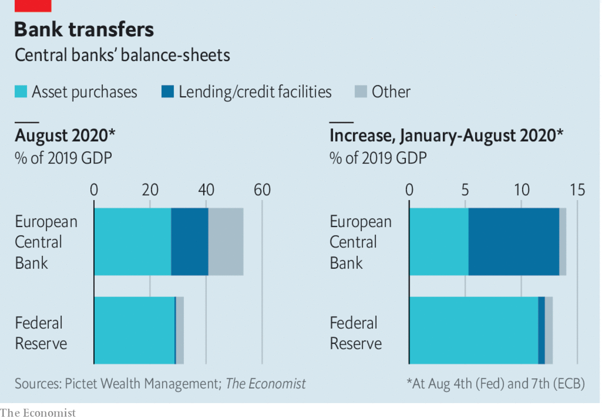

## Free exchange

# Has the ECB found a way around the lower bound on interest rates?

> Its cheap loans to banks could help kickstart inflation

> Aug 15th 2020

IMAGINE BEING locked in a dark room. Fearful of slamming into a wall or tripping, you inch forwards, arms outstretched. That is roughly how the European Central Bank (ECB) has approached interest-rate cuts since it first ventured into sub-zero territory in 2014. It knows there is a limit to how low rates can go, and that the limit is near, but, like the economics profession more broadly, it has no idea when it will hit the wall. With growth and inflation subdued, it cut rates gingerly, by 0.1 percentage points at a time. Even before covid-19 struck, its deposit rate was down to -0.5%. Rather than cut rates further, it has since relied on unconventional measures, such as bond-buying. Much of its stimulus has come from expanding its loans to banks, and decoupling the scheme’s interest rate from the main policy rates. With the introduction of dual interest rates, the ECB could well escape its locked room.

Cuts to interest rates are aimed at encouraging firms and households to spend by making borrowing more attractive, and saving less so. But when rates are negative their transmission to the real economy breaks down. Depositors can always choose to hold their funds in cash, which has an effective interest rate of zero. Banks worry that if they pass on negative rates, customers will yank their money out and stash it under mattresses instead. The result is squeezed net interest incomes for banks, a hit to their profitability, and, potentially, a reduced willingness to lend. Economists reckon that at a certain point—the so-called reversal rate—the stimulative effect of an interest-rate cut will be offset by the strain placed on banks. Fear of reaching this point helps explain why no central bank has gone deep into negative terrain.

In order to get around the problem, the ECB has souped up its long-term repo operations (LTROs), which lend to banks. When introduced during the euro area’s sovereign-debt crisis in 2011, they were meant to quell fears about banks’ funding shortfalls. Since then they have come in several flavours, from VLTROs—“very long-term”—to three rounds of TLTROs, or “targeted” operations, to PELTROs, for the “pandemic emergency”, announced in April. And the intention behind them has changed. TLTROs are a way to encourage banks to lend to the private sector. The more a bank lends to households and businesses, the lower the rate at which it can access TLTRO funds, according to a sliding scale set by the ECB. And in the topsy-turvy world of negative rates, the ECB is paying banks to extend credit to the economy.

This sort of scheme is hardly unique. The Bank of England has something similar. But one feature makes the ECB’s set-up novel. Until March the TLTRO rate was tied to the ECB’s benchmark interest rates. But the link has since been severed, and banks that meet the lending criterion can access funds at a much lower interest rate of -1%. The result is that banks can now get super-cheap funding, making a profitable spread when they use the proceeds to make new loans. Meanwhile deposit rates remain closer to zero, preventing savers from running to the door.

So far it seems that TLTROs have been popular and effective. Whereas the Fed this year has mostly focused on supporting capital markets, lending to banks has made up the bulk of the ECB’s stimulus—hardly surprising given the much bigger role banks play in intermediating credit in the euro area. By August 7th the ECB had lent €1.6trn ($1.9trn or 13% of euro-area GDP) through its lending schemes. In June alone banks borrowed €1.3trn. Once you add these in, finds Frederik Ducrozet of Pictet Wealth Management, the ECB’s balance-sheet has expanded more quickly this year than the Fed’s (see chart). In a speech in June Philip Lane, the ECB’s chief economist, reckoned that the measures alone, by averting a liquidity crisis, may prevent output in the euro zone from falling by three percentage points over 2020-22.

Proponents say dual rates could be more powerful still. There is no technical floor on the TLTRO rate: it can fall to -5%, -10%, or further. Lower rates could give inflation, long subdued, the kick it needs. Meanwhile the central bank could start to raise its deposit rate, satisfying critics in Germany and elsewhere, who worry about the impact of negative rates on savers. The sliding scale for assessing who gets access to cheaper ECB funding could be altered to, say, improve the transmission of negative rates. Banks could be asked to reprice their existing loan books, suggests Eric Lonergan of M&G Investments, a fund manager; in its most daring form, perpetual TLTROs could require banks to lend at negative rates—a way of transferring cash to citizens.

Could dual rates in some form become an established part of the toolkit, at the ECB and at other central banks? The impediments may well be political not technical. If a central bank lends to banks at a cheaper rate than the rate at which it remunerates reserves, then it makes a loss. (At the ECB, these losses are probably more than offset by profits on asset purchases.) Most economists would point out that losses do not matter; central banks can just print more money to pay their bills. But in practice central bankers have been wary of making losses, fearing that recapitalisation by governments might open them up to political pressure and scrutiny. They may also not want to be seen to be subsidising greedy bankers with deeply negative loan rates: some commentators in France, says Mr Ducrozet, are already muttering that the ECB is doing so. Perhaps it was for a combination of such reasons that Andrew Bailey, the governor of the Bank of England, told Bloomberg on August 6th that he did not expect to follow the ECB’s lead.

Dual rates may also not seem worth bothering with when fiscal policy is the more potent tonic for an economy in a recession. Even the European Union has managed to loosen the fiscal purse strings this time. But a quick, sufficiently large and well-targeted response from governments in the next downturn is not guaranteed. One lesson from the past decade of attempts to revive growth and inflation is that every stimulus measure has a political downside of one kind or another. If dual interest rates hasten the day that the economy recovers enough for monetary policy to be tightened, then surely they are worth having. ■

## URL

https://www.economist.com/finance-and-economics/2020/08/15/has-the-ecb-found-a-way-around-the-lower-bound-on-interest-rates
