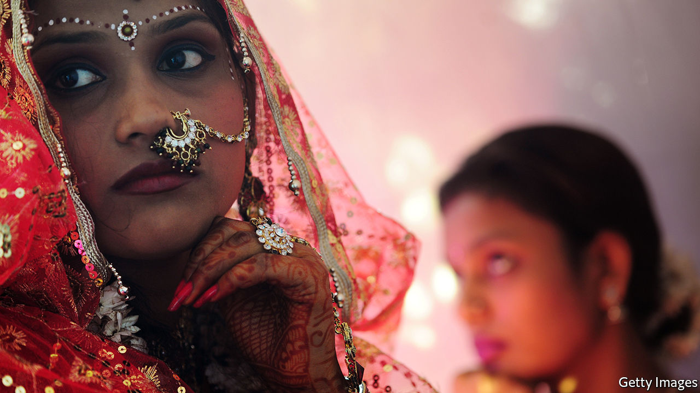

## Financial alchemy

# In India, gold-based finance is booming

> Jewellery turns to collateral in troubled times

> Aug 15th 2020

CLOSING TIME for the Kondapur branch of Muthoot Finance, in Hyderabad, is usually 5.30pm on a Monday. But on August 10th it was only two hours later that the manager, Haripuri Padmavati, and her five colleagues, could shut the doors. More than 150 customers had visited the gold-backed lender, six times as many as on a Monday before covid-19. Among the borrowers were those caring for infected family members; those who had lost their jobs but had big bills, such as school fees, to settle; and business owners needing to pay creditors and employees. The average loan size was 50,000 rupees ($700).

The pandemic has meant huge uncertainty about banks’ loan losses. Business at Muthoot, though, is booming. Loans are extended for a year in exchange for collateral in the form of gold—usually a bangle or necklace of the sort that lights up Indian weddings. The entire lending process usually takes 15 minutes. Jewellery is weighed, then scratched on a small square stone. Acid and salt are applied to the scratch, to test purity; 5-10% of items fail. With experience, says George Alexander Muthoot, the company’s managing director, you can tell by touch. In a video call with your correspondent, he demonstrates by putting a chain in his palm, flopping his hand to the left and right, and then opening up his fingers with a nod and a smile: appraisal done.

Muthoot has grown steadily since the early 1950s. It has more than 5,000 branches serving 250,000 customers a day, ranging from construction workers to IT professionals. Total loans exceeded $6bn in the year to March. Muthoot is the largest of the formal gold-backed lenders: collectively, their assets come to $40bn. Smaller lenders, which make loans worth twice that, charge annual interest rates as high as 50%. Muthoot charges 12-24%, as do its direct rivals. Banks, which are tiptoeing into the business, charge a bit less.

When the price of gold rises, as has happened for much of the past few months, so does a client’s ability to borrow. But lenders’ greatest risk is that the gold price falls, undermining collateral values. To provide a buffer, regulators had required that loans be less than 75% of the value of collateral. On August 6th the limit for banks was raised to 90%. But the gold price fell by 5% on August 11th—a reminder of why the buffer exists. Muthoot follows the old rule.

The greatest virtue of gold-backed finance, though, is how neatly it fits with India’s long-standing love for the yellow metal. In the past decade, despite high tariffs, India has imported 8,400 tonnes of it, more than the holdings of America’s Federal Reserve, the world’s largest repository. Windfalls are often channelled into gold. Jewellery bought in times of plenty becomes collateral when things go wrong—“the poor person’s insurance”, says Mr Muthoot. What makes his business especially lucrative is that borrowers work so hard to redeem their collateral, not just to help guard against future troubles, but to adorn the good times to come. ■

## URL

https://www.economist.com/finance-and-economics/2020/08/15/in-india-gold-based-finance-is-booming
