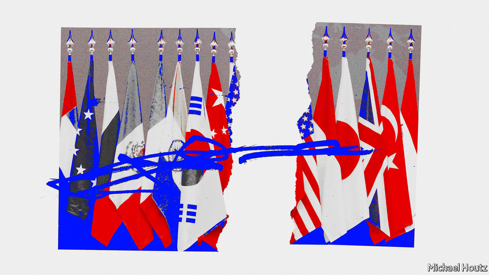
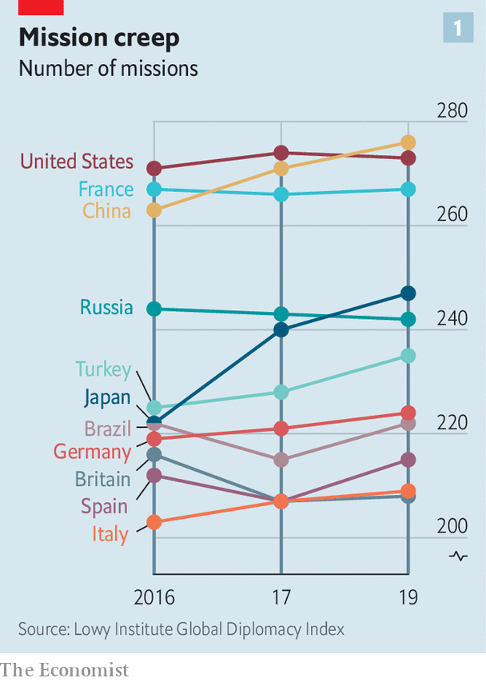
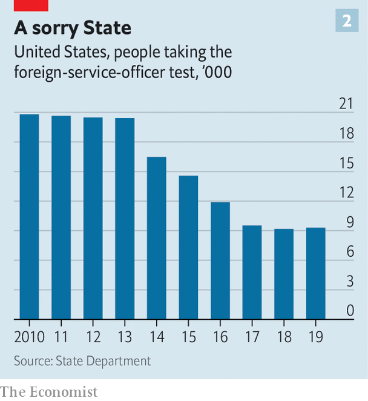
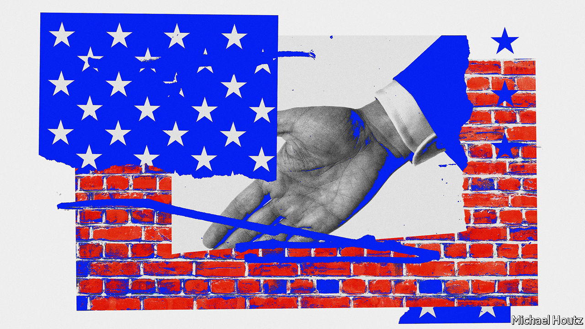

## Facing the world, blindfolded

# The dereliction of American diplomacy

> Donald Trump dismisses it as the “Deep State Department”. Yet America needs it more than ever

> Aug 13th 2020

THE AMERICAN embassy escaped the blast in Beirut’s port unscathed. Many Western countries either have missions in the city centre or diplomats who live in the area. The wife of the Dutch ambassador was killed, as was a German diplomat. But America’s embassy sits in the mountain village of Awkar, five miles (8km) from the port. Security measures are onerous, a hangover from the bombing of the American embassy in Beirut in 1983, which killed 63 people. It took a week before the ambassador, Dorothy Shea, a career diplomat, toured the port. The embassy has been short-staffed for much of the year because of covid-19. Even on social media it has been far quieter than other foreign powers. The ambassador has kept a low profile. 

The low visibility is a small sign of a wider malaise in American diplomacy. The country’s foreign service is damaged and demoralised. Last month Bob Menendez, the senior Democrat on the Senate Foreign Relations Committee, released a report warning that the State Department was “at risk of catastrophic failure”. The report is a catalogue of the damage done to America’s oldest federal agency, founded in 1789. It describes a department haemorrhaging talent and influence. The litany of woes is summed up in a leaked recording of a briefing on Washington last November by Colombia’s ambassador there, Francisco Santos, to his incoming foreign minister: “The US State Department, which used to be important, is destroyed, it doesn’t exist.”

Hand-wringing over the state of State is hardly new. More than two dozen government agencies now have people overseas, eroding the State Department’s primacy. Nowadays, the boss of a global American company may have a one-on-one with a head of state without going through the embassy, notes Stuart Holliday of Meridian, a centre for diplomacy in Washington, DC: “There’s been a recognition that the diplomatic channel is not the channel through which all American engagement happens.” In 2015, well before Donald Trump became president, the American Academy of Diplomacy, a club of senior ex-diplomats, warned that the country’s foreign service was in trouble because of its increasing politicisation, poor professional education and outdated career structure.

Mr Trump has tried to cut the department’s budget, most recently by 34%. Congress ignored him. But deep cuts came in the mid-1990s after the end of the cold war, when America thought it could scale back diplomacy—resulting in problems when the government found itself needing to deploy extra diplomats to Afghanistan and Iraq. More belt-tightening followed under the Obama administration. In 2018 Barbara Stephenson, then head of the American Foreign Service Association (AFSA), which represents the country’s diplomats, pointed out that America’s spending on “core diplomatic capability” (excluding outlays on security) declined by nearly a quarter in real terms between 2008 and 2016.

So the State Department was already wounded. “It’s not an exaggeration to say this is the most difficult time in a generation,” says Eric Rubin, AFSA’s current president. Nicholas Burns, an ex-ambassador to NATO now running a project on the future of American diplomacy at Harvard (the project is non-partisan but Mr Burns is an adviser to Joe Biden), believes it is time to “ring the village bell”. William Burns, another former top diplomat, who heads the Carnegie Endowment for International Peace, a think-tank in Washington, DC, decries the “demolition” of the State Department and argues that the damage is “even more severe than we imagine”.

Three things have created a sense of urgency. One is covid-19, the kind of crisis where America is expected to take a lead, but has faltered. In future more global issues—from climate change to cyber-security—will need managing. “Diplomacy is becoming far more important globally now than it has been before,” argues Mr Burns from Harvard. But the diplomatic landscape is more contested. “We’re going to have to fight for influence and for our priorities in a way that maybe we didn’t have to in the past,” says Mr Rubin.

The second worry is the rise of China. Last year China overtook America as the country with the most embassies and consulates around the world, says a Global Diplomacy Index compiled by the Lowy Institute, an Australian think-tank (see chart 1). Mr Trump has sought to slash America’s spending on diplomacy; Xi Jinping doubled China’s between 2011 and 2018.

China’s advances are evident at the United Nations, where Chinese nationals now head four of 15 UN specialised agencies, compared with America’s one. America has started to push back. It stopped China claiming the leadership of a fifth agency, the World Intellectual Property Organisation—the job went to a candidate from Singapore, a country, as Mr Pompeo said last month, that “actually gave a darn about intellectual-property rights”. But as America withdraws from bodies such as the World Health Organisation it gives China a chance to exert yet more influence.

Hence the third reason for alarm over the state of American diplomacy: its undermining by its own government. A senior US diplomat says the White House is “blatantly hostile” to the foreign service. Mr Trump publicly refers to “the Deep State Department”, implying its people are out to sabotage him. “Diplomacy is simply not valued,” says Roberta Jacobson, who resigned as American ambassador to Mexico in 2018. “The only form of foreign policy that this administration seems to understand is one of threats.” Mr Trump’s threats have sometimes targeted his own diplomats—including Marie Yovanovitch, who was his ambassador to Ukraine before being abruptly recalled. In the phone call in July 2019 that led to his impeachment by the House of Representatives, Mr Trump told Ukraine’s president, Volodymyr Zelensky, that she was “bad news” and that “she’s going to go through some things.”

In appointing ambassadors Mr Trump has favoured political picks over career diplomats to a degree that is unprecedented in modern times. America has a long tradition of deploying political emissaries. They can have the authority of a direct line to the president. Many also have the financial means to entertain in some style. Don Beyer, a businessman appointed by Barack Obama as ambassador to Switzerland, now a congressman for Virginia, says he spent about $1m of his own money on entertainment over four years. The budget allocated by Congress was a fraction of what he spent (“I was just blessed that Obama didn’t send me to Paris or London, which I could never have afforded,” he quips).

Typically, between a quarter and a third of a president’s ambassadors have been political appointees, often hefty campaign donors. In Mr Trump’s case the figure is 43%. The quality of those picks can be as unsettling for the career diplomats who serve under them as the quantity. Mr Trump’s ambassador to Iceland has been through seven deputy mission chiefs in little over a year. His man in London, Woody Johnson, removed his deputy whose mistake seems to have been to have included a favourable anecdote about Mr Obama in a speech at an English university. At Mr Trump’s behest, Mr Johnson reportedly tried, unsuccessfully, in 2018, to help push the British Open golf tournament towards the Trump Turnberry course in Scotland (Mr Trump has denied making the request).

Although ambassadors are the most visible sign of the politicisation of diplomacy, appointments back home are at least as significant. “The senior jobs in Washington is where policies are made,” says Ronald Neumann, president of the American Academy of Diplomacy. “There you have a wiping out of the career service.” Between 1975 and 2014, the share of career diplomats in the 50 or so jobs at assistant-secretary level and above shrank from about 60% to 30%; now, says Mr Neumann, it is down to 8%. No career foreign-service professional currently occupies a Senate-confirmed assistant-secretary post; according to AFSA, that has never happened before. Talented diplomats leave because of the lack of senior jobs available to them (America’s foreign service, like its army, operates an “up or out” system).

These days it is also hard to spot any senior foreign-service officers working in the White House. Mr Burns of Harvard spent five years seconded to the White House under presidents George Bush senior and Bill Clinton. “Those opportunities are not happening,” he says, “so the State Department has been sidelined.”

Many posts requiring Senate confirmation have stayed unfilled for long periods, creating a sense of drift and neglect. The job of assistant secretary for Europe and Eurasian affairs has been without a nominee since February last year. The Trump administration has so far had no confirmed nomination for assistant secretary for South and Central Asian affairs. Hiring for Africa roles has been painfully slow.

All this has contributed to a hollowing out of expertise that has been particularly severe thanks to a hiring freeze introduced by Rex Tillerson, the former ExxonMobil boss whose brief tenure as Mr Trump’s first secretary of state was a disaster. “Tillerson did more damage to the State Department than I could have imagined was possible in one year, particularly in the loss of experienced senior people,” says Mr Neumann.

Mr Pompeo ended the hiring freeze and has sought to bring back “swagger” to the department. He has taken a lead in belligerent policies towards Iran and, especially, China. He has restored a degree of vigour at the top. But he has not soothed critics.

They worry that he asked Mr Trump to fire his department’s inspector-general, who was investigating complaints against Mr Pompeo himself. They grumble that hardly any career officers are involved in his staff meetings. And they question whether he really has his diplomats’ back. True, he has not actively added to his boss’s attacks on his own envoys—yet, mindful of the art of survival in the Trump administration, neither has he actively defended them. In Senate testimony last month, he refused to say whether Ms Yovanovitch was a talented ambassador. “Hey, look at you, smiling and laughing and calling it silly,” concluded Senator Tim Kaine, a Democrat. “I don’t think it’s silly to Marie Yovanovitch or the people who work for you.”

Staff surveys suggest that confidence in the department’s leaders has plunged. Some of its lawyers resorted to a rarely used “dissent channel” to question an agreement to designate Guatemala as a “safe third country” for migrants. The numbers of people taking the foreign-service entrance exam has fallen by more than half over the past ten years (see chart 2). The inflexibility of foreign-service career paths is a problem: how many high-flyers today are happy to envisage a 35-year stay with the same employer and to wait 15 years for a senior job? Linda Thomas-Greenfield, a former head of the foreign service, recalls the case of an African-American woman who asked for three years’ leave to do a Harvard Law degree but had to apply one year at a time; her second year’s request was turned down and she left the department.

Such experiences have not helped the department’s record on diversity. “As far as African-Americans are concerned, the numbers are appalling,” says Ms Thomas-Greenfield. Just 2.8% of the senior ranks are black; a few years ago the figure was “upwards of 8%”, still short of a representative share. Only three black Americans are currently serving overseas as ambassadors, and four Hispanics. Last month Karen Bass, the chair of the Congressional Black Caucus, introduced a bill, along with the heads of Congress’s Hispanic, Asian and Native American caucuses, that seeks to help the foreign service “reflect the rich composition” of the country’s citizenry.

“It’s really important to understand just how much more quickly the deterioration of the State Department has gone under this administration than under previous ones,” says Ms Jacobson. Seasoned diplomats (including a former secretary of state for a Republican president) think it may take a generation to repair the damage. But several efforts are under way to come up with ideas. In September the Council on Foreign Relations, a non-partisan think-tank, will suggest reforms for the months after the presidential election, whoever wins. At Harvard Mr Burns and three other ex-ambassadors are leading an ambitious project to reimagine the longer-term future of American diplomacy; they will publish their proposals after the election.

Some changes could come swiftly. A push to fill top positions and promote the brightest career diplomats would help. And a president who believed in diplomacy would be a powerful start in setting a different tone and direction. Clearly, that is not going to happen if Mr Trump is re-elected. A Biden presidency would seem to be a necessary condition for a real revival.

But it is not a sufficient one. The problems of American diplomacy run deeper than the Trump administration’s assault on it. Senator Elizabeth Warren’s campaign envisaged doubling the size of the foreign service—pointing out that “we employ more people to work in military grocery stores than we do foreign-service officers”—and professionalising its envoys instead of “selling swanky diplomatic posts to rich buffoons”. Mr Burns from Harvard also favours a drastic shift in the mix of ambassadors, with perhaps 90% career diplomats and only 10% political appointees.

Ambassadorships are just the tip of the iceberg. “A total review of the personnel system should be a top priority for the next secretary of state,” says Ms Thomas-Greenfield. An inflexible career structure means that the department forces some of its best and brightest out and then doesn’t let them back in. A nimbler entry-exam process, faster promotions and greater opportunities to enter at every level would all help.

So would better training. The State Department is lousy at it. Yet the skills diplomats need are only going to grow. America’s armed forces has about 15% of its officers in training at any given time. Reformers argue that America’s diplomatic service should create a similar “training float”, which would require hiring enough people and spending enough money to have that extra capacity.

Reformers also call for a deeper cultural change. Clunky procedures can require dozens of names to sign off a policy statement. “The State Department as an institution is rarely accused of being too agile or too full of initiative,” says Mr Burns from Carnegie. He thinks it should be stripped of layers of bureaucracy, with authority pushed down to regional heads and out to ambassadors overseas. The place has become risk-averse, and needs to question conventional wisdom, Mr Burns argues.

The scale of the transformation needed in American diplomacy leads some to believe that its mission should be codified in a new act of Congress. Three times in the past century Congress stepped in. At the time of its last reform, in 1980, Leonid Brezhnev was in power in Moscow, China was beginning its one-child policy and home computers were becoming common. There is a case today for Congress to issue new marching orders. But sceptics wonder when—or whether—lawmakers might agree on the terms of a broad new act for the foreign service. Reform cannot wait.

That means changing not only the way the State Department works, but the weight diplomacy carries in foreign policy. America will always rely on a mix of military might and smooth talking. The two complement each other. “If you don’t fund the State Department fully then I need to buy more ammunition,” General Jim Mattis, then head of US Central Command, told Congress in 2013. Since 9/11 the emphasis on military force has made the country’s foreign policy lopsided.

Reformers say America must make diplomacy a first resort. Robert Gates, who was defence secretary in 2006-11, writes in Foreign Affairs about the “overmilitarisation” of American foreign policy and the neglect of its non-military tools. “The State Department should be the central non-military instrument of US national-security policy,” Mr Gates argues. But if it is to be up to the job, it will need more money, more manpower and far better management. ■

Dig deeper:Sign up and listen to Checks and Balance, our [weekly newsletter](https://www.economist.com//checksandbalance/) and [podcast](https://www.economist.com//podcasts/2020/08/01/checks-and-balance-our-weekly-podcast-on-american-politics) on American politics, and explore our [presidential election forecast](https://www.economist.com/https://projects.economist.com/us-2020-forecast/president)

## URL

https://www.economist.com/international/2020/08/13/the-dereliction-of-american-diplomacy
