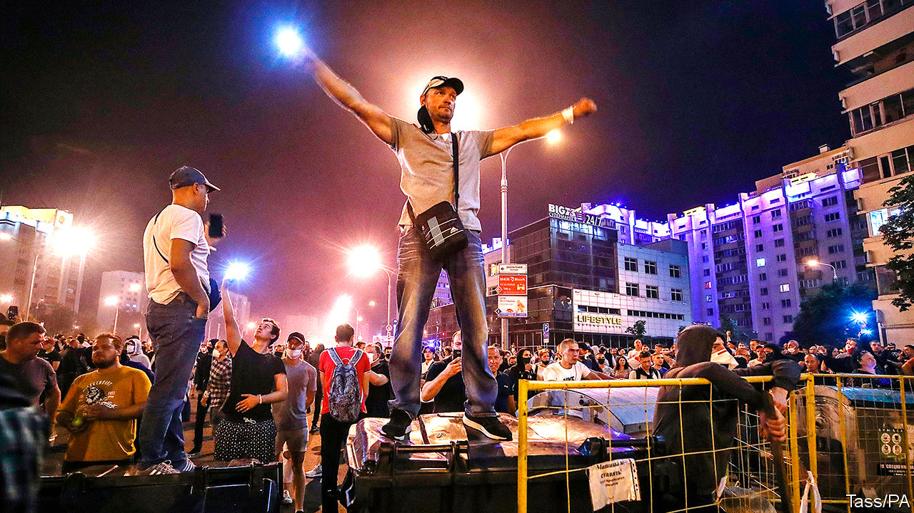

## Fraud in Russia’s near-abroad

# Belarus’s election was a sham. The West’s response has been feeble

> The biggest protests in the country’s history call for proper democracy

> Aug 15th 2020

IN A COUNTRY in the heart of Europe grisly acts were being committed this week, with the approval of Russia and China, the mildest of European protests and near-silence from America. An election was rigged; the challenger was forced to leave the country; protesters are being beaten and jailed. The perpetrator is Alexander Lukashenko, a 65-year-old dictator who has ruled the former Soviet republic of Belarus for most of its 30 years of independence. With luck, though, he may have overreached.

After a presidential election on August 9th the authorities proclaimed that Mr Lukashenko had won 80% of the vote. But the process was rigged from the start (see [article](https://www.economist.com//node/21790849)). Opposition candidates had been jailed or had gone into exile; most independent observers were barred and “preliminary” voting was extended to allow more time for ballot-stuffing. Mr Lukashenko has done all this before and got away with it, largely because he retained enough support to claim a degree of legitimacy.

This time, however, he appears to have lost most of the population, thanks partly to his extraordinary incompetence in dealing with covid-19. They queued up to vote for Svetlana Tikhanovskaya, a 37-year-old former teacher who became an accidental candidate after her popular vlogger husband was jailed to prevent him from running. She made only two big promises: to release all political prisoners and to hold a proper election within six months. The authorities said she had won only 9.9% of the vote, an impossibility given the vast crowds she attracted during her rock-star progress around the country during the campaign. The true result is unknowable, but in a few polling stations where rigging was prevented by observers she won about 70%. When Mr Lukashenko was declared the victor, the largest crowds in independent Belarus’s history came out to roar their rage and disbelief.

They were met with rubber bullets and stun grenades. Thousands have been arrested. Journalists have been hunted down. Ms Tikhanovskaya herself was detained inside the central election commission where she went to file a complaint, and was apparently coerced to read out a statement renouncing her claim to power. Her husband is incarcerated and her children are in hiding. Her supporters assume that they were threatened. Ms Tikhanovskaya was forced to go to Lithuania, explaining that: “Children are the most important things in our lives.”

The Western response has been feeble. Ursula von der Leyen, the president of the European Commission, urged Mr Lukashenko to count votes “accurately”. Angela Merkel’s spokesman expressed “great doubts” about the conduct of the election. Donald Trump said nothing. Access to the country has been shut down, so TV pictures are limited. But the main reason for Western acquiescence is that Mr Lukashenko has skilfully portrayed himself as the guarantor of national sovereignty. Without a strongman, some fear, Belarus might be gobbled up by Russia.

This argument is misguided. There is nothing Mr Putin would like more than for Mr Lukashenko to use violence against his own people. Not only would this make him more dependent on the Kremlin, but it would serve as a warning to Russia’s own protesters. By cutting Mr Lukashenko some slack, the West makes that more likely. Instead, it should recognise the election in Belarus for what it was—a sham.

It should demand the release of all political prisoners and the formation of a transitional government. If Mr Lukashenko refuses, the West should impose sanctions not only on him and members of his family but also on everyone involved in rigging the election and abusing protesters. It should warn the heads of the Belarussian law-enforcement agencies and the armed forces of their personal responsibility if they carry out the orders of an illegitimate president. That is the right way to help the people of Belarus, who are demonstrating and striking against repression, and so that a phoney election shall not stand. ■

## URL

https://www.economist.com/leaders/2020/08/15/belaruss-election-was-a-sham-the-wests-response-has-been-feeble
