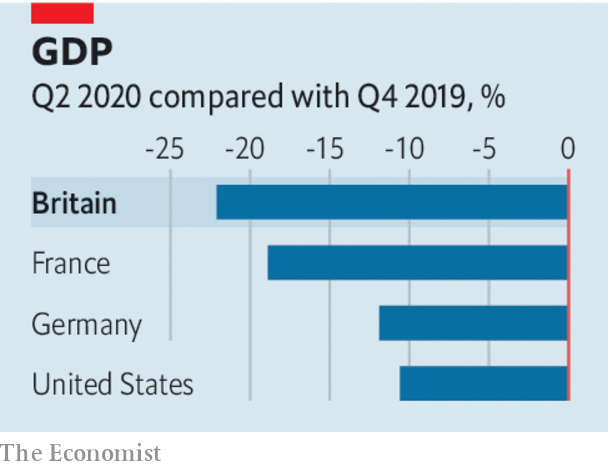

## Grey v growth

# Boris Johnson needs to focus on boosting Britain’s economy

> The prime minister needs to recover the spirit of Margaret Thatcher

> Aug 15th 2020

NORTHERN EUROPEAN countries think of themselves as rather superior to southern European ones—economically healthier, less corrupt and generally better run. Britain, of course, places itself firmly in the former group. But since the covid-19 crisis exploded, it has found itself running with a different pack. Its death rate from the disease has been as bad as the worst that southern Europe has seen, and far worse than those in most of northern Europe or America. And now GDP figures from the first half of the year, published on August 12th, show a similar picture on the economic front: Britain’s economy shrank by 22%, twice as much as America, worse than Germany and France, and within Europe better only than Spain.

Getting the country back on its feet economically will require deft management. The chancellor of the exchequer, Rishi Sunak, has shown himself capable of that. His furlough scheme was a well-designed short-term measure, and he seems rightly determined to shut it down in October to allow labour and resources to shift to where they will be most useful. But the government also needs longer-term policies that are focused on boosting growth.

Since Margaret Thatcher turned round a sluggish, unionised economy by sweeping away institutional barriers to growth, Tories have tended to follow her lead, promoting trade, deregulation and flexible labour markets. But in the past decade Britain’s productivity has grown more slowly than that of comparable countries. Part of the problem is a failure to prioritise growth.

A tension has developed within the Conservative Party, which has run the country for a decade. Although many politicians understand the importance of revving up the economy, Tory voters are ageing, and for many older people the costs of growth loom larger than the benefits (see [article](https://www.economist.com//node/21790852)). Many are insulated against the vagaries of the economy by inflated property prices and generous pensions. They have less of a stake in the future than young people and are more averse to the changes—spoiled views, building work, more immigrants—that go with growth.

Tory voters’ preferences show up in policies that will hamper growth and in spending preferences that will not help it. Brexit, supported by 60% of pensioners but only 27% of under-25s, will damage the economy. Spending on health, which disproportionately benefits old people, has grown from 6% to 7% of GDP since 2010, when the Tories came to power, while spending on education, which matters not just to the young of today but also to the growth rates of tomorrow, has dropped from 6% to 4% over the period. The “triple lock”, guaranteeing that state pensions will rise annually by whichever is the highest of earnings growth, inflation or 2.5%, will be especially generous this year and next: if the government sticks to that promise, pensioners will get a 2.5% increase this year while earnings decline by 1.5%, and a big rise next year too, when they are expected to rebound.

Even when the government does go for growth-oriented policies, they are held back by oldsters’ attitudes. The “big bang” planning reform it announced on August 6th, for example, was something of a damp squib. It contained, among other limitations, a commitment not to loosen restrictions in the “green belt” that is the main constraint on development in the south-east of England.

With the Brexit transition period due to expire at the end of the year, pro-growth policies are urgently needed. It is all very well for the government to aim for “levelling up” the left-behind regions of the country, especially in the north, but it will undermine that effort if it is simultaneously levelling down the country’s overall economic potential. Boris Johnson’s government should go for the softest possible post-transition Brexit to allow trade to continue to flow, a more muscular reform of the planning system, a new focus on education—especially of the vocational sort—and an end to the triple lock on pensions.

Before Thatcher put Britain on a new, higher, growth path, the country appeared to be in long-term decline. Covid, Brexit and a government that fails to prioritise growth could see it resume that dismal trajectory. ■

## URL

https://www.economist.com/leaders/2020/08/15/boris-johnson-needs-to-focus-on-boosting-britains-economy
