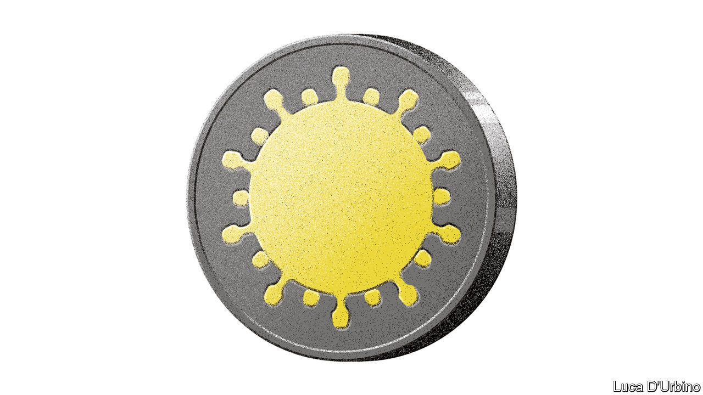

## Credit where it’s due

# Covid-19 is causing a microcredit crunch

> Lenders deserve relief, belief and a dose of red tape

> Aug 15th 2020

ACROSS THE developing world vast numbers of people have lost their jobs or seen their incomes fall. Many are being forced to sell their meagre belongings to pay for food. Ideally state handouts would plug the gap in their finances, but in many countries the public coffers are empty. Often people are too poor a credit risk, or live too remotely, to get help from banks. Microcredit, a form of lending tailored to them, should be part of the answer, but the industry is flunking one of its biggest tests.

In the 1990s and 2000s microcredit was one of the next big things in development finance. In 2006 Bangladesh’s Grameen Bank and its founder, Muhammad Yunus, won the Nobel peace prize. The industry’s champions developed a grand ambition. Letting the poor borrow and invest, they argued, would unleash their inner entrepreneur and allow them to earn their way out of poverty. A new model emerged. Instead of demanding collateral, which few poor people have, loan officers judged creditworthiness by assessing expected income. Lending often went to groups of people, who knew and monitored each other better than banks could. That also saved officers time and hassle, creating efficiencies that enabled clients to borrow small sums at affordable rates.

Today the lending portfolios of microfinance institutions (MFIs) are worth a combined $124bn. But the industry is in trouble. Covid-19 is straining its finances. Repayments, usually done in cash and in person, have plummeted, yet the banks and investors which provide the MFIs with funds still expect money. A crunch looms. More than two-thirds of MFIs have cut lending, often by at least half. Nearly one-third do not have enough cash to meet outflows this quarter. If only this were the industry’s only problem. Compounding it is a set of deeper, longer-standing issues that have begun to undermine its reputation for efficiency and probity (see [article](https://www.economist.com//node/21790899)).

As the industry has grown in size it has also grown in complexity. From insurance to leasing, a lengthening suite of services has turned microcredit into microfinance, adding new players to the fray. A mishmash of regulators have struggled to keep up. Patchy regulation and lots of loopholes have become a serious problem as the industry’s high repayment rates—well above 90% on average—have lured for-profit lenders, some of which demand land titles as collateral, charge extortionate rates and use heavy-handed tactics to collect payments. From Congo to Kosovo, scandals have surfaced.

An expanding body of academic research suggests that microfinance consistently falls short of its boosters’ admittedly high expectations. Among the economists who have plucked at its laurels are last year’s Nobel prizewinners, Abhijit Banerjee and Esther Duflo. They and others have found that its effects on investment, revenue and consumption are small and uncertain. The result is waning interest in the industry from blue-chip investors and donors.

The timing is terrible. People use MFIs for a variety of needs, from buying goods to helping relatives. What matters is less what the funds are spent on than households’ and firms’ ability to smooth their income and outgoings over time, which is particularly important when bad news, or a bad season—or a pandemic—strikes. Without microcredit, covid-19 means more people in desperate situations will turn to loan sharks and pawnbrokers, at the risk of falling into debt spirals.

What to do? In the short term, viable MFIs need support. Donors and investors should consider moratoriums, reschedulings or injecting capital. Nearly half of MFIs say they have not had any discussion with funders yet. Supervisors may need to loosen reserve requirements to provide breathing space. Forbearance with struggling clients should be tolerated, as long as MFIs sketch out a path back to normal for when the pandemic is over.

In the longer term governments need to crack down on predatory lending and make rules more consistent and uniform. That will prevent vulnerable people from being exploited and also help restore confidence in legitimate microlending firms. Calibrating regulation is not easy, but some obvious measures include better information-sharing, so MFIs know what they are doing and people can shop around; an obligation to properly assess borrowers’ ability to repay; transparency on rates and fees; protection against harassment; and credible grievance mechanisms, advertised in information campaigns. For governments battling deep recessions microfinance may seem a sideshow. But all MFIs together have 140m customers, so nursing the industry back to health will give a big bang for the buck.■

## URL

https://www.economist.com/leaders/2020/08/15/covid-19-is-causing-a-microcredit-crunch
