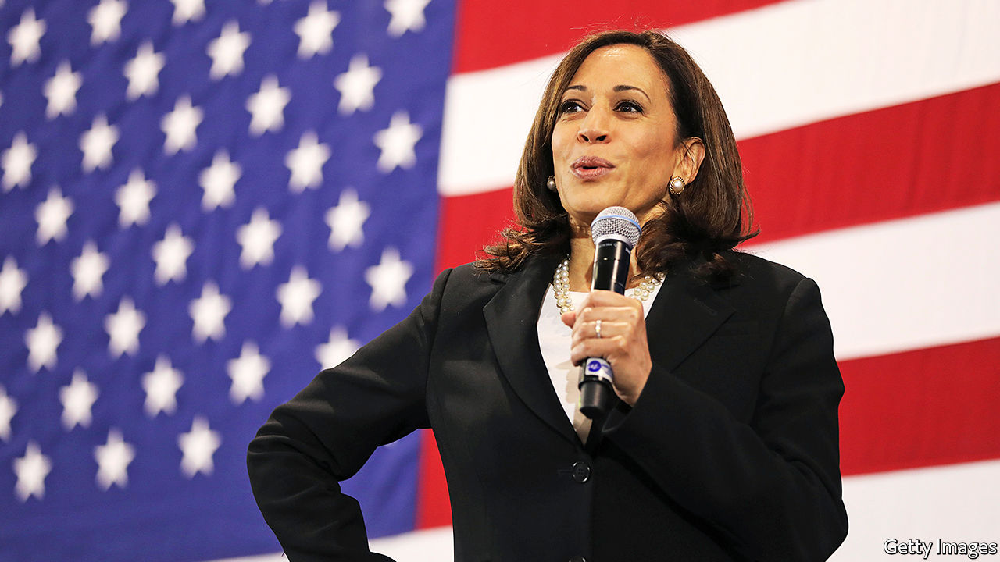

## Kamala Harris

# What Kamala says about Joe

> Joe Biden’s choice of running-mate reflects well on him

> Aug 13th 2020

JOE BIDEN’S strategy so far has been to stay out of the way as far as possible. The more the news cycle is filled with President Donald Trump, covid-19 deaths and economic misery, the better for Mr Biden’s campaign. So far it has worked: he is nine points up in our average of polls. Democrats have a shot not just at taking the presidency and retaining the House but also at capturing the Senate, which earlier this year had looked out of reach. With that trifecta comes the power to change America.

But to what end? Mr Biden’s stealth campaign is fine as an approach to winning the election in November, but it has not revealed much about what sort of president he might be. His choice of Senator Kamala Harris as his running-mate is different. Because this is the first big call he has had to make, it says something about how he would make decisions in the White House. It also gives an indication of the ideological leanings of a future Biden administration.

The pick reflects well on the former vice-president, who spent eight years doing the job he has recruited Ms Harris for. Mr Biden has chosen the person who went at him hardest during the primary debates; he has not held a grudge. And he has picked someone who, for all her mould-breaking qualities as the first African-American woman and the first Asian-American on a presidential ticket (her parents are from Jamaica and from India), has come up through the conventional route to high office. Ms Harris has been chief prosecutor in San Francisco, state attorney-general in California and is now a US senator (see [article](https://www.economist.com//united-states/2020/08/13/why-kamala-harris-was-a-good-choice-for-joe-biden)). Mr Biden promises a return to competent governing. His running-mate’s CV reinforces the pitch.

What does the choice say about what a would-be Biden administration might do? Like Mr Biden, she comes from the Democratic Party’s centre. That means pursuing progress on climate change, health care and the relationship between business and the state through incremental change rather than cheerleading for a revolution.

Her main drawback, for both libertarians and progressive Democrats, is her record as a prosecutor. California suffers from overcrowded prisons and a dysfunctional probation system. Ms Harris did not make either better. She opposed the legalisation of cannabis and prosecuted non-violent crime aggressively. But if this becomes a law-and-order election, which is the fight Mr Trump would like, this record would probably be an advantage. She would be hard to paint as soft on crime, which matters in a year that has seen a sharp rise in murders in America’s big cities.

Ms Harris is not particularly ideological, a quality which could also be an asset in November. The Trump campaign was hoping for a crazed leftist; the president’s first attack ad has had to settle for going after “phoney Kamala”. As often with Mr Trump’s insults, there is an element of truth to the charge. During the Democratic primary Ms Harris seemed willing to abolish private health insurance when the wind appeared to be blowing that way. Then, when the scheme began to look like a gift to Mr Trump’s re-election campaign, she ditched it, sort of, in favour of an unworkable, cobbled-together hybrid. This suggests a lack of fixed ideas. It also suggests a kind of flexibility that can be a useful attribute in Washington dealmaking.

In short, she resembles the old white guy at the top of the ticket. Some veep picks try to compensate for the headline candidate’s particular weakness—think of Mike Pence’s evangelical piety and Mr Trump’s Hugh Hefner tendencies. Ms Harris is more of an amplifier. Like Mr Biden she has moved with her party, for example on criminal justice, but without ever straying too far from where a majority of voters are. She has accumulated enough experience in executive positions and as a legislator to provide competent backup. That may not sound inspiring, but it would be a contrast to the administration which the Biden/Harris ticket hopes to replace.

This is all the more important because Ms Harris may one day inherit or win the presidency herself. Average male life expectancy in America is 76. Mr Biden is 77. If he does triumph in November, she may be called on to deputise for him while he is in office. If he loses, she would be first in line next time round. For all the anxiety about racism in America at the moment, Ms Harris feels in many ways like a safe, unremarkable choice for vice-president. That is a sign of progress. ■

Dig deeper:Sign up and listen to Checks and Balance, our [weekly newsletter](https://www.economist.com//checksandbalance/) and [podcast](https://www.economist.com//podcasts/2020/08/01/checks-and-balance-our-weekly-podcast-on-american-politics) on American politics, and explore our [presidential election forecast](https://www.economist.com/https://projects.economist.com/us-2020-forecast/president)

## URL

https://www.economist.com/leaders/2020/08/13/what-kamala-says-about-joe
