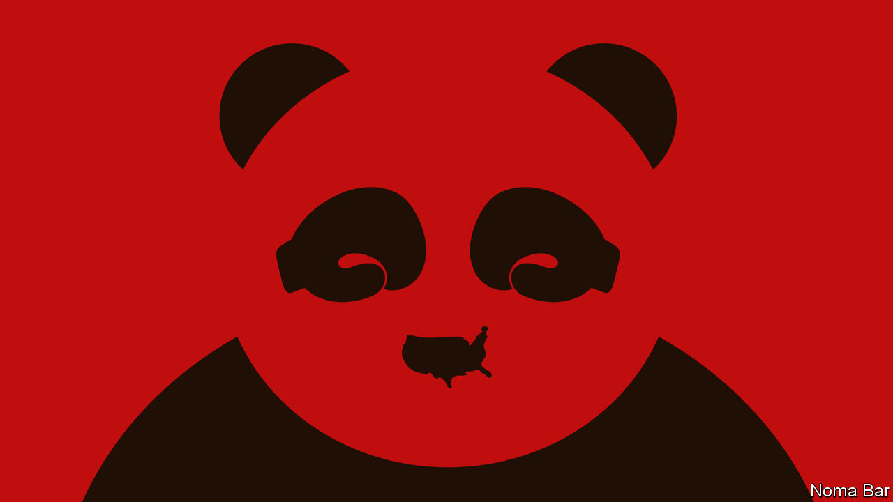

## The Chinese economic model

# Xi Jinping is reinventing state capitalism. Don’t underestimate it

> China’s strongman leader has a new economic agenda

> Aug 13th 2020

AMERICA’S CONFRONTATION with China is escalating dangerously. In the past week the White House has announced what may amount to an imminent ban on TikTok and WeChat (two Chinese apps), imposed sanctions on Hong Kong’s leaders and sent a cabinet member to Taiwan. This ratcheting up of pressure partly reflects electioneering: being tough on China is a key strut of President Donald Trump’s campaign. It is partly ideological, underscoring the urgency the administration’s hawks attach to pushing back on all fronts against an increasingly assertive China. But it also reflects an assumption that has underpinned the Trump administration’s attitude to China from the beginning of the trade war: that this approach will yield results, because China’s steroidal state capitalism is weaker than it looks.

The logic is alluringly simple. Yes, China has delivered growth, but only by relying on an unsustainable formula of debt, subsidies, cronyism and intellectual-property theft. Press hard enough and its economy could buckle, forcing its leaders to make concessions and, eventually, to liberalise their state-led system. As the secretary of state, Mike Pompeo, puts it, “Freedom-loving nations of the world must induce China to change.”

Simple, but wrong. China’s economy was less harmed by the tariff war than expected. It has been far more resilient to the covid-19 pandemic—the IMF forecasts growth of 1% in 2020 compared with an 8% drop in America. Shenzhen is the world’s best-performing big stockmarket this year, not New York. And, as our [briefing](https://www.economist.com//briefing/2020/08/15/xi-jinping-is-trying-to-remake-the-chinese-economy) explains, China’s leader, Xi Jinping, is reinventing state capitalism for the 2020s. Forget belching steel plants and quotas. Mr Xi’s new economic agenda is to make markets and innovation work better within tightly defined boundaries and subject to all-seeing Communist Party surveillance. It isn’t Milton Friedman, but this ruthless mix of autocracy, technology and dynamism could propel growth for years.

Underestimating China’s economy is hardly a new phenomenon. Since 1995 China’s share of world GDP at market prices has risen from 2% to 16%, despite waves of Western scepticism. Silicon Valley chiefs dismissed Chinese tech firms as copycats; Wall Street short-sellers said ghost towns of empty apartments would bring a banking crash; statisticians worried that the GDP figures were fiddled and speculators warned that capital flight would cause a currency crisis. China has defied the sceptics because its state capitalism has adapted, changing shape. Twenty years ago, for example, the emphasis was on trade, but now exports account for only 17% of GDP. In the 2010s officials gave tech firms such as Alibaba and Tencent just enough space to grow into giants and, in Tencent’s case, to create a messaging app, WeChat, that is also an instrument of party control (see [article](https://www.economist.com//china/2020/08/13/donald-trump-has-caused-panic-among-millions-of-wechat-users)).

Now the next phase of Chinese state capitalism is under way—call it Xinomics. Since he took power in 2012 Mr Xi’s political goal has been to tighten the party’s grip and crush dissent at home and abroad. His economic agenda is designed to increase order and resilience against threats. For good reason. Public and private debt has soared since 2008 to almost 300% of GDP. Business is bifurcated between stodgy state firms and a Wild West private sector that is innovative but faces predatory officials and murky rules. As protectionism spreads, Chinese firms risk being locked out of markets and denied access to Western technology.

Xinomics has three elements. First, tight control over the economic cycle and the debt machine. The days of supersized fiscal and lending binges are over. Banks have been forced to recognise off-balance-sheet activity and build up buffers. More lending is taking place through a cleaned-up bond market. Unlike its reaction to the financial crisis of 2008-09, the government’s response to covid-19 has been restrained, with a stimulus worth about 5% of GDP, less than half the size of America’s.

The second strand is a more efficient administrative state, whose rules apply uniformly across the economy. Even as Mr Xi has used party-imposed law to sow fear in Hong Kong, he has constructed a commercial legal system in the mainland that is far more responsive to businesses. Bankruptcies and patent lawsuits, once rare, have risen fivefold since he took office in 2012. Red tape has been trimmed: it now takes nine days to set up a company. More predictable rules should allow markets to work more smoothly, boosting the economy’s productivity.

The final element is to blur the boundary between state and private firms. State-run companies are being compelled to boost their financial returns and draw in private investors. Meanwhile the state is exerting strategic control over private firms, through party cells within them. A credit blacklisting system penalises firms that misbehave. Instead of indiscriminate industrial policy, such as the “Made in China 2025” campaign launched in 2015, Mr Xi is shifting to a sharp focus on supply-chain choke-points where China is either vulnerable to foreign coercion or where it can exert influence abroad. That means building up self-sufficiency in key technologies, including semiconductors and batteries.

Xinomics has performed well in the short term. The build-up of debt had slowed before covid-19 struck and the twin shocks of the trade war and the pandemic have not led to a financial crisis. State-run firms’ productivity is creeping up and foreign investors are pouring cash into a new generation of Chinese tech firms. The real test, however, will come over time. China hopes that its new techno-centric form of central planning can sustain innovation, but history suggests that diffuse decision-making, open borders and free speech are the magic ingredients.

One thing is clear: the hope for confrontation followed by capitulation is misguided. America and its allies must prepare for a far longer contest between open societies and China’s state capitalism. Containment won’t work: unlike the Soviet Union, China’s huge economy is sophisticated and integrated with the rest of the world. Instead the West needs to build up its diplomatic capacity (see [article](https://www.economist.com//international/2020/08/13/the-dereliction-of-american-diplomacy)) and create new, stable rules that allow co-operation with China in some areas, such as fighting climate change and pandemics, and commerce to continue alongside stronger protections for human rights and national security. The strength of China’s $14trn state-capitalist economy cannot be wished away. Time to shed that illusion. ■

## URL

https://www.economist.com/leaders/2020/08/13/xi-jinping-is-reinventing-state-capitalism-dont-underestimate-it
