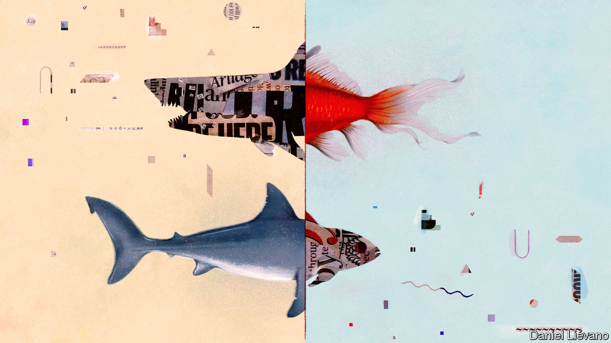

## On elderly care, technology, Lyndon Johnson, choral singing, journalism

# Letters to the editor

> A selection of correspondence

> Aug 15th 2020

Your first-class report on looking after the elderly suggested that caring for old people in their own homes is cheaper and better than caring for them in care homes (“[No place like home](https://www.economist.com//international/2020/07/25/the-pandemic-shows-the-urgency-of-reforming-care-for-the-elderly)”, July 25th). So far as cost is concerned, you pointed to a study that put the saving from staying at home at $4,500 a year. But the average for a group conceals wide variation. A person requiring trained nursing 24 hours a day can be cared for much more cheaply in a nursing home where, for example, the cost of a nurse’s overnight shift can be spread among several residents.

As for “better”, it is true that people say they would prefer to stay in their own homes. However, that preference is expressed without actually experiencing the alternative situations. Being on your own when needing care at home can be a dismal experience. In nursing homes, as I know from my own mother’s experience, staff talk to you and the cheery clatter as they go about their business can make for a better life, as can communal activities and friendships with other residents.

The pandemic has indeed shown that residential care can be perilous. Many of the people affected are of an age and state of health that means they would die quite shortly even without the virus. The inevitable risks can be managed by the proper provision of personal protective equipment and scrupulous hygiene. And the thought of dying at home on your own from coronavirus, which has happened to many old people during this epidemic, doesn’t bear thinking about.

DAVID LIPSEYMember of the Royal Commission on the Long-Term Care of the Elderly, 1999Brecon, Powys

“[Techtonic plates](https://www.economist.com//leaders/2020/07/09/tiktok-and-the-sino-american-tech-split)” (July 11th) predicted a painful rupture between China and the United States over the technology industry. You are correct but your timing is off. China initiated the split in 1997 when it began building the Great Fire Wall and when it later locked Google, Yahoo and other American tech companies out. China continued emphasising the need for self-sufficiency in technology in its five-year plan of 2005. To ensure there would be no doubt about this it called for “Made In China 2025” in its five-year plan of 2015. Mike Pompeo’s remark about banning TikTok did not signal a new split. It only responded to the great split initiated by China a long time ago.

CLYDE PRESTOWITZPresidentEconomic Strategy InstituteWashington, DC

Huawei has not been prosecuted, let alone convicted, of any wrongdoing that deserves banning its business. We cannot attain a rules-based international order if the rules are broken because the defendant is Chinese. In Britain, it is not even clear what the government’s legal basis is to interfere with the normal activities of a private company. I imagine the decision to ban Huawei won’t be challenged in court by the company, but by its network customers.

LEO LIAOLondon

Though I wouldn’t want to belittle Hubert Humphrey’s fair share of the credit for America’s groundbreaking Civil Rights Act, Ed Giera’s account amounts to topsy-turvy history ([Letters](https://www.economist.com//letters/2020/07/18/letters-to-the-editor), July 18th). No president but Lyndon Johnson would have been able to manoeuvre a civil-rights bill through a Senate still dominated by southern Democrats. Having once been the “Master of the Senate” (the title of Robert Caro’s seminal biography of LBJ), Johnson not only knew all the parliamentary procedure strategies inside-out, which opponents of the legislation attempted to deploy against its progress, but also blatantly antagonised his former mentor, Senator Richard Russell of Georgia, in navigating the bill through the Senate.

Johnson was able to propel the late John Kennedy’s comparatively meek push for a civil-rights act. It would never have made it onto the statute book otherwise, with or without the assistance of Humphrey, who was too much of a firebrand to build the necessary rapport with southerners.

JAKOB STEFFENWuppertal, Germany

As you noted, “choral singing has been devastated by the pandemic” (“[Voices off](https://www.economist.com//books-and-arts/2020/07/08/choral-singing-has-been-hit-hard-by-the-pandemic)”, July 11th). Singing is so important to our sense of community and to our mental health that we need to find a way that we can safely resume singing without spreading the virus. As the choir conductor you quoted said, “We can innovate”.

How? Well, who says we have to sing while breathing out, which is what risks spreading covid-19? Yes, it will require some readjustments, but I have experimented and I can verify that it is possible to sing while breathing in. Only in my falsetto voice so far. If you’re sceptical about my proposal, just think of the way Parisians say oui! while breathing in. Or the involuntary gasps we make when terrified, while suddenly breathing in.

I suggest we name this new form of music “inspirational singing.”

RICHARD WAUGAMANClinical professor of psychiatryGeorgetown UniversityWashington, DC

I find it a curious notion that some journalists want to abandon objectivity in favour of “moral clarity” (“[Invisible men](https://www.economist.com//books-and-arts/2020/07/16/how-objectivity-in-journalism-became-a-matter-of-opinion)”, July 18th). This assumes that most people view the world in the same way. As you bite into that beefburger there is no issue of morality in your mind. One billion Hindus may take a decidedly different view. A woman chooses to flush an unwanted fetus from her womb as she exercises her right to agency over her body. There are many who would view this as the moral equivalent of murder. After the Holocaust, the UN established a Jewish state in Palestine irrespective of the views of the indigenous population. And some Christians celebrate gay marriage while others view it as an abomination.

Moral clarity is simply shorthand for, “What I believe is true, proper and correct. What you believe is false, flawed and wrong.” That is no basis for journalism.

GUY WROBLEDenver

John Stuart Mill championed the importance of healthy debate, reminding us that “conflicting doctrines, instead of being one true and the other false, share the truth between them”. Rather than convincing people of their arguments, journalists who indulge in self-righteous moralising risk antagonising the other side, thereby entrenching existing ideologies. By seeing just half the story we neuter our ability to come to a thoughtful, balanced consensus on complex, divisive issues.

LAURIE WASTELLLondon

My father, himself a lifetime journalist, offered me this old piece of advice when I entered the trade in the 1950s: The role of the journalist is to comfort the afflicted and afflict the comfortable.

DAVID HARRISONLondon

After reading your thoughtful article a quote came to mind from Vaclav Havel: “Keep the company of those who seek the truth; run from those who have found it.”

RANDY SULLIVANAtlanta

## URL

https://www.economist.com/letters/2020/08/15/letters-to-the-editor
