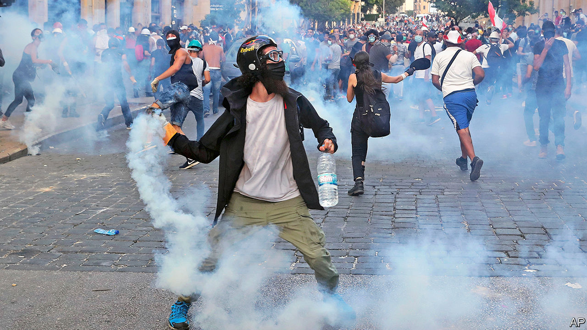

## Taking a fall

# After the blast, Lebanon’s prime minister quits

> But real change is yet to come

> Aug 15th 2020BEIRUT

THE DEAD were still being buried, victims treated, rubble cleared. But less than a week after the massive explosion at Beirut’s port on August 4th, which devastated much of the city centre, Lebanon’s leaders had returned to their usual priority: self-preservation. The prime minister, Hassan Diab, announced his resignation six days after the blast. He will linger on as a caretaker until the country’s political leaders choose a replacement. They are determined to escape blame for a disaster of their own making—and, despite the horror, many Lebanese fear they will succeed.

Everyone can agree the blast was caused by stunning negligence. For six years authorities stored at the port 2,750 tonnes of ammonium nitrate, a chemical used in bombs, despite many warnings that this was not a good idea. It may have been heaped in a hangar along with fireworks and other combustible materials. More than 200 people were killed and thousands wounded when the warehouse exploded. An estimated 300,000 people are homeless. Fixing the ruined city could cost $15bn, a quarter of Lebanon’s GDP in 2019.

No one wants to be held responsible for the negligence, however. The judge supervising an investigation is a relative by marriage of Nabih Berri, the parliament’s speaker, whose Amal party wields influence at the port. President Michel Aoun brushes off calls for an international probe. Instead politicians were keen to blame the cabinet, stocked with political outsiders, which took office only in January. Mr Diab beat them to the punch by resigning (under pressure from his own ministers).

His going may not change much. It will not force early elections, which require the approval of Mr Aoun and powerful factions such as Amal and Hizbullah, the Iranian-backed political party and militia. All oppose the idea. Instead it will cause a repeat of what happened in October, when the previous prime minister, Saad Hariri, quit amidst big protests. Lawmakers took two months to agree on a replacement.

Lebanon can ill afford such delay. Apart from the humanitarian crisis, the economy is sinking. The currency has lost 80% of its value since October. Inflation is at 90%. The country defaulted in March. The cabinet put forward a well-received economic plan to reduce debt and clean up the insolvent financial sector, only to back-pedal under pressure from bankers and MPs. Efforts to restructure debt worth perhaps 170% of GDP have stalled: bondholders do not know whom they are negotiating with. Talks with the IMF about a $10bn bail-out have led nowhere.

Yet it may be difficult to find a candidate both acceptable to parliament and willing to take charge of a collapsing country. Some MPs hope to bring back Mr Hariri. The return of a man who led the country for six years, at the helm of governments widely seen as corrupt, is not much of a change. A few other names are being floated, such as Nawaf Salam, a diplomat and judge with a clean reputation. But he would face the same problems as Mr Diab, an academic, who was brought in not to implement reforms but to defuse protests.

While politicians argue, citizens deal with the explosion’s aftermath. Volunteers throng the streets of east Beirut helping to clear debris. Universities have sent teams of engineers to check the structural integrity of damaged buildings. The vast diaspora has contributed money and materials, such as 138 tonnes of glass.

Cleaning up may prove the easy part. To rebuild will require money that Lebanon does not have. A summit on August 9th raised €253m ($297m) for health care, food and other necessities. A bigger aid package will probably require political reforms of the sort Mr Diab failed to implement. The IMF says any bail-out must be linked to changes: a recapitalisation of the banks, with the burden on shareholders and large depositors; a capital-controls law; and an audit of the central bank.

Since August 8th there have been nightly protests near parliament. The mood is furious, but the crowds are smaller than those that gathered last winter. People are preoccupied with survival: rebuilding shattered lives, navigating a brutal economy. The bleak circumstances may help the reviled political class survive as well. ■

## URL

https://www.economist.com/middle-east-and-africa/2020/08/15/after-the-blast-lebanons-prime-minister-quits
