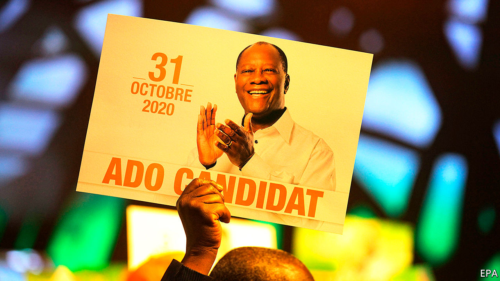

## Old actors never die

# Alassane Ouattara gambles on a third term in Ivory Coast

> His reputation, and the country’s stability, are at stake

> Aug 15th 2020NAIROBI

HE IS THE type of leader donors revere. When Alassane Ouattara became president in 2011, Ivory Coast was a ruin, despoiled by two civil wars and a decade of political turmoil. Under his stewardship the country has grown calmer and richer. He has attracted foreign investment, made inroads against corruption and presided over an economy that has grown by an average of 8% a year since he came to power. Ivory Coast was once regarded as the jewel of Francophone Africa. Mr Ouattara (pictured) has restored some of its sparkle.

Such accomplishments aside, the president appeared to have secured his reputation when, after some equivocation, he announced his retirement in March. Though he insisted that a new constitution in 2016 allowed him to seek a third (and fourth) term, the 78-year-old concluded that he would content himself with two—and then hand power to a pliant successor.

In Amadou Gon Coulibaly, Ivory Coast’s prime minister, he seemed to have just the man. Not only had Mr Coulibaly been by his master’s side for 30 years, his loyalty was so fervent that he liked to describe himself as the president’s “disciple”. Mr Coulibaly’s candidacy would prove short-lived, however. On July 8th he died.

So on August 6th, pleading “force majeure”, Mr Ouattara agreed to contest October’s election. Opposition parties have cried foul, saying he has hit his term limit.

Donors will be feeling squeamish, too. It did not help that on the very day Mr Ouattara reversed course, the ruling party in nearby Guinea asked its 82-year-old leader, Alpha Condé, to run for a third term in an election also scheduled for October.

Even so, most outsiders will probably go along with a Ouattara candidacy, if only because the alternatives are unprepossessing. The president’s chief opponent is Henri Konan Bédié, a former president who claims to be the voice of the youth. He is 86. Between 1993 and his overthrow in 1999 his government was venal and inept.

Worse, he stirred up ethnic chauvinism in a quest to prevent Mr Ouattara, a northerner, from running against him and upsetting decades of southern hegemony. The 12 years of upheaval that Ivory Coast suffered between 1999 and 2011 have much to do with Mr Bédié’s pigheadedness.

Even if a third Ouattara term represents the lesser evil (which is unclear), there are still reasons to be anxious. As leaders age they often become more ruthless. Mr Ouattara has already shown an authoritarian streak. Guillaume Soro, a rival presidential candidate and former rebel leader, was sentenced in absentia to 20 years in prison for embezzlement, charges not everyone believes. Nineteen people close to Mr Soro have been in detention since December. Other parties also complain of harassment. More worryingly, Mr Ouattara’s candidacy may increase the chance of violence. Disagreements tend rapidly to take on an ethnic dimension in Ivory Coast, where parties are rooted in ethnicity, not ideology.

Although Mr Ouattara restored stability, he did little to allay the underlying tensions that saw the country split in half when civil war erupted in 2002. Southerners chafe at Mr Ouattara’s perceived favouritism towards the north. “He tried to bring economic responses to political problems,” says Rinaldo Depagne of the International Crisis Group, an NGO based in Brussels. “Reconciliation opportunities have been missed.”

As if there has not been enough drama (“there have been more twists than a Netflix series,” says Mr Depagne), two actors have yet to walk onto the stage. The first is Laurent Gbagbo, another former president. His refusal to concede defeat to Mr Ouattara in 2010 sparked a fresh round of fighting that claimed 3,000 lives. Acquitted of crimes against humanity last year by the International Criminal Court in The Hague, he is plotting his return. Though not a candidate, Mr Gbagbo could sway the outcome should he throw his weight behind Mr Bédié. Mr Ouattara remains the favourite but a combined southern ticket could run him close.

The final actor is the army, which tends to make its entrance late in Ivorian dramas. Some of its officers are former rebels loyal to Mr Soro. Should a contested election trigger violence, some fear that the next act might be a coup d’état. ■

## URL

https://www.economist.com/middle-east-and-africa/2020/08/15/alassane-ouattara-gambles-on-a-third-term-in-ivory-coast
