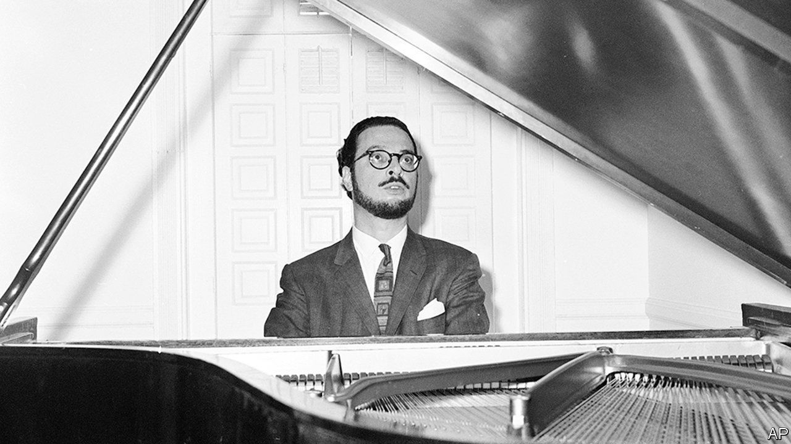

## Right hand, left hand

# Leon Fleisher died on August 2nd

> The acclaimed pianist who lost the use of his right hand was 92

> Aug 15th 2020

A  WHILE AFTER his argument with the patio table, when his sliced right thumb had had stitches and appeared to be healing, Leon Fleisher noticed a sluggishness in his right index finger. It was especially unresponsive when he tried to play trills, and that was no small matter. The ascending trills in the cadenza of the adagio of the Brahms first piano concerto, each joined by the next and then prolonged with a touch of the pedal—just a little, nothing showy—had a resonance like the shimmering of the universe.

He noticed, too, that the fourth and fifth fingers of his right hand were starting to curl under. This made the playing of triplets more or less impossible. Yet in the third movement of the Brahms they made the dancing culmination of the work, delighting him so much that they made the hairs stand up on the back of his neck.

In short he could no longer play the most important piece in his life, the one that had first struck him like Thor’s thunder on his 12th birthday, had anchored his debut as “the pianistic find of the century” at Carnegie Hall in New York when he was 16, and had been his talisman and friend ever since. He, whose greatest terror was failure, could not, in fact, play anything.

It was 1964, and he was 36. In the spring he was due to tour the Soviet Union, having performed in America and Europe all through the 1950s. He had made definitive recordings of Liszt, Beethoven and Brahms with George Szell and the Cleveland Orchestra, with Leonard Bernstein and with Otto Klemperer. Such a career had possessed him from childhood, and his slightly crazy mother had also thought of nothing else, pushing him under the nose of every eminent musician she could find in San Francisco, Pierre Monteux, Alfred Hertz, even Sergei Rachmaninoff once, as the maestro came off stage. His path had long been set.

Yet he felt he was only beginning to understand what music needed. Ten years of training with Artur Schnabel had laid down firm principles of faithfulness to the score and integrity in the playing; watching Schnabel had taught him to treasure not only each note, but also the potency of silence. In his 20s he developed his own opinions, discovering French, Russian and 20th-century composers. But now he might, after all, be going nowhere.

For 30 years his right hand was little use to him. He tried lidocaine injections, massage, psychotherapy, acupuncture, Tiger Balm. Quacks and gurus were called in. He let Bernstein pour Scotch on it. The condition had a name, focal dystonia, and a cause, over-practising, but there was no cure. At times the fingers loosened, but nothing helped for long. And since music was his life, taking priority over everything including, to his regret, his first two wives and their children, he had to keep making it somehow. Pieces like the Brahms lay not only in his fingers but in his mind and heart, and his purpose, paraphrasing Beethoven’s inscription in the “Missa Solemnis”, was to communicate their power to other hearts. He just had to find alternative means of doing so.

One was teaching. He had already been giving classes at the Peabody Conservatory in Baltimore, and now he did so, both there and at the Boston Symphony’s Tanglewood, as energetically as if his life depended on it, as it did. He also took up conducting, which—despite the oddity of standing in front of an orchestra—he greatly enjoyed. Both activities plunged him deeper into music, letting him see it through the eyes of other instrumentalists and, when he was teaching, pushing him to pin down the ephemeral beauty of notes with words alone. They went most of the way.

Yet still he was not playing. Stubbornly he went on practising a bit, though it was hopeless and probably did damage, and his attempt at a public two-handed comeback, in 1982, was a failure. Stubbornly, too, he resisted for a long time the left-hand piano repertoire. Though it was wide, most of it was bad. The whole notion seemed gimmicky, as well as an admission that, from now on, a left-handed pianist was all he could be. Old prejudices would keep surfacing. The right hand was the singer, doing most of the important work and so wearing out faster. The left balanced it and did its share, but inevitably had second billing.

The disaster that had befallen him slowly changed that view. He found left-hand masterpieces, notably Ravel’s “Concerto for the Left Hand” and a transcription by Brahms of the Bach D minor Chaconne for solo violin, which became firm favourites. Friends and colleagues wrote new pieces for him. And he discovered that his left hand, even by itself, gave him more to say at the piano. Unlike the right, it was built for the instrument, since the high tune could still be tapped out by the thumb while the other fingers kept to the bass. Besides, melody was the least important element in a piece. Rhythm came first, the heartbeat, then harmony, and these were both the province of the left hand—though they might emerge, as in the opening of the Ravel, out of the murkiest depths.

He performed that piece in concert, by his reckoning, more than 1,000 times, sliding across the stool through its leaps and glissandi, his right hand now a mere anchor to grip the frame. A later album cover of his work showed his left hand protectively covering the still-eager, straining right. But he had never quite given up hope that the same karma that had knocked him sideways might one day, equally mysteriously, heal that hand again.

By 1994 a combination of Botox and Rolfing, or deep massage, seemed to be helping. He was cautious. The pretence of his “comeback” more than a decade before still haunted him, when the cheering audience had no idea how he had struggled to control his right hand, and when he had had to rule out playing Beethoven’s fourth concerto in favour of something less exposed. This time, as it turned out, the improvement heralded a definite return to full playing. But on that first day of real hope he took no public chances. As he felt his hand properly opening again, he went instead to his study, where only the sun observed him through the windows. There, in the sunlight, with two hands, the piece growing note by note whole and complete, he played the Brahms. ■

## URL

https://www.economist.com/obituary/2020/08/15/leon-fleisher-died-on-august-2nd
