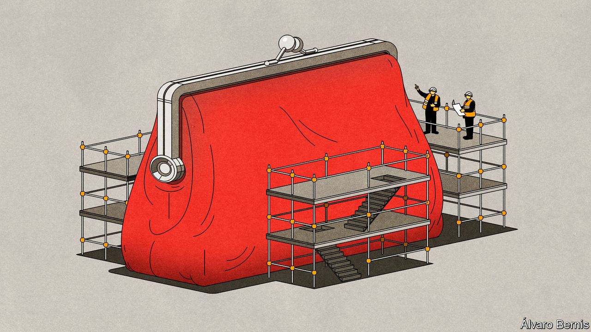
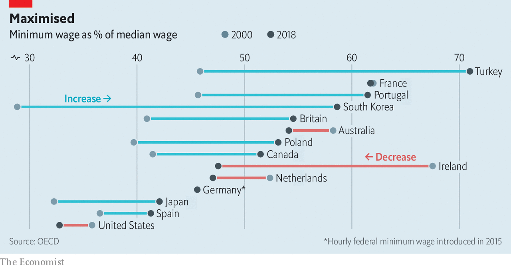

## Raising the floor

# What harm do minimum wages do?

> Three decades of research have led to a rethink

> Aug 15th 2020

FOR A LONG TIME economists—whose median income, according to a survey of the American Economic Association (AEA), is $104,000 a year—considered minimum wages to be harmful. A survey of AEA members in 1992 found that 79% of respondents agreed that a minimum wage increases unemployment among young and low-skilled workers. In an often fractious field, that is about as close to a consensus view as can be found. Although many economists recognised that low pay can indeed be a real problem, they argued that no pay was worse.

They were not the only people who thought so. The same argument was used by Republican politicians. In 1968, America’s federal minimum wage stood at its highest level since first being applied in 1938. During the following two decades it fell, in real terms, by 44%. Though Jimmy Carter raised the wage in each of the four years he was president, keeping pace with inflation, Richard Nixon raised it only twice in six years and Ronald Reagan not once in eight. Some state and local politicians, mostly Democrats, tried to offset the fall by raising their minimum wages, creating a patchwork of different levels. The disparities this created allowed detailed empirical research on the policies’ effects, and provided the means by which the economists’ consensus would be undermined.

Not only did this see the conventional wisdom on minimum wages challenged in America; it also saw such policies spread elsewhere. Britain introduced a national minimum wage in 1998, and has increased it in recent years. Germany’s came into effect in 2015. Around 90% of countries have some sort of legal wage floor, although enforcement practices vary widely. Economists now have lots of data with which to understand how minimum wages affect the economy in practice and, in the context of a promise by Democratic presidential candidate, Joe Biden, to raise America’s federal minimum wage to $15, to argue about how high they can go.

The concern that minimum wages destroy jobs comes from the most basic of economic models: supply and demand. If labour is made more expensive, employers will probably want less of it. Textbooks state that, in the absence of a minimum wage, a worker is paid his “marginal product of labour”, which means the value of what he produces. There is no room to deviate from this wage in either direction. If an employer tries to pay a worker less, a rival firm will poach him. If the government imposes a minimum wage that is higher than a worker’s marginal product, the firm loses money by employing him. He is left jobless instead.

Reality is more complex. Firms do not know how much each worker contributes to their revenues. Few workers can find a new job at the drop of a hat. Yet the basic model reveals one important truth: the workers who are most vulnerable to losing their job as a result of the minimum wage are those whose productivity is low—the very people the policy is designed to help.

More sophisticated theorising about labour markets recognises that they are not perfectly competitive. There is no single wage at which a worker has his pick of employers. As a result, firms probably pay workers less than their marginal revenue product. How much less depends on negotiations and who does best there depends on bargaining power. In this framework, the goal of the minimum wage is not to defy market logic but to stop firms in a strong negotiating position from squeezing their workers.

The upper bound on the minimum wage still applies: firms will not willingly employ workers at a loss. But below that ceiling, the effect of the minimum wage is ambiguous. It depends on a series of questions. Can a company replace its workers with machines? Can it raise prices and make its customers pay for the minimum wage? Does it face competition from foreign firms who face laxer rules overseas?

Consider a comparison between factories and restaurants. Logically, there would be little scope to increase manufacturing pay using minimum wages, because firms face stiff international competition, and jobs are constantly automated away. By contrast, jobs in restaurants are hard to automate and face no foreign competition. Any increase in costs affecting the whole sector should be passed on to consumers. Job losses should be lower—especially if it turns out that consumers are willing to pay higher prices. So can one minimum wage do justice by both sectors? 

The empirical study which revitalised the debate on minimum wages in the 1990s was by David Card and Alan Krueger, both then at Princeton University. In 1992 New Jersey increased its hourly wage floor from $4.25 to $5.05. Neighbouring Pennsylvania kept its own at $4.25. Thrilled at the prospect of a naturally occurring case study, the two economists gathered information of employment at fast-food restaurants in both states before the April increase and again several months later. Fast food seemed to offer the ideal conditions for a study, as a homogenous sector employing unskilled workers.

The increase in the wage floor did not lead to jobs being lost in New Jersey; employment in the restaurants they looked at went up. Nor did the authors find any indication that the opening of future restaurants would be affected. Looking at the growth in the number of McDonald’s restaurants across America, they saw no tendency for fewer to open where minimum wages were higher.

Their book, “Myth and Measurement” (1995), changed a lot of minds. By 2000 only 46% of AEA members were certain that a minimum wage increased unemployment among the young and low-skilled: to the rest the textbook view—that, faced with a rise in the cost of employing workers, firms would use fewer of them—was wrong. But why? Over the past 20 years a growing body of research has shown that a key consideration is the power enjoyed by employers.

This school of thought argues that some labour markets are characterised by a market structure known as monopsony. Under a monopolistic regime one dominant supplier sells to many buyers, whereas under a monopsonic regime, one dominant buyer purchases from many sellers. Just as a monopolist can set prices higher than would be the case in a competitive market, a monopsonist can set prices artificially lower.

Thus, though it may sound counterintuitive for a higher wage to lead to more employment, it makes sense if what the legislation is doing is pushing a wage kept artificially low by monopsony back to where it would be in a market where supply and demand were matching each other freely. People who may not have bothered to look for a job at $10 an hour may be drawn into a job market offering $15 an hour. Push the minimum wage significantly beyond that point, though, and jobs will indeed be lost as companies find labour too expensive to afford.

Once the role of competition in the labour market is accepted, the debate on minimum wages becomes more nuanced and more empirical. Gathering data is not easy. Researchers must consider whether to track jobs or workers, and whether to study certain groups, such as teenagers or the unskilled, or broader sectors. And the job market is affected by more than just minimum-wage rules. Constructing reasonable counterfactuals is hard.

Consider an example from Seattle. The city has been at the forefront of the “fight for $15” campaign that led to Mr Biden’s pledge, and its rapid wage rises have made it an attractive laboratory for economic studies, despite the fact, some grumble, that it is unrepresentative. A paper by Ekaterina Jardim and others at the University of Washington, published in 2017, found that minimum-wage increases in the city in 2015 and 2016 led to employers reducing hours in low-paid sectors. The average low-paid worker earned more per hour but, because they worked fewer hours, their monthly earnings dropped by $74—the equivalent of five hours’ pay.

That paper used aggregate data on hours and earnings by sectors. In a paper published in 2018, the same authors used administrative data to track individual workers rather than looking at averages. This time they found that low-paid workers saw their weekly earnings increase by $8-12 a week. The majority of that gain, though, was taken by low earners with above-median experience levels and some of it from workers making up lost hours worked in Seattle with additional hours elsewhere in Washington state.

In 2019 a review commissioned by the British government of more than 50 recent empirical studies into wage floors found the effect on employment to be generally muted, even with relatively ambitious increases. Yet some studies did find higher impacts. Arindrajit Dube, the author of the review, warned that the evidence base is still developing. It is, for instance, too soon to opine on South Korea’s 25% increase in its minimum wage between 2016 and 2018.

The effects of a wage floor can also be felt outside low-pay sectors. A preliminary study in 2019 of the impact of Germany’s minimum wage found it led to more reallocation of workers from smaller, lower-paying firms to larger, higher-paying ones. The same year an article in the Quarterly Journal of Economics found that the impact of minimum-wage laws on average earnings was amplified by small but important spillover effects higher up the earnings ladder. Employers tend to want to maintain some sort of wage differential for staff with more responsibility. So if the minimum wage boosts the pay of fast-food workers, then restaurants may also need to raise the pay of fast-food supervisors.

Who pays for the minimum wage? In theory a higher cost base could be passed on to consumers through higher prices, or absorbed by employers through lower profit margins. In reality the answer varies by market. In competitive sectors, such as fast food, research has found that a 10% increase in the wage floor pushes up burger prices by just 0.9%. In 2019 a study of supermarkets in Seattle found no impact on grocery prices from big increases.

Economists no longer think higher minimum wages are always bad. But that is not the same as saying they are always good. In 2018 a paper by Isaac Sorkin and others cautioned policymakers to take a longer-term view, rather than worry about short-term unemployment. Its authors found that if firms perceived a higher wage floor to be permanent and unlikely to be eroded by inflation, it could encourage them to automate more and decrease employment growth in the future. The idea that a minimum wage can sometimes lead to higher rather than lower employment does not mean it always will. When pushing up the floor, policymakers need to ensure they do not hit the ceiling. ■

## URL

https://www.economist.com/schools-brief/2020/08/15/what-harm-do-minimum-wages-do
