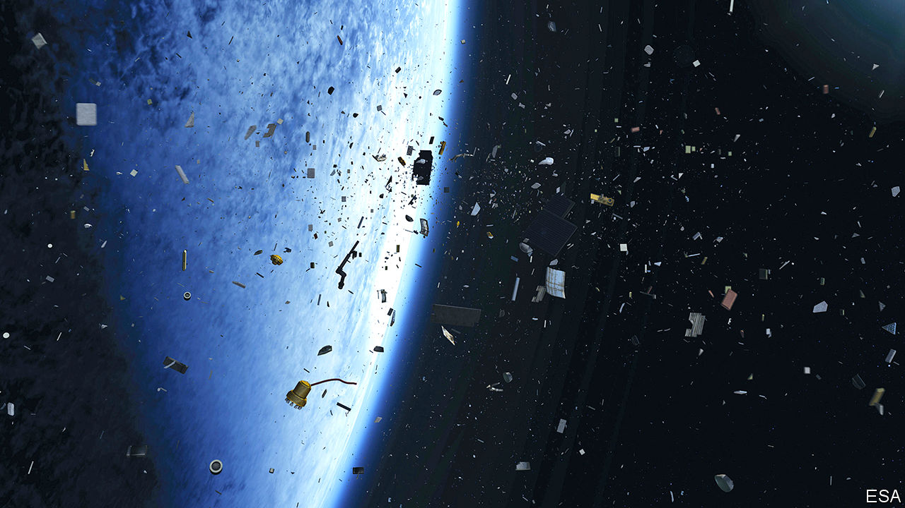

## Satellite warfare

# An arms race is brewing in orbit

> Experts want to clarify how the laws of war on Earth apply beyond it

> Aug 15th 2020

KOSMOS 2542, a Russian satellite that was launched in November, was “like Russian nesting dolls”, said General John Raymond, head of America’s newly formed Space Force, in February. Eleven days after its launch it disgorged another satellite, labelled Kosmos 2543. Then, on July 15th, Kosmos 2543 itself spat out another object, which sped off into the void.

Merely a “small space vehicle” to inspect other satellites, said the Russians. Nonsense, said the Americans; it was a projectile. The intent, said Christoper Ford, the State Department’s top arms-control official, was to signal Russia’s ability to destroy other nations’ satellites.

Anti-satellite weapons are not new. During the cold war, America and the Soviet Union developed several ways to blow up, ram, dazzle and even nuke each other’s satellites. The countries conducted two-dozen anti-satellite tests between them. Ten were “kinetic”, involving a projectile physically striking a target.

But new competitors, and new technologies, mean anti-satellite warfare is a hot topic once again. China has conducted ten tests over the past 15 years, including a kinetic one in 2007 that created a great deal of space debris. India conducted its first kinetic test in 2019. America, Russia and China have all manoeuvred their satellites close to others, sometimes provocatively so. New methods of attack are being tested, including lasers and cyber-attacks.

There is little in the way of law or custom to restrain this new arms race. Alarmed by the risks, several groups of diplomats and lawyers are trying to change that, and work out how to extend the laws that cover Earth-bound war into orbit.

They must grapple with several thorny issues that make space war different from the terrestrial sort. Some satellites, such as America’s GPS constellation, blur the distinction between military and civilian assets. Over the past decade, America’s armed forces have put payloads on three commercial satellites, and plan to pay Japan to host others on its own navigation satellites.

Then there is the question of what counts as an attack. Michael Schmitt, a law scholar, and Kieran Tinkler, a professor at the US Naval War College, say it is unclear whether jamming a civilian satellite would violate the general prohibition on attacking civilian objects. Blowing up a military one, meanwhile, might or might not constitute an indiscriminate (and hence illegal) attack, depending on whether it could have been disabled by other means and how much debris was produced.

Perhaps the biggest difference between space war and terrestrial war is how long the consequences can last. Much of the debris from China’s 2007 test, for instance, will still be in space at the turn of the next century. The more debris, the greater the likelihood of accidental collisions with other satellites, which generates more debris in turn. Enough debris could lead to a chain reaction known as Kessler syndrome, which could render entire swathes of near-Earth space unusable for decades.

For now, there are no widely accepted answers to any of these questions. The Outer Space Treaty of 1967 requires states to consult each other on actions that “would cause potentially harmful interference”, though the rule has rarely been heeded. Most countries accept that, in wartime, a body of existing laws known as international humanitarian law would apply, as on Earth—something America confirmed in its “Spacepower” doctrine, published on August 10th. International humanitarian law is based on principles such as distinction (between combatants and civilians) and proportionality (between civilian harm and military advantage). But how to apply such ideas in a place with few humans is not always obvious.

In other domains of war, like naval conflict, legal manuals spell out what is and is not permissible. Legal experts are now attempting to do this for space. The Manual on International Law Applicable to Military Uses of Outer Space (MILAMOS) is being spearheaded by McGill University, in Montreal, and a separate Woomera Manual by the University of Adelaide. Both hope to publish their documents next year.

Hitoshi Nasu, a director of the Woomera project, says that—perhaps surprisingly—big countries are genuinely interested in complying with international law in war, if only to deprive their rivals of an excuse to break the rules. The trickier and more pressing issue, he says, is clarifying the day-to-day rules in peacetime, which might help avert a conflict in the first place.

Russia and China would like a formal treaty banning all weapons in space. Both are keen to prevent America from deploying space-based anti-missile systems which might threaten their own nuclear forces. America and its allies resist this. They argue that it is impossible to define a space weapon—anything that manoeuvres in orbit could serve as one—and that it would be easy to cheat.

The European Union has instead proposed a voluntary code of conduct. Many non-Western countries would prefer a binding treaty, says Daniel Porras of SWF. Though most are not space powers, many are likely to become so in the future, so their buy-in is important. Later this month Britain will publish a draft UN resolution seeking views on behaviour in space, with the results to be submitted to the secretary-general next year.

A group of experts has met regularly at the UN to try to hash out a solution, without much progress. On July 27th America and Russia held a 13-hour “space security exchange” in Vienna, the first such talks in seven years. It produced warm words, but is unlikely to lead to new laws—especially with existing arms-control collapsing.

Back in orbit, the problem is pressing. In January America complained that Kosmos 2542 and 2543 had tailed a spy satellite in an “unusual and disturbing” way (American satellites have also sidled up to others in the past). As space gets more “congested and contested”, the diplomats and lawyers have their work cut out. ■

## URL

https://www.economist.com/science-and-technology/2020/08/15/an-arms-race-is-brewing-in-orbit
