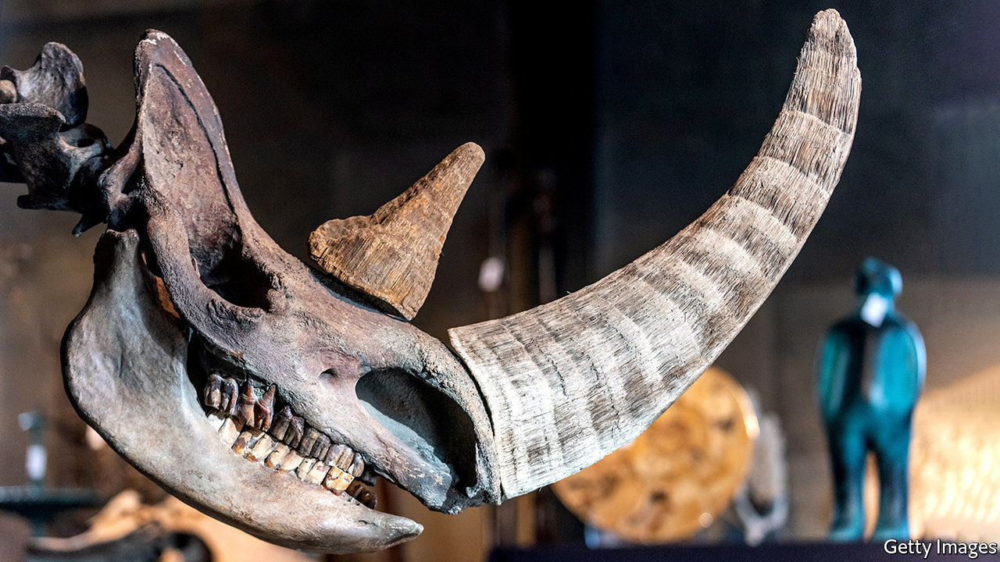

## An ancient murder-mystery

# What killed the woolly rhino?

> Not humans, for a change

> Aug 15th 2020

FROM THE moa in New Zealand to the dodo in Mauritius, the arrival of humans has often spelled extinction for tasty but previously isolated animals. Many scientists had assumed that the woolly rhinoceros, a shaggy beast that sported an enormous horn, suffered the same fate. The animal was common in northern Europe and northern Asia 30,000 years ago, when the first humans arrived. Shortly after, it disappeared.

But Love Dalén, a professor at the Centre for Palaeogenetics in Stockholm, and Edana Lord, one of Dr Dalén’s PhD students, are not so sure. In a paper published in Current Biology, they use data from ancient DNA to argue that, this time at least, humans might be innocent.

Until recently, information on the fate of the great ice-age mammals had been limited to what could be gleaned from fossilised bones. While useful, bones can only tell you so much. They can reveal the number of animals of different ages present at a specific location at a specific time. With some species sex can be determined. Occasionally the cause of death can be detected.

In the past couple of decades, though, scientists have learned to tap another, richer source of information: ancient genomes. By itself, DNA degrades quickly, attacked by water and sunlight. But DNA encased within bones and teeth can survive for longer, especially if those bones and teeth are themselves encased in permafrost. It was this sort of DNA that enabled Dr Dalén and Ms Lord to investigate the woolly rhino’s disappearance.

Working with a team of colleagues, the researchers obtained DNA from 12 woolly-rhinoceros bones collected from permafrost in Siberia, dating from the beginning of the Late Pleistocene, about 130,000 years ago, until the animals were on the verge of extinction. Extra DNA was recovered from one sample of rhino hair and one piece of tissue found in the stomach of a frozen wolf that had been preserved by the cold.

Analysing the genetic diversity of the samples allowed the researchers to make a rough calculation of the size of the woolly-rhino population over time. Rather than declining as humans arrived, the population remained stable from 29,000 years ago until 18,500 years ago, just a few thousand years before the species went extinct.

That suggests that, far from being hunted to extinction, the rhinos co-existed stably with humans for around 10,000 years. Perhaps the people who encountered the beasts found them unpalatable. Or perhaps the rhinos were simply too dangerous to hunt with their simple weapons. (They were the size of the modern white rhino, which is not an animal that takes kindly to being stabbed with spears.)

The researchers’ case is not quite conclusive. It is possible that some sort of technological advance eventually gave ancient humans the ability to hunt rhinos safely, and that extinction followed after that breakthrough. On the other hand, the animals’ decline lines up suggestively with a rapid bout of global warming that began around 14,700 years ago. The researchers argue that this was the more likely cause of the animal’s disappearance. This time, it seems, it was Mother Nature whodunnit. ■

## URL

https://www.economist.com/science-and-technology/2020/08/15/what-killed-the-woolly-rhino
