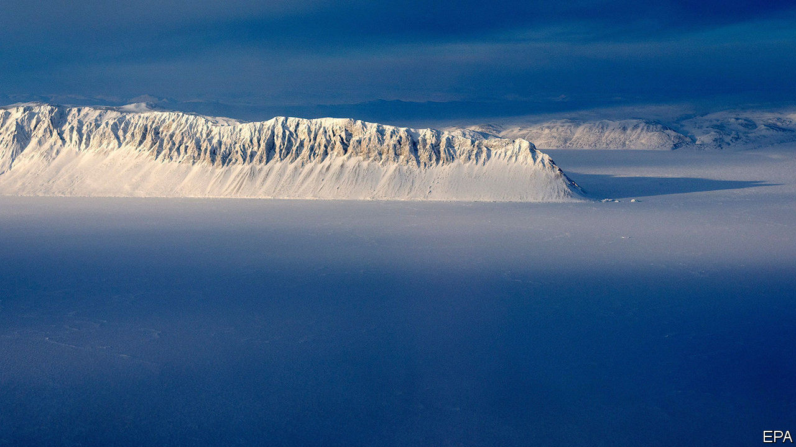
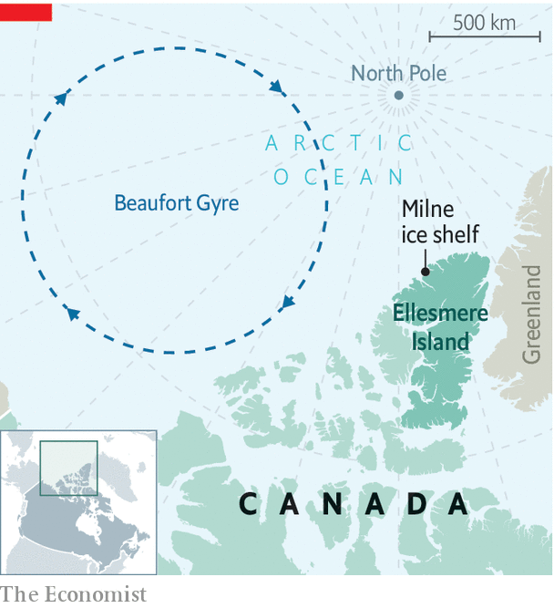

## A shortened shelf life

# Canada’s last intact ice shelf breaks up

> The fate of a rare “epishelf lake” is unknown

> Aug 15th 2020OTTAWA

THE LAST whole ice shelf in Canada’s Arctic was no match for this summer’s heatwave. In northern Ellesmere Island temperatures since May have been 5⁰C warmer than the 30-year average of 0-1⁰C. On July 30th-31st, the 80-metre (260-foot) thick Milne ice shelf, which juts out from the island’s north-western coast, split in two. A slab measuring 80 square km (31 square miles), more than 40% of the shelf’s surface area, broke away. By August 3rd the wandering wedge of ice split again. The two strays will now drift on the Beaufort Gyre current as they melt away (see map).

A century ago Ellesmere’s northern coast had one 8,600 square km shelf, a floating island of ice driven onto shore some 4,000 years ago. During the 20th century it broke apart. The Milne shelf is the biggest remaining constituent. Derek Mueller, a geography professor at Carleton University in Ottawa who began documenting the ice shelves’ erosion in 2005, has seen the smaller ones collapse. Until now the Milne shelf had been protected by the high walls of the narrow 30km fjord along which it stretches.

The breakaway block, a frozen chunk of the Arctic Ocean, will not itself raise sea levels. But the shelf’s disappearance would remove a stopper that prevents melting glacial water from seeping into the ocean, notes Luke Copland, a glaciologist at the University of Ottawa.

As the ice vanishes, so do ecosystems dependent on it. Mr Mueller must wait until next July to learn the fate of one habitat, a rare epishelf lake. This is a body of ice-covered fresh glacial water trapped between the Milne shelf and the fjord’s wall. Using ice-penetrating radar he and his team discovered a channel consisting of a layer of fresh water atop one of seawater that under some circumstances conducts some of the lake’s water to the ocean. To their surprise, a robot camera lowered into the channel revealed abundant sea life, including anemone, scallops, brittle stars (similar to starfish) and Arctic cod.

Covid-19 obliged Mr Mueller to cancel this summer’s trip to Ellesmere Island. He had hoped to bring back specimens from the channel to figure out, among other things, how long the animals have been there. The shelf’s collapse probably destroyed equipment that checks air and water temperatures. It may also have damaged or drained the epishelf lake and its channel to the sea.

Although the shelves are just fringes along much bigger masses of ice, their disappearance is among the most dramatic signs that the Arctic’s climate is changing profoundly. Since 2007 the mean temperature in summer has flipped from below freezing to above it. The consequences will be felt far beyond the north.

## URL

https://www.economist.com/the-americas/2020/08/15/canadas-last-intact-ice-shelf-breaks-up
