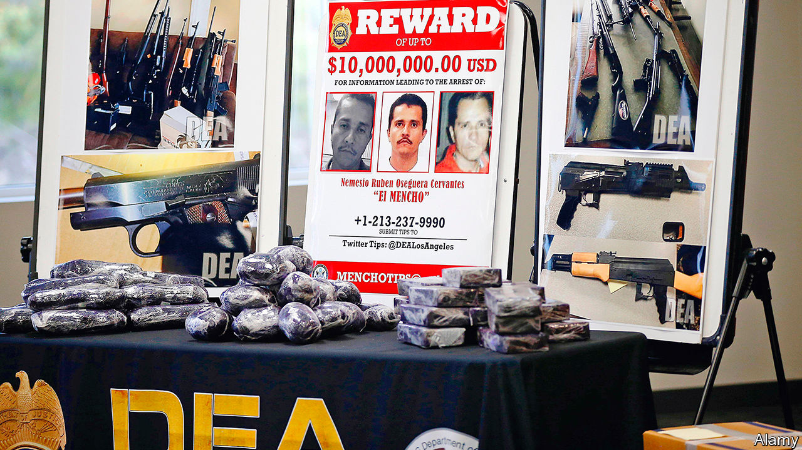

## Hand-ups, not handcuffs

# How will Mexico’s president handle “El Mencho”, a kingpin on the rise?

> Andrés Manuel López Obrador’s policy of “hugs, not bullets” faces a new challenge

> Aug 15th 2020MEXICO CITY

PLOT TWISTS in Mexico’s underworld happen quickly. In Netflix narco-dramas, Joaquín (El Chapo) Guzmán, the former boss of the Sinaloa drug gang, is the country’s chief mobster. In real life Mr Guzmán is serving a life sentence in a Colorado prison. He has been eclipsed by Nemesio Oseguera Cervantes, the boss of the Jalisco New Generation Cartel (CJNG). Five years ago it appeared for the first time in the list of top drug-trafficking gangs put out by the United States’ Drug Enforcement Administration (DEA). Today Mr Oseguera (aka El Mencho, derived from Nemesio) is the agency’s most-wanted suspect. It calls the CJNG “one of the five most dangerous transnational criminal organisations in the world”. It wants Mexico to nab its boss.

Mexico’s president, Andrés Manuel López Obrador, who is normally keen to co-operate with the United States, may in this case have reservations. A left-wing populist, he has never endorsed his predecessors’ policy of capturing or killing kingpins. With reason. The tactic caused gangs to fracture and proliferate. The former bosses’ lieutenants battled bloodily for control, pushing up the murder rate. Gangs diversified and entered new territories.

The implementation of the kingpin strategy may have been corrupt. The government of Felipe Calderón, Mexico’s president from 2006 to 2012, locked up El Chapo’s rivals but rarely members of the Sinaloa gang. Mr Calderón’s security minister, Genaro García Luna, was arrested on charges of taking $50m in bribes from gangs. He is expected to go on trial in the United States. He denies wrongdoing.

Mr López Obrador has taken a different approach to criminals, based on a philosophy of “hugs, not bullets”. He has had 20 months in office to prove that his pacific policy can work, but so far the results are disappointing. American pressure, and El Mencho’s outrages, could oblige him to adopt tactics he has hitherto resisted.

In June this year Mr Oseguera, now in his mid-50s, allegedly ordered the murder of a federal judge who approved the extradition of his son to the United States. Ten days later, in a posh neighbourhood of Mexico City, gunmen shot at a car carrying Omar García Harfuch, the police chief, killing two bodyguards and a bystander. Mr García, nursing three bullet wounds, accused the CJNG from his hospital bed. Killings of federal judges are rare; the attack on Mr García is unprecedented in its brazenness.

Mr Oseguera owes his rise to the tumult triggered by Mr Calderón’s decapitation strategy, which was continued by his successor, Enrique Peña Nieto. Caught selling heroin in San Francisco in 1992, Mr Oseguera spent three years in a Texan prison and was then deported back to Mexico, where he soon found work as a policeman in the western state of Jalisco. He joined the Milenio drug gang, which split into warring groups after its leaders were locked up. Mr Osegura’s faction became the CJNG.

He is a more shadowy figure than El Chapo. Many of his closest associates have never met him. He deals with them mainly through relatives. Mr Oseguera is thought to be living somewhere in the mountains in one of three neighbouring states: Jalisco, Colima or Michoacán.

The gang he leads now has operations in 27 of Mexico’s 32 states (but has rivals in most). It has succeeded in part because it was among the first to diversify away from cocaine into synthetic drugs like meth and, just as Americans were becoming hooked on opioids, fentanyl. The CJNG’s base is near Manzanillo and Lázaro Cárdenas, seaports where precursor chemicals arrive from China. It oversees manufacture of the drugs (often by independent labs) and ships them to the United States. Unlike the Sinaloa outfit, the CJNG makes much of its money from extortion, robbery, fuel theft and domestic drug-dealing.

Law-abiding Mexicans suffer more from the new business model than the old. The CJNG subjects them to penalties that gangs once reserved for competitors. Last year CJNG gunmen burned down a nightclub in Veracruz, killing 32 people. The owner had refused to pay extortion money. At the same time, the gang poses as the friend of common folk. “You know well that I like to support the people,” a masked figure claiming to be El Mencho told residents of Tepalcatepec, Michoacán, in a video that declared war on a local crime boss. He offered to pay local members of Mexico’s national guard double the money that they get from his rivals. In 2016 a CJNG detainee boasted to his captors that half of Jalisco’s municipal police were on its payroll.

When Mr López Obrador’s government has pursued crime bosses, it has done so reluctantly. Last year, perhaps in response to pressure from the DEA, police and soldiers captured Ovidio Guzmán, El Chapo’s son, in Culiacán, Sinaloa. After the gang threatened retribution, the president quickly ordered his release. A massacre would have left his government “with very little moral authority” and “put at risk” his plans to transform Mexico, he explained in May this year.

This month, after the CJNG’s spree, the government arrested José Antonio Yépez, the head of the Santa Rosa Lima gang in Guanajuato, Mexico’s bloodiest state. Mr López Obrador may have targeted Mr Yépez because his gang specialises in stealing fuel from pipes belonging to Pemex, the state-owned oil firm, which is a pillar of the president’s economic-development strategy. The arrest of Mr Yépez, who had been battling the CJNG for control of Guanajuato, is more likely to empower Mr Oseguera than worry him.

Mr López Obrador’s answer to crime is hand-ups, not handcuffs. He contends that violence is the result of poverty caused by three decades of “neoliberalism”. His administration would end poverty and therefore crime, he claimed. Among its flagship programmes is a nationwide apprenticeship scheme.

There are other elements to his crime-fighting policy, but they are not very effective. He created a national guard, which will have 60,000 troops at full strength, to replace the 37,000-member federal police, but it has made little difference. State and municipal police continue to be underpaid, ill-equipped and badly supervised. This year the federal government told states to divert money from a fund for improving policing to hospitals coping with covid-19.

The government claims some successes. Its Financial Intelligence Unit froze nearly 2,000 bank accounts belonging to the CJNG. The Trump administration accepted Mexico’s demand that it help reduce the flow of weapons to Mexico, but has done little in practice. In March, before the pandemic chased people indoors, 2,628 people were murdered, a monthly record. The lockdown barely reduced the carnage.

If Mr López Obrador’s theory about the connection between poverty and crime is correct, things may get worse. Mexico’s economy is expected to shrink by around 10% this year. GDP will not regain its level of 2018 until 2024, predicts BBVA, a bank.

A dominant CJNG, facing less defiance from other gangs, might lead to a reduction in today’s record murder rates. What now happens in Guanajuato will be “an ideal case study”, says Cassius Wilkinson, a security analyst at EMPRA, a risk-consulting firm in Mexico City.

But there are reasons to doubt that the CJNG will be capable of imposing an unlawful peace, not least competition from such outfits as the Santa Rosa Lima group. The CJNG’S expansion has come about partly through local gangs adopting its name. They may prove fickle. The goons who shot Mr García appear to have been hired guns. El Mencho is thought to have a kidney disease; to treat it he is said to have built a hospital in the mountains of Michoacán. Some analysts wonder if the point of his recent audacity is to scare internal challengers.

His relative weakness does not mean that a government determined to nab him would have an easy time of it. El Mencho seems to have learned from past kingpins like El Chapo, who was captured three times—and escaped twice. He lives less lavishly. Mr Peña’s government tried to catch Mr Oseguera in 2015. He was tipped off by someone in the army. His men shot down a military helicopter and blockaded Guadalajara, Jalisco’s capital, with burning vehicles. Ten soldiers died and Mr Oseguera slipped away. He may never achieve the dominance that El Chapo and his kind once exercised in parts of Mexico. But he remains just as dangerous.

Correction: this article originally misspelled the name of Nemesio Oseguera Cervantes

■

## URL

https://www.economist.com/the-americas/2020/08/15/how-will-mexicos-president-handle-el-mencho-a-kingpin-on-the-rise
