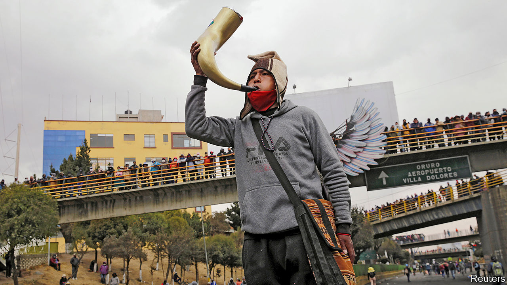

## Democracy deferred

# Protests and the pandemic bring chaos to Bolivia

> A crisis of legitimacy that even an election may not solve

> Aug 15th 2020SÃO PAULO

MOST OF THE liquid oxygen in Bolivia comes from Santa Cruz, many miles and many mountains away from other cities. For years doctors urged Evo Morales, the socialist president who was overthrown last November, to boost production in La Paz, the administrative capital, or to equip hospitals with systems to make their own. Supplies were running low even before August 3rd, when supporters of Mr Morales, Bolivia’s first president of indigenous origin, began blockading roads across the country to protest against the second postponement of a general election because of the covid-19 pandemic. Since then, at least 30 people have died because of oxygen shortages, according to the interim government. Protesters say they are letting oxygen trucks and ambulances pass.

“We were already living through a tragedy, but this is a massacre,” says Fernando Romero of the public-health workers’ union. More than 200 doctors and nurses have died from the virus. Personal protective equipment, covid-19 tests and intensive-care beds are in short supply. The precarious health system is a legacy of Mr Morales, who resigned during protests provoked by suspicions that he tried to rig his re-election. But there is plenty of blame to go around. Jeanine Áñez, the right-wing caretaker president, has been an incompetent crisis manager.

The pandemic and the protests are feeding off each other to deepen a crisis that began when Mr Morales ignored the constitution to run for a fourth term. Faith in the legitimacy of Bolivia’s institutions worsens with each month that goes by without an elected president (and with legislators whose mandates have expired). Politically unstable when the pandemic hit, Bolivia is descending into chaos.

The electoral tribunal now says that the vote, a precondition for restoring stability, will take place on October 18th, a year after the original flawed election. But to Ana Suñagua, a student who dragged tyres to help set up a roadblock on a highway outside La Paz, this is another empty promise. Not long after Ms Áñez swore that her only goal was to lead Bolivia through a transition, she announced that she would run for president. Then her government filed charges against members and former officials of the Movement to Socialism (MAS), Mr Morales’s party, for various misdeeds, including sedition. To many, that seemed politically motivated. “Now she’s using the pandemic as an excuse to stay in power,” Ms Suñagua said by phone over the clangs of protesters hitting rocks against highway guardrails and the explosions of tear-gas canisters fired by police.

Bolivia has reported 95,071 covid-19 cases and 3,827 deaths. The real numbers are probably much higher. Last month, police recovered the bodies of 400 people from streets and homes over five days. Four-fifths are thought to have died from covid-19. Patients wait eight to ten days for results from covid-19 tests, which makes them nearly useless. In May the health minister resigned and was arrested on suspicion of corruption involving overpayment for 170 respirators from Spain. He denies wrongdoing.

Even when Ms Áñez does something sensible to contain the pandemic, such as imposing an early lockdown, its effect is blunted by the hostility she provokes. “Everything she says and does is seen as suspicious” because of her candidacy and her attacks on the MAS, says María Teresa Zegada, a sociologist. Bolivians have been stockpiling oxygen canisters at home, exacerbating the oxygen shortage, along with a toxic disinfectant falsely touted as a cure by the MAS-controlled congress. The government has cancelled classes, both in schools and online, for the rest of the year, admitting that it had failed to bring digital teaching to rural pupils.

Like the protests last year, the blockades have begun to take on a life of their own. Demands by indigenous groups and labour unions for prompt elections have evolved into a demand for Ms Áñez’s resignation. Marginalised since Mr Morales left office, they are trying to reclaim their seat at the negotiating table, says Fernando Molina, a journalist. Mr Morales’s enemies are raising the tension. Luis Fernando Camacho, who led last year’s uprising against him and is now a presidential candidate, urged thuggish citizen groups called cívicos to break up the protests. Clashes landed several people in hospital with bullet wounds.

There is a glimmer of hope. After talks mediated by the Catholic church, the European Union and the UN, the government offered to accept a law guaranteeing that elections would not be postponed again. In a tweet from Argentina, where he is in voluntary exile, Mr Morales asked protest leaders to lift the roadblocks, which he had initially encouraged. Anger about oxygen shortages could hurt the MAS at the voting booth, admits Diego Pary, a foreign minister in Mr Morales’s government. Polls suggest that the MAS’s presidential candidate, Luis Arce, a former finance minister, will face Carlos Mesa, a centrist, in a second round. But a fifth of voters are undecided. As The Economist went to press, it was unclear whether protesters would heed Mr Morales’s call to clear the roads. Said one diplomat: “He created a bit of a monster.”■

Editor’s note: Some of our covid-19 coverage is free for readers of The Economist Today, our daily [newsletter](https://www.economist.com/https://my.economist.com/user#newsletter). For more stories and our pandemic tracker, see our [hub](https://www.economist.com//news/2020/03/11/the-economists-coverage-of-the-coronavirus)

## URL

https://www.economist.com/the-americas/2020/08/15/protests-and-the-pandemic-bring-chaos-to-bolivia
