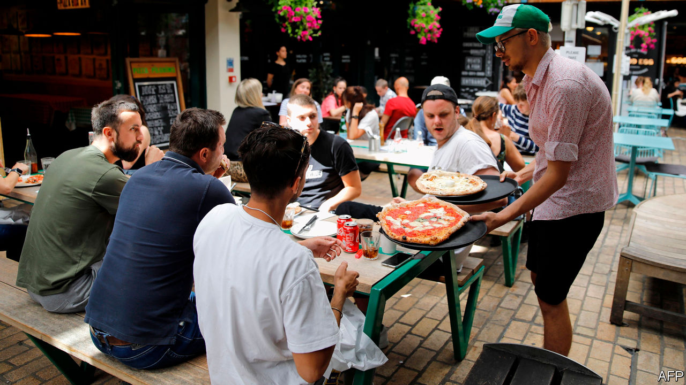
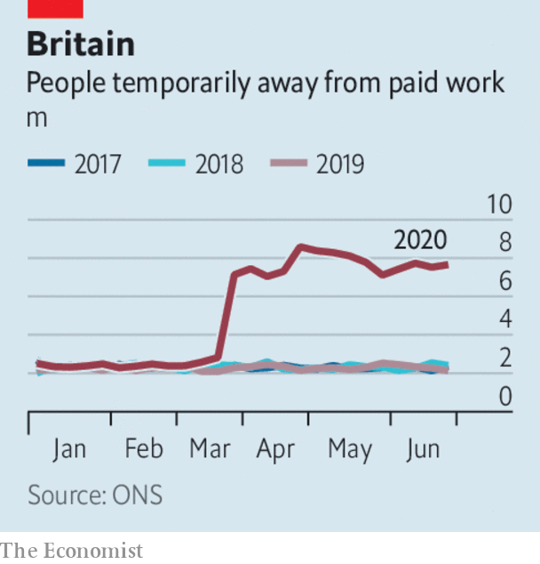

# Business this week

> Aug 15th 2020

Britain’s economy plunged into recession in the second quarter, as GDP contracted by a record 20.4% compared with the previous three months. In the first half of 2020 the British economy was hit twice as hard as America’s and fared worse than Germany, Italy and France. There was a sliver of positive news—growth picked up again in June. That will be of little comfort to those facing the end of furlough. Figures also showed a huge drop in the number of people in employment, and redundancies are at a seven-year high. The government’s job-retention scheme will soon start to wind down, though millions still depend on it (see chart). See [article](https://www.economist.com//node/21790867).

The hospitality industry in Britain has been missing all those absent workers. A government scheme to help the industry by subsidising meals in restaurants, pubs and cafés during August was used by 10.5m diners in its first week. Each customer gets up to £10 ($13) deducted from his meal on Mondays to Wednesdays; the restaurant claims the money back from the Treasury.

America’s unemployment rate fell again in July, to 10.2%. Employers created 1.8m jobs, fewer than the 4.8m that were added to the payrolls in June, when lockdowns eased. 

With Democrats and Republicans at loggerheads over a new stimulus package, Donald Trump issued an executive order that, among other things, would reinstate the additional unemployment benefits that ceased in July (though at $400 a week rather than $600) and defer the collection of payroll taxes. The order’s intent may be to concentrate minds; the extra benefits depend on contributions from cash-strapped states. See [article](https://www.economist.com//node/21790921).

Mr Trump also issued orders banning ByteDance, the Chinese owner of TikTok, from America within 45 days and a similar decree curtailing American firms from doing business with WeChat. As with many of Mr Trump’s dictums, the legality of the president’s latest orders is questionable, though they undoubtedly create uncertainty for the companies involved. The share price of WeChat’s parent company, Tencent, was hammered following his pronouncement.

Despite a big drop in quarterly profit, Saudi Aramco said it would still pay a shareholder dividend, most of which goes to the Saudi government. The oil company’s net income in the three months to June 30th was $6.8bn; in the same quarter last year it made $24.7bn. Unlike other oil companies, Aramco has not written down assets because of lower oil prices, but it will slash spending. Occidental cut the value of its assets this week, and reported a quarterly loss of $8.4bn. See [article](https://www.economist.com//node/21790901).

The $765m loan that the American government said it would provide to Kodak to produce generic drugs was put on hold until allegations of wrongdoing are resolved. The company’s share price soared when the loan was made public, but the timing of the announcement has led to claims of insider trading that are being investigated by regulators and Congress. Kodak is co-operating with the inquiries; its stock has plunged by 70% since its post-announcement peak.

Airbnb is reportedly preparing to file documents for an IPO, which could take place later this year. The home-rentals firm has said that demand is picking up, especially for properties that are closer to home for holiday-makers.

Tesla announced a five-for-one split of its stock. From August 28th each shareholder will receive four extra shares for each share they hold, at the reduced price. With the value of its stock tripling since the start of the year, the intention is to make the shares more attractive to small investors. Apple recently split its stock, as its share price has also rocketed in value.

Following its biggest-ever loss earlier this year, SoftBank swung back to a quarterly profit, of ¥1.25trn ($12bn), mostly because the value of its holdings in tech companies rose and it sold a large chunk of its telecoms assets. The Japanese conglomerate is also considering selling some or all of Arm, a British chip designer it bought in 2016 for $32bn. 

Steve Easterbrook, who was sacked by McDonald’s as chief executive last November for having a romance with an employee, was sued by the company, which claims he had three additional sexual relationships with staff. McDonald’s said that if it had known about the extent of Mr Easterbrook’s “inappropriate” behaviour it would not have agreed to the compensation package it paid him.

Sumner Redstone died, aged 97. The media mogul’s empire spanned Paramount Pictures, Viacom and CBS. Feuds among family and management over the ownership of his companies entangled Mr Redstone in legal proceedings for years, and his mental competency was challenged as he got older. He once said that success is built on failure, frustration and sometimes catastrophe.

## URL

https://www.economist.com/the-world-this-week/2020/08/15/business-this-week
