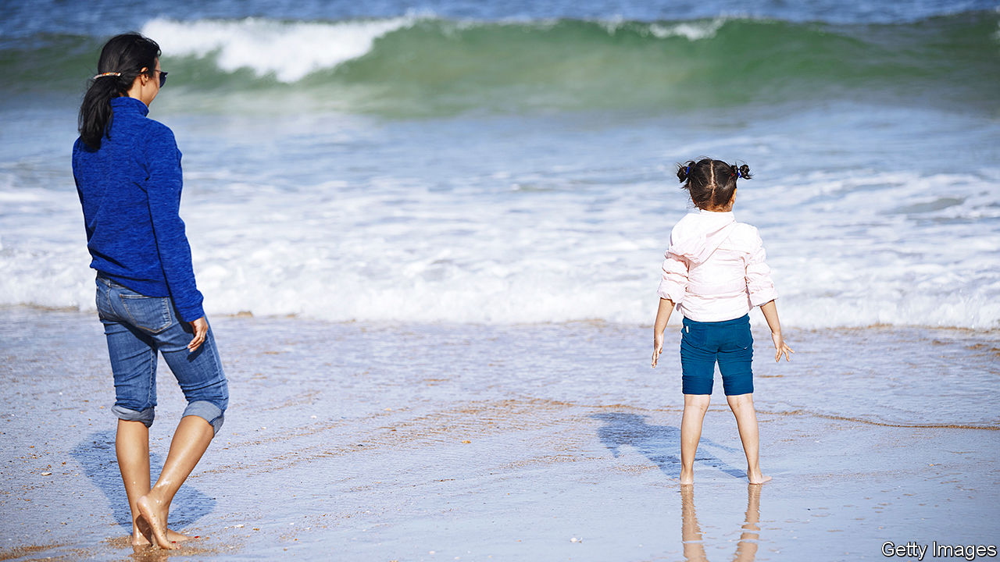

## Au-pair wars

# America’s au-pair programme is under assault from Donald Trump and the left

> Changed immigration rules create a bidding war for nannies

> Aug 13th 2020

WITH SO MANY schools and child-care facilities closed in the pandemic, getting an au pair to help with the children can make a big difference. So it came as a jolt to parents when, on June 22nd, the president suspended the arrival of new au pairs, along with some other sorts of foreigners, until at least the end of the year. His order, meant to protect American jobs, has stranded crowds of would-be au pairs in their home countries. Au pairs already in the United States have fared somewhat better.

Replacing the au pairs who leave the United States when their contracts expire requires about 20,000 new arrivals a year. Now that the number of au pairs in the country is dwindling, the number of desperate families is climbing correspondingly, says Ilir Zherka, director of the Alliance for International Exchange, an industry association in Washington, DC. The result, says Katherine Gallagher Robbins, head of child care at the Centre for Law and Social Policy, an advocacy group in the same city, has been “total chaos”. Wealthier families, she explains, have begun poaching au pairs from households with lower incomes.

Au pairs have typically received a weekly stipend of $195.75, the legal minimum. Now an au pair willing to switch homes can easily secure $500 a week, says Anna Edhegard, a host mother in Alexandria, Virginia. Many parents, she notes, now use social media to attract an au pair by dangling perks like a nice car. Another Alexandria mum, a covid-19 researcher, hopes to secure a “national-interest” exception for her would-be au pair, who is stuck in Colombia. But she frets that if an exception is granted, her au pair may be tempted to “rematch” later with a family offering more money.

The au-pair programme is also under siege from left-leaning outfits that call it exploitation. If you discount room, board and money for education, the minimum stipend works out at $4.35 for each hour of a 45-hour week. This is because au pairs are regulated not by the Department of Labour but by the Department of State, which considers the programme to be a form of cultural exchange and grassroots diplomacy. Colin Seeberger of the Centre for American Progress, a progressive think-tank in Washington, puts it bluntly: “Cheap au-pair labour shouldn’t really exist.”

Au pairs, argues Janie Chuang, a vocal opponent at American University’s law school, undercut the market for ordinary nannies. Beyond that, she claims that lax regulations and hesitation to investigate accusations of mistreatment have made au pairs vulnerable to human trafficking. In response, the industry association’s Mr Zherka points to independently audited surveys that show high levels of satisfaction among au pairs. He describes the harsh rhetoric as “an argument in search of evidence.”

Activists scored a victory in June when the Supreme Court declined to hear a challenge to a ruling that requires au pairs in Massachusetts to be paid the state’s minimum wage of $12.75 an hour. That thrilled pressure groups like the National Domestic Workers Alliance, which are now multiplying suits against the programme. Expect fireworks. The State Department says it is revising its au-pair rules to clarify that they override state and local laws.

## URL

https://www.economist.com/united-states/2020/08/13/americas-au-pair-programme-is-under-assault-from-donald-trump-and-the-left
