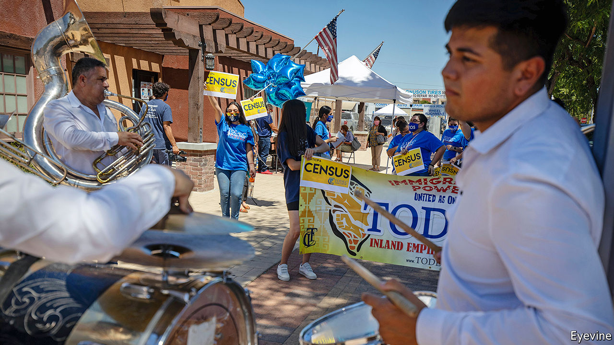
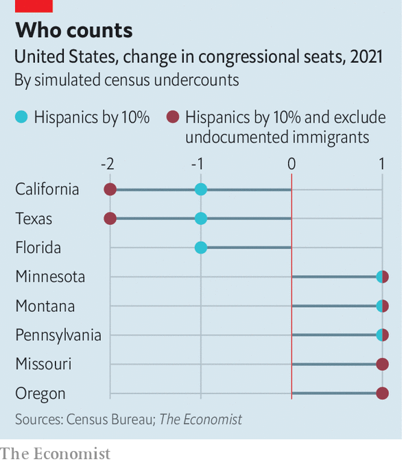

## All flaxen was his poll

# America’s decennial census and covid-19

> Trouble with counting would disproportionately disenfranchise Hispanics

> Aug 15th 2020WASHINGTON, DC

AMERICA’S GOVERNMENT relies on regularly updated, accurate tallies of how many people live within its borders. To produce the data, the founders charged the government with administering an “enumeration” of “the whole number of free persons” living in each state every ten years. Most notably, the decennial census data are used to assign members of Congress to each state according to population. But the tallies are also used as a guide for allocating billions of dollars in programmes such as Medicaid, child health insurance and food stamps for low-income mothers.

This year the accuracy of the census is at risk. Researchers are afraid that the Census Bureau may not be able to count enough people, or a fully representative set of Americans. Facing extra burdens imposed by the Trump administration as well as staffing shortfalls as a result of the covid-19 pandemic, the agency could end up undercounting minority voters which would bias the government against them for at least the next ten years.

The task of enumerating America is a massive one. Records must be compiled on almost every citizen, which requires hundreds of thousands of hours of research and hiring and co-ordinating more than half a million workers. Aside from data processing and technical work, the actual counting takes place in three stages.

First, the government sends a request to fill out the census questionnaire to every household in the country. The primary census form asks for the name and demographic information of each person living there. In past censuses respondents posted these forms back, but for the first time this year they could fill them out online.

Most Americans end up submitting a completed census form themselves. In 2010, the final self-response rate was 67%, indicating that two-thirds of households were counted by mail. For those who do not respond, the bureau deploys an army of interviewers called “enumerators” to contact them in person. If neither of these approaches gets a response, the bureau hazards a guess as to how many people live in a household by looking at reports for households round about. They use a similar method to fill in demographic information for households who provide no data.

This is all complex enough in a normal year, but the agency faces extra hurdles in 2020. First, Mr Trump and his administration have waged numerous political battles against the census. Put off by the constitution’s stipulation that the census should include all “persons” in the country, which they think unfairly gives a voice to millions of undocumented immigrants, the administration has tried to exclude them from the count. After losing a court battle to add a citizenship question to the questionnaire—which experts believed would have discouraged Latinos and immigrants from responding—Mr Trump on July 21st issued a presidential memorandum declaring that people living in the country illegally should be ignored for congressional apportionment in 2021. The move is probably unconstitutional, but researchers are concerned that the politicisation of the census may hurt its legitimacy and make people even less inclined to fill out the forms.

The census also faces a troubling combination of budget problems and large methodological changes. In 2011 Congress instructed the bureau to spend no more on the 2020 canvassing than was spent for the 2010 count. That would be too low even if they kept the same procedures, but experiments with an internet form, and the need to make new adjustments for non-response, has led to other costs.

A final challenge is covid-19, which prompted the bureau to delay field operations and reduce staffing in the spring. Bureau directors have also cut the window for following up on households that fail to respond from three months in the autumn to two months, ending on September 30th instead of October 31st.

Most scholars agree that all this will cause the ultimate census numbers to underestimate the share of minorities in the electorate. That is because harder-to-contact households tend to be composed of minority and immigrant families, with several generations under the same roof (and some spaces shared between families). If census interviewers miss their homes, they will be disproportionately deprived of their fair share of congressional representation and governmental funds. Using data from a census survey conducted last year, The Economist estimates that a 5-10% undercount of Hispanics would cost California, Texas and Florida one member of Congress each. If you exclude undocumented immigrants from the tally, as Mr Trump wants, California and Texas would lose another representative to boot.■

Dig deeper:Sign up and listen to Checks and Balance, our [weekly newsletter](https://www.economist.com//checksandbalance/) and [podcast](https://www.economist.com//podcasts/2020/08/01/checks-and-balance-our-weekly-podcast-on-american-politics) on American politics, and explore our [presidential election forecast](https://www.economist.com/https://projects.economist.com/us-2020-forecast/president)

## URL

https://www.economist.com/united-states/2020/08/15/americas-decennial-census-and-covid-19
