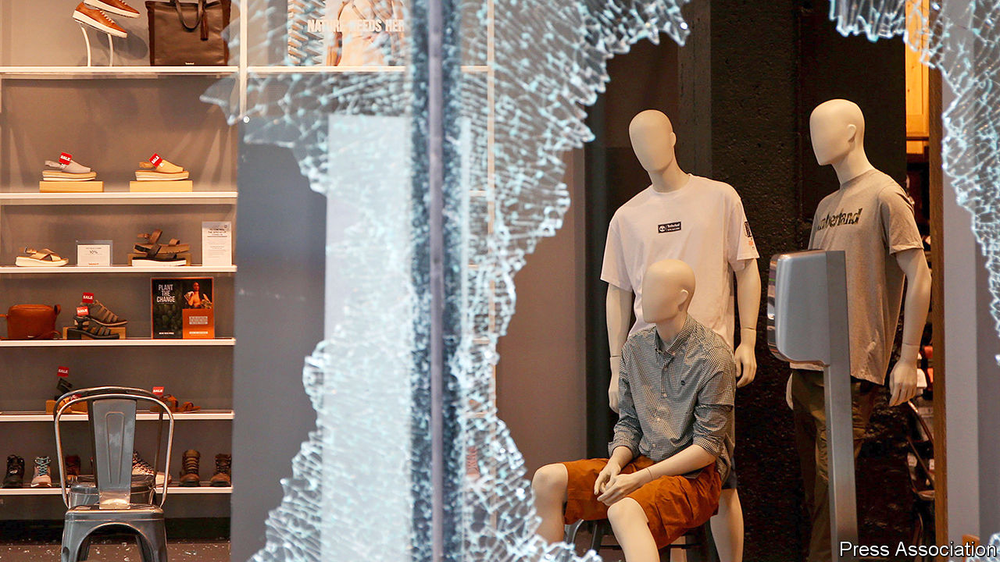

## Smash and grab

# Chicago, civil unrest and inequality

> Is it ever legit to loot?

> Aug 15th 2020CHICAGO

POLICE IN CHICAGO have an unusual tool to deploy for crowd control: 43 liftable road bridges that span urban stretches of river. Officials ordered many to be raised on successive nights this week, to limit access to the city centre after sunset. That followed an outbreak of rioting on August 10th, when looters—some of whom had hired vans for the occasion—flooded to rich central districts and smashed into luxury-goods, electronics and other shops.

Attackers prised open cash dispensers, seized cash registers and hauled off carloads of fancy clothes, jewellery, televisions and alcohol, even as hundreds of police chased them and helicopters watched from above. Eager for notoriety, a few looters laden with armfuls of designer goods live-streamed themselves on social media. Some violence erupted; a security guard was shot. Police arrested over 100 people.

Shopkeepers lamented they had only just replaced stock stolen in an earlier round of looting after police killed George Floyd in Minneapolis, in May. Once more a clash with police sparked the uprising. Officers repeatedly shot a young black man in Englewood, on Chicago’s poor South Side, on August 9th. They claimed he had fired at them first, but failed to produce bodycam video footage to prove it. He survived but, as false rumours of his death spread, angry residents shared plans online for looting that night.

Condemnation flowed from all sides. President Donald Trump had already said he would send federal agents to tackle gun violence in Chicago. A Republican state representative in Illinois said the National Guard should be deployed after the looting. Lori Lightfoot, Chicago’s mayor, rejected that but warned criminals that police would come for them. She blamed the looting on a lax policy of not prosecuting everyone who had robbed shops earlier.

Across a swathe of larger cities, recent months have seen a strange shift in crime rates. As a result of lockdowns, reports of most violent and non-violent crimes have fallen compared with last year. In contrast, rates of murder and violent assault have surged, especially as temperatures have risen. Gun violence is most prevalent. Last month 105 people were murdered in Chicago alone, its bloodiest month in 28 years.

Some civil-rights activists fret that the latest events in Chicago will weaken national support for police reform that has grown in the months since Floyd was killed. The Rev Jesse Jackson called the events in Chicago “humiliating, embarrassing” and “morally wrong” on August 10th. Not everyone agreed. A few radical activists, including some associated with Black Lives Matter in Chicago, argued that looting can be legitimate. One woman, protesting at a police station that held arrested looters, called it a form of “reparations” for white oppression.

This really is a live debate. Vicky Osterweil, author of “In Defence of Looting: A Riotous History of Uncivil Action”, published this month, sets out the same argument at book length. Looting by the poor, black or otherwise repressed is a radical tactic that brings welcome change, in her view. Peaceful civil-rights demonstrations are too easily ignored, whereas “riots and looting are more effective at attracting attention to a cause”. The shared experience of looting can also be “joyous”, produce “community cohesion”, count as a small act of “direct redistribution of wealth” and, she reckons, does little harm to those who have insurance. She thinks it also leads people to question high levels of inequality.

Her claims are unconvincing. Those who snatched swag from Gucci or Louis Vuitton in order to sell them on hardly share her anti-capitalist views. Nor is it clear that looting spreads solidarity in poor neighbourhoods. The grandmother of the man shot by police condemned the looting. Ms Osterweil might be right, however, that residents of poor areas, who rarely even set foot in the wealthy central parts of their city, are fed up. Looting is not a helpful way to respond, but the resentment at this disparity is real enough.■

## URL

https://www.economist.com/united-states/2020/08/15/chicago-civil-unrest-and-inequality
