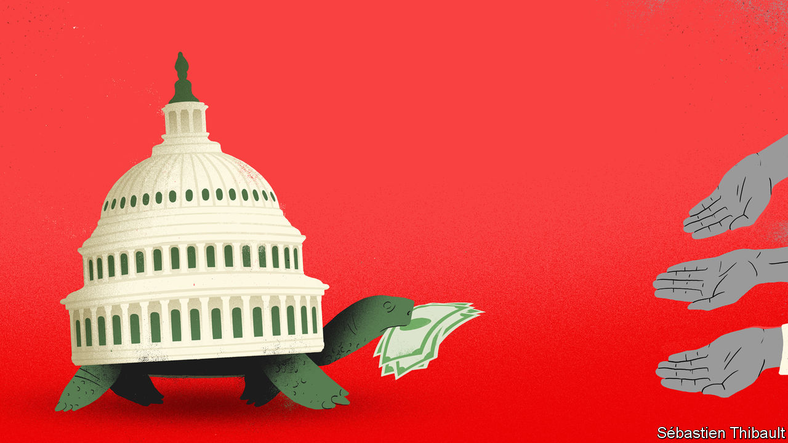

## The stymied stimulus

# Donald Trump’s executive orders do little for hard-hit Americans

> Congressional gridlock prolongs the pain

> Aug 12th 2020

IN LATE MARCH Congress broke its characteristic gridlock and passed the CARES Act, a huge stimulus package. On the day that President Donald Trump signed it into law, around 2,000 Americans had died of the virus. America’s death toll now exceeds 160,000, and its GDP fell by 10% year-on-year in the second quarter of 2020. The case for further stimulus remains strong, but political will has weakened. Congress adjourned without passing another bill, each party blaming the other. That failure imperils America’s shaky economic recovery, and could presage a brutal end to 2020.

In July America added 1.8m jobs. Such is the scale of the damage caused by the coronavirus that the world’s largest economy needs another seven similarly large jobs increases just to reach its pre-pandemic level of employment. And there is growing evidence that the recovery is losing steam. Almost all economists believe the country needs more fiscal stimulus.

Since the pandemic began Congress has passed some $3trn-worth of fiscal stimulus. It has made grants to small businesses, bumped up unemployment-insurance (UI) payments by $600 a week and sent out cheques worth up to $1,200 per person. Both in absolute terms and relative to the size of the economy, America’s fiscal stimulus is the world’s largest. But many of the elements of the various packages have now expired, including a federal moratorium on evictions (which ended on July 24th) and the $600-a-week bump to UI (July 31st).

America probably cannot leave it at that. The numbers of infections and deaths from covid-19 remain extraordinarily high. That threatens the economic recovery which began in April, as state lockdowns have been reimposed and consumer confidence has suffered. A closely watched measure of credit-card spending has not grown since mid-June, while the number of small businesses which are open appears to be in decline. The reduction in fiscal support will be a further drag on growth, not to mention a source of anxiety for many Americans, especially those with less or no work. Worries that investors would balk at another stimulus package have, meanwhile, proved wide of the mark. As talk has swirled of extra borrowing, yields on Treasuries have fallen to new lows.

Moderates on both sides argue in favour of sending extra cheques to households, for more money for bumped-up UI payments, and for extra money for states. But they disagree on how generous these plans should be. The Democrats originally put forward a package worth some $3.5trn (17% of GDP). The Republicans have proposed their own plan, and the Democrats have since made theirs less generous, but there remains a gap of $1trn between them.

With congressional negotiations stalled, on August 8th Mr Trump signed four executive orders that purport to extend UI benefits and the eviction moratorium, and defer student-loan payments and payroll taxes. Democrats howled that these orders were unconstitutional. But except for the UI extension, most appear broadly legal—but ineffective. The eviction order, for instance, simply asks a few cabinet departments to look for ways to help renters; it does not direct anyone to do anything. Payroll taxes will still come due at year’s end, so businesses may well withhold them from employees anyway rather than scramble to find funds in December.

The UI order provides $400 a week, with states (many of which are cash-strapped, and all of which face stricter borrowing limits than the federal government) responsible for $100 of that. It provides just $44bn for these payments, enough for perhaps six weeks. By law only Congress can appropriate funds, though federal law allows presidents to provide financial aid during a “major disaster”. As one conservative legal scholar notes, covid-19 may not qualify: “He can’t call it a disaster just because it’s a disaster for him politically.” But for a court to find it illegal, first someone has to sue, and House Democrats seem an unlikely plaintiff: that would let Mr Trump claim that they are holding up funds to needy people.

Though stubborn partisan disagreement is nothing new, it contrasts sharply with the spirit of co-operation that Republicans and Democrats showed in the early part of the pandemic, when everyone agreed that they needed to get money out as quickly as possible. In some ways the Republicans’ unwillingness to go along with the Democrats’ spending plans this time around is puzzling, not least since a new stimulus would help the economy and thus Mr Trump’s chance of re-election.

A few things are different now. Back in March many people worried that the economy was going to enter a recession of cataclysmic proportions. Research published by the Federal Reserve Bank of St Louis had suggested that the unemployment rate was going to rise above 30%. In fact it peaked at about 15%, and has since fallen to 10%. And whereas six months ago double-digit unemployment would have seemed catastrophic, now it seems almost normal, points out Gbenga Ajilore of the Centre for American Progress, a think-tank. So whereas some fiscal hawks may have been bumped into backing fiscal support in March, they now believe the economy does not need it. (Mr Ajilore adds that the evidence that the pandemic has disproportionately affected non-white folk may also explain why some urgency has been lost.)

Politically, too, the ground seems to have shifted. Mark Meadows became Mr Trump’s chief of staff after the CARES Act passed. In these negotiations, he has taken a prominent role, and he is a longtime fiscal hawk, as are many Senate Republicans. Five months ago fear of crossing Mr Trump before primary season may have pushed many of them into supporting a stimulus bill that they may otherwise have opposed. But the primaries are over, and Mr Trump is trailing in the polls. Ben Sasse, for instance, is a generally principled Republican who went quiet during impeachment and won his primary in May; he called Mr Trump’s executive orders “unconstitutional slop”.

Still, that may be the only relief America sees: a substantive congressional deal looks unlikely before the parties’ conventions later this month. For millions of Americans enhanced UI benefits have already ended, and even if no court stops Mr Trump’s extension, implementing it requires states to reconfigure their rickety payment infrastructure and scrounge between sofa cushions to find the money. Weeks will pass before people see the money. States and cities that need federal aid are similarly left adrift. After the recession of 2008-09, local budgets faced drastic cuts, reducing services and prolonging economic woes. A similarly drawn-out recovery appears far likelier now, unfortunately, than it did just a few weeks ago. ■

Dig deeper:Sign up and listen to Checks and Balance, our [weekly newsletter](https://www.economist.com//checksandbalance/) and [podcast](https://www.economist.com//podcasts/2020/08/01/checks-and-balance-our-weekly-podcast-on-american-politics) on American politics, and explore our [presidential election forecast](https://www.economist.com/https://projects.economist.com/us-2020-forecast/president)

## URL

https://www.economist.com/united-states/2020/08/12/donald-trumps-executive-orders-do-little-for-hard-hit-americans
