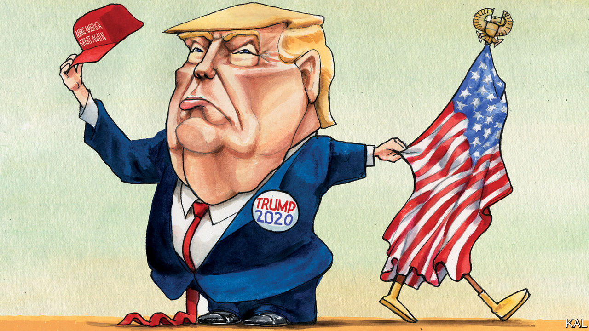

## Lexington

# The politics of patriotism

> Americans are becoming less vulnerable to flag-waving opportunists. This is bad for the president

> Aug 15th 2020

THE LAST time a Democratic presidential candidate was nine points ahead in a two-horse race, less than four months from a general election, Republicans throttled him with the flag. Michael Dukakis’s alleged crime was to have vetoed a bill, as governor of Massachusetts, that would have compelled teachers to lead their pupils in the pledge of allegiance. The Democratic nominee in 1988 said he had had no choice, the bill was unconstitutional. But for his navy-hero Republican opponent, George H.W. Bush, this was a worrying reflection of the swarthy Mr Dukakis’s “values”.

He and other Republican leaders began reciting the sacred pledge at every opportunity. At the Republican convention that year John McCain, a senator and former prisoner-of-war, told a remarkable story about one of his fellow captives sewing Old Glory out of rags with a bamboo needle. Their Vietnamese captors discovered it and pulverised the flag-maker. But no sooner had he been dragged back to their communal cell, half-blind from his beating, according to McCain, than he was back at it with his bamboo splinter, “making that flag because he knew how important it was to us to be able to pledge our allegiance”.

Mr Dukakis’s subsequent hammering underlined how completely the Republicans owned patriotism (and how ruthlessly they were prepared to use it). A Harvard study found that merely exposing Americans to July 4th parades as children made them likelier to vote on the right. Is President Donald Trump ending this decades-old Republican advantage?

His efforts to capitalise on it are not subtle. He has advocated prison for flag-burners and possible deportation for black footballers who kneel during the anthem; he often accuses his critics—including racial-justice protesters in Portland—of “hating our country”. Against the wishes of service chiefs, he presided over a triumphalist military display in Washington. Such gestures would look phoney to everyone outside the president’s base even if he had not also denigrated American generals, sided with Russia against American intelligence agencies, implored Ukraine and China to intervene in American elections and in a hundred other ways run down the “big, fat, sloppy United States”, as he falsely claimed the world sees America.

Polls point to a collapse in national pride, a proxy for patriotism, during his presidency. In recent months, as America has fought a losing battle against the coronavirus, this has extended to the president’s own supporters. Mr Trump’s decision to change his campaign slogan from “Keep America Great” back to “Make America Great Again” was in that sense a response to public demand.

Yet there is more than Mr Trump going on. Even before his election Americans were starting to view patriotism in a more qualified, more Democratic way.

Where conservatives often claim to love their country uncritically—or “unambivalently”, as Ronald Reagan recommended—progressives are likelier to talk of using America’s strengths to correct its weaknesses. For John Lewis, the last titan of the civil-rights movement, non-violent protest was a patriotic act. Until recently, Democrats tended to worry more about threats to free speech than, say, clamping down on flag-burners. Political scientists call this “constructive patriotism”. In the 1930s and 1940s, when Franklin D. Roosevelt united the left and centre-right to defeat poverty and fascism, it was the dominant kind. For Adlai Stevenson, the party’s presidential nominee in the 1950s, patriotism was expressed not in “short, frenzied outbursts of emotion”, but the “tranquil and steady dedication of a lifetime”.

As the cold war loomed, he was traduced by Richard Nixon as an “appeaser”. Yet the more contingent Democratic view is coming back into vogue. Younger Americans are increasingly hostile to ostentatious flag-waving. According to one survey, two in ten millennials even consider the flag a symbol of “intolerance and hatred”. They meanwhile show no waning enthusiasm for American ideals such as equality and opportunity. They are also increasingly politically engaged; turnout among younger voters was sharply up in the 2018 mid-terms and there are indications that it will be again this year. Popular support for footballers taking a knee is consistent with this shift towards restrained national self-criticsm.

Demographic change is playing a big part in it. The armed forces—a generator and focus of patriotic fervour—were 75% white in 1990; now around 45% of their members are from mostly Democratic-voting minorities. And just as Roosevelt was able to push his values by enlarging his coalition, so the extremism of the right is expanding the left. The many veterans, of all ethnicities, who ran for the Democrats in the 2018 mid-terms proved that.

A row between Tucker Carlson, a Fox News talking-head, and Senator Tammy Duckworth encapsulated these developments. Mr Carlson accused her of hating America after she expressed willingness to debate the appropriateness of celebrating George Washington, a slave-owner. Nonsense, said Ms Duckworth, a half-Asian former army pilot: her views reflected her commitment to “every American’s right to speak out”. She had fought for her country—and lost her legs—for that, she said.

This will not be the first election in which the Democrats hope to wrest patriotism from the right. They tried in 2004, through John Kerry’s army record, and in 2016, when the spectre of Mr Trump pushed retired generals and the parents of a soldier killed in battle to Hillary Clinton. Both lost to Republican draft-dodgers. Yet Joe Biden may be a more compelling patriot.

He is not a patrician like Mr Kerry or despised as Mrs Clinton was. He is an amiable former vice-president. And, for all his weaknesses, he is good at admitting America’s failures without underselling its strengths. It will be hard to frame him as anti-American. This suggests patriotism will not be Mr Trump’s last refuge.■

Dig deeper:Sign up and listen to Checks and Balance, our [weekly newsletter](https://www.economist.com//checksandbalance/) and [podcast](https://www.economist.com//podcasts/2020/08/01/checks-and-balance-our-weekly-podcast-on-american-politics) on American politics, and explore our [presidential election forecast](https://www.economist.com/https://projects.economist.com/us-2020-forecast/president)

## URL

https://www.economist.com/united-states/2020/08/15/the-politics-of-patriotism
