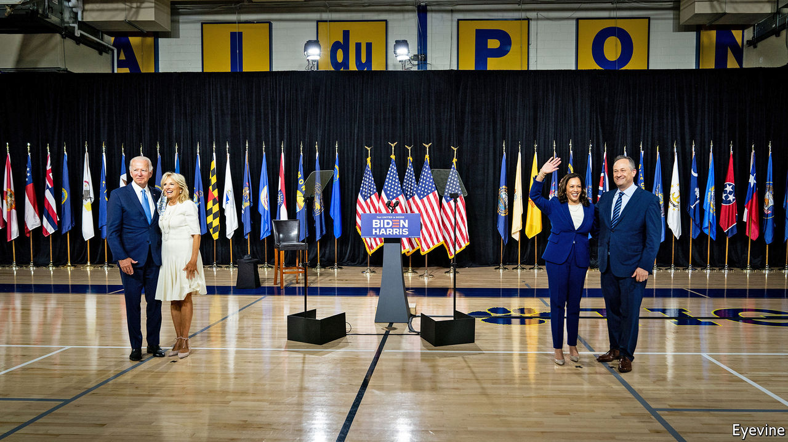

## Joe Biden’s veep pick

# Why Kamala Harris was a good choice for Joe Biden

> Groundbreaking and predictable, just the ticket

> Aug 13th 2020WASHINGTON, DC

MORE THAN a year ago, before a pandemic put paid to traditional political campaigning, before anyone had heard of Gordon Sondland or Lev Parnas or any of the other minor characters who emerged from Donald Trump’s impeachment saga, the Democratic Party had a problem: how to hold a presidential debate with 20 candidates. They solved it by getting them to draw lots; ten would debate on the first night, ten on the second. The debates’ only memorable moment came on the second night, when Kamala Harris laid into Joe Biden over his opposition to federally mandated busing to integrate schools, and what she deemed to be his too-kind recollection of two segregationist senators.

They were the field’s centrist heavyweights. Mr Biden led in the polls, though many dismissed that as a sign of name-recognition; he was unimpressive on the stump, rambling and half a step too slow. Ms Harris, who served as San Francisco’s chief prosecutor and then California’s attorney-general (where she ran a department of 5,000 people) before becoming a senator in 2016, was seen as the candidate best able to reassemble the Obama coalition of progressives, non-white voters and the young.

What people remember from their exchange was Ms Harris’s line, referring to how she was bused to a majority-white school: “That little girl was me”. Less remembered was that Mr Biden, having absorbed her blows, threw a few back, reminding the audience that unlike Ms Harris, he was a public defender, not a prosecutor (an applause line). He held his own in the ensuing argument, which was no easy feat: Ms Harris is a clinical, relentless debater. In subsequent debates the two circled each other, but never really traded haymakers again, and on August 11th Mr Biden named Ms Harris as his running-mate.

The choice is at once groundbreaking and predictable. It is groundbreaking, of course, because Ms Harris, the daughter of a Jamaican economist and an Indian scientist (her first name means “lotus” in Sanskrit), is the first black woman and the first Asian-American chosen for a major-party national ticket. She is also the first Democratic presidential or vice-presidential nominee from west of Texas. The mountain west is ancestrally Republican, and California’s two presidents, Ronald Reagan and Richard Nixon, were both Republicans. She is only the fourth woman—after Geraldine Ferraro, Sarah Palin and Hillary Clinton—to appear on either party’s ticket.

It is predictable because, ever since Mr Biden announced he would choose a female running-mate, Ms Harris was the front-runner. She seemed to have the fewest flaws. Elizabeth Warren is polarising, almost as old as Mr Biden and might have cost Democrats a Senate seat. (The governor of Massachusetts, who would have nominated her replacement pending a special election, is a Republican.) Stacey Abrams, the progressives’ darling, had never held higher office than in Georgia’s state legislature. Karen Bass, who chairs the Congressional Black Caucus, was a vocal admirer of Fidel Castro—an impediment to any ticket that wants to win Florida. And too many people who know Susan Rice, Barack Obama’s former national security adviser, seem to dislike her.

Of course, Ms Harris also has her share of detractors. Some in Bidenworld deemed her “too ambitious”, a criticism that has more than a whiff of sexism about it, and also makes no sense: an ambitious vice-president will realise her future depends on helping to make Mr Biden’s presidency successful. But her own presidential campaign was dreadful. After a promising start, it fizzled, riven by infighting and disorganisation. By trying to appeal to the party’s centrist and progressive wings, she pleased neither, often looking weak and vacillating in the process, as when she seemed to both support and oppose Medicare for All.

Her record before becoming a senator makes advocates of criminal-justice reform uneasy, with good reason. She fought rulings ordering California to ease prison overcrowding and releasing wrongly convicted prisoners. She opposed marijuana legalisation, threatened truants’ parents with jail, supported a policy to report undocumented children to immigration authorities, defended California’s use of capital punishment in court (despite personal opposition) and aggressively prosecuted non-violent crime.

She has long insisted that she wanted to reform the system from the inside—a position for which her record bears scant evidence. But as a senator she has tried to reinvent herself as a reformer. She helped craft the Justice in Policing Act after George Floyd’s death. That bill would establish a national use-of-force standard for police, ban no-knock warrants in drug cases and expand the investigative powers of attorneys-general. She also introduced a measure to decriminalise and tax marijuana.

One way to read that shift is the Trump administration’s take: Ms Harris is a “phoney” who “will abandon her own morals” in pursuit of power. The other interpretation is that, like Mr Biden, she is an instinctive centrist and insider, open to changing positions, and not motivated by ideology.

Ms Harris also has a star quality that Mr Biden lacks. She wields a deft knife, and will perform the vice-presidential nominee’s traditional attack duties fearsomely well. No doubt Democrats are already salivating at the thought of her facing off against Mike Pence’s tut-tutting. Her background as a prosecutor makes her ideally suited for a law-and-order election, as this one is shaping up to be, and helps counter the Trump campaign’s slur that Mr Biden is simply a front for the radical left. Choosing Ms Warren would have given that argument some validity; choosing Ms Rice would have let Republicans endlessly relitigate Obama-era foreign-policy failures. But finding a potent, specific and coherent attack line against Ms Harris is difficult.

The choice suggests that Mr Biden is not terribly worried about his left flank, or, at least, that he thinks the groundbreaking nature of Ms Harris’s candidacy will do at least as much as choosing Ms Warren or Ms Abrams would have done to boost turnout where he needs help: among young and non-white voters. Mr Biden won the nomination on the strength of his appeal to African-American voters, but he needs non-white voters to turn out in the general election at 2012, not 2016 levels—particularly in swing states such as Pennsylvania, Wisconsin, Michigan and Florida.

The choice also suggests that Mr Biden wants to recapture some of the 2008 magic. Faced with a norm-breaking, attention-grabbing opponent in 2016, Hillary Clinton played it safe and chose Tim Kaine, a worthy but dull running-mate. Mr Biden has opted for excitement. But the fact that the exciting choice—an Indian-Jamaican-Californian woman—is also the safe, predictable one says something about America’s continuing evolution on race.■

Dig deeper:Sign up and listen to Checks and Balance, our [weekly newsletter](https://www.economist.com//checksandbalance/) and [podcast](https://www.economist.com//podcasts/2020/08/01/checks-and-balance-our-weekly-podcast-on-american-politics) on American politics, and explore our [presidential election forecast](https://www.economist.com/https://projects.economist.com/us-2020-forecast/president)

## URL

https://www.economist.com/united-states/2020/08/13/why-kamala-harris-was-a-good-choice-for-joe-biden
