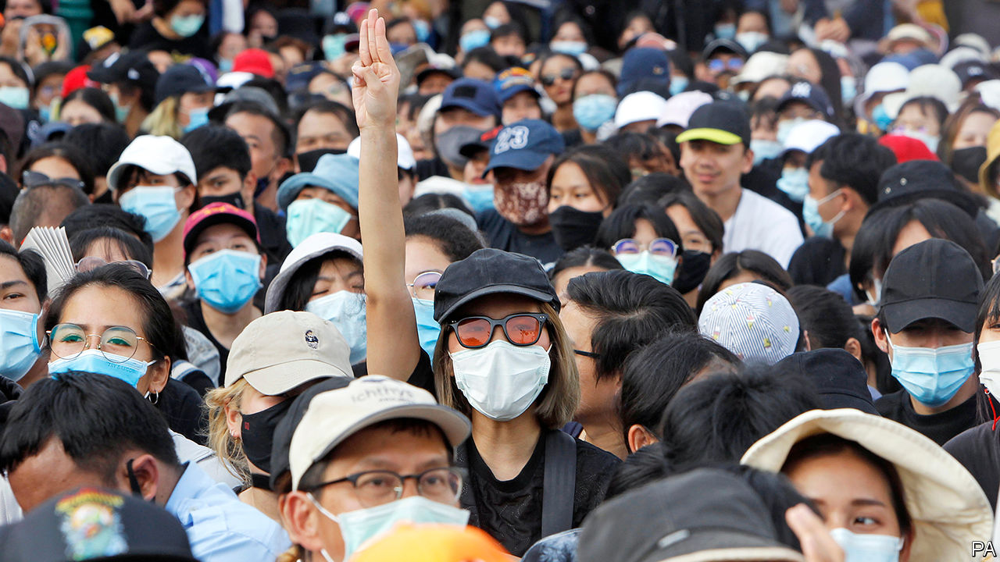

## Street cred

# Audacious student protests are rocking Bangkok

> But the government looks stronger than it was

> Aug 20th 2020SINGAPORE

IT WAS THE largest demonstration since Prayuth Chan-ocha, the prime minister, seized power in a coup in 2014. On August 16th more than 10,000 protesters flocked to the Democracy Monument in Bangkok, Thailand’s capital. Student unions and youth groups have led protests for more than a month across the country. They want the government to step down. They demand a new constitution and an end to the harassment of opposition campaigners. More controversially, at a rally at Bangkok’s Thammasat University on August 10th, some agitators openly called for reform of the monarchy, still a strict taboo.

Thailand has endured 12 coups since revolution brought an end to absolute monarchy in 1932. Wrestling between generals and politicians has yielded 20 constitutions over the years. Military regimes boost their legitimacy through reverence for the crown. For almost two decades a feud between “yellow shirts” (royalist elites) and “red shirts” (supporters of Thaksin Shinawatra, a populist former prime minister) has divided Thai politics.

The latest protests are somewhat different. They have their roots in unrest that began in February, before social-distancing measures for covid-19 put public demonstrations on ice. Future Forward, a progressive party less than two years old, was dissolved by the constitutional court. Its leader, Thanathorn Juangroongruangkit, though he has been banned from politics for a decade, has inspired millions of Thais with his call to reform the army, decentralise government and tackle big business.

In many ways Mr Prayuth is stronger than he has been for months. In a recent cabinet reshuffle, technocrats favoured by him gained powerful posts. The new minister of finance is a former banker who inherits the task of sorting out the virus-ravaged economy; the central bank expects it to contract by more than 8% this year. The prime minister’s closest comrade, Prawit Wongsuwan, has calmed infighting within the army-aligned party, Palang Pracharat, that nominated Mr Prayuth for his post last year—by becoming its new leader.

The protesters reject the very system that protects Mr Prayuth and his allies. For one thing, any election held under the constitution favours them. Thailand’s upper house, an appointed body which includes bigwigs from the armed forces, has a say in the choice of prime minister after any popular vote. These senators can also block efforts to alter the constitution, since Article 256 needs at least a third of them to amend it. So the opposition’s attempts to change that article look doomed.

The protesters’ open criticisms of the monarchy—including objections to King Maha Vajiralonkorn’s financial arrangements and his personal control over military units—are the first of their kind. Harsh lèse-majesté laws, which can land a person in prison for up to 15 years for defaming, insulting or threatening high-ranking royals, have fallen from official favour. But critics of the crown are still targeted under laws against sedition, defamation and computer crime.

That does not deter the most daring. A “Harry Potter” protest has amusingly played on such repression, with marchers dressed as wizards declaring themselves against “he-who-cannot-be-named”.

Crafting a robust response is tricky for the government. The longer the protests drag on, the bigger the headache for the unpopular Mr Prayuth. Politicians and universities have sternly criticised anti-royal sentiments. The government plans to hold a forum to discuss matters with students. At the same time it has identified dozens of protesters who will be in its sights from now on; some have already been detained. The education minister says the police can now arrest law-breakers on campus.

Yet avoiding the sort of violent clashes that occurred in the 1970s appears to be a priority for Mr Prayuth and his inner circle. “They learned a lot from the past with other coups,” reckons a Thai academic. “They know that confrontations and violence mean the end of their power.” A far happier result for the protesters would be the end of Mr Prayuth’s leadership altogether. ■

## URL

https://www.economist.com/asia/2020/08/20/audacious-student-protests-are-rocking-bangkok
