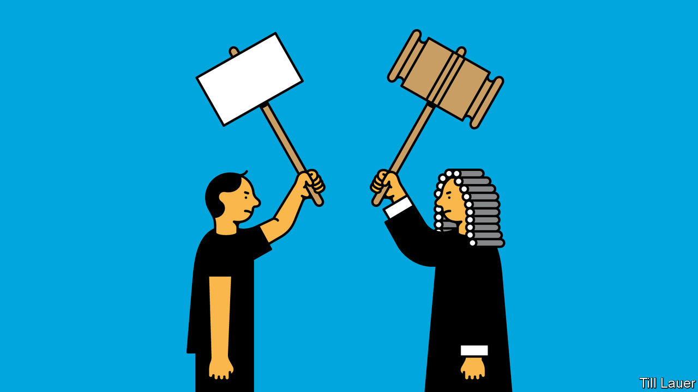

## Banyan

# South Korea’s liberal rulers unleash their inner authoritarians

> Used to dishing out the criticism, they seem unwilling to take it

> Aug 20th 2020

SOUTH KOREA has a proud history of noisy opposition to the powers that be. Japanese colonisers found their subjects unruly. Homegrown military dictators, who brutally suppressed their citizens’ democratic yearnings for decades, eventually yielded to widespread protests. Even democratically elected leaders have incurred the wrath of civil society. Park Geun-hye, the predecessor of Moon Jae-in, the current president, was chased out of office in 2017 after millions of South Koreans took to the streets to decry rampant corruption in her government.

Ms Park’s left-wing successors had vowed to do better. Mr Moon, a former activist and human-rights lawyer, and his Minjoo party claim to embody the legacy of the pro-democracy movement. They promised to honour the spirit of the protests that swept them to power. The country would become more egalitarian. The government would be more open, tolerant of dissent and responsive.

Those good intentions seem to be flagging. Opponents of the government are again finding that their views may attract litigation rather than benign indifference or even constructive responses. Nearly a fifth of civil libel suits against media organisations last year involved senior officials, more than during Ms Park’s administration.

Last month the president’s office appealed against a court ruling that cleared a conservative newspaper of defaming Mr Moon’s wife in an opinion column (the writer mused over whether the couple’s official overseas trips were too heavy on sightseeing). A right-wing YouTuber has been jailed for spreading rumours about Cho Kuk, a former senior official in Mr Moon’s government (Mr Cho has since been disgraced). The Minjoo party lodged a criminal complaint against a political-science professor after she criticised it for being self-serving and suggested that progressives should vote for other parties; the complaint was withdrawn after a public outcry. NGOs led by North Korean refugees who dislike the government’s conciliatory stance towards the North have lost their non-profit status and allege police harassment.

There is trouble in the legislature, too. Earlier this month Minjoo lawmakers proposed a bill that would grant the government the power to order the media to correct “fake news” (a similar bill was proposed by the conservatives in 2017). Another set of bills being considered seeks to punish anyone spreading “distorted” historical accounts of a crackdown in 1980 on pro-democracy protesters.

Park Kyung-sin, a law professor and free-speech advocate at Korea University, thinks the government’s touchiness in the face of criticism has its roots in “a long-standing vendetta between progressives and the conservative media”. Even in government, left-wingers have not shed their self-image as underdogs. They tend to think of certain media outlets as arms of political parties, and have a “siege mentality” when it comes to their critics.

Activists forged their political identities against a military dictatorship implacably hostile to their aims, so opponents’ freedom of expression was not a priority. South Korean politics—and many media organisations—remain polarised, with cross-party co-operation virtually unheard of. Loyalty to one’s own camp is prized above all. Kim Kyung-ryul, a progressive intellectual who broke with his former comrades over attitudes to Mr Cho’s conduct earlier this year, has likened the two main parties to “backstreet gangster groups” serving only their own interests.

Mr Park is keen to stress that current developments are less worrying than the systematic use of criminal defamation law against political opponents that occurred under previous administrations. Some Minjoo lawmakers are still trying to soften the country’s punitive defamation laws, whereby journalists and ordinary citizens can get long prison sentences for damaging reputations, even if their offending statements are true. Despite the recent litigiousness of some of their colleagues, South Korea’s rank on the world press-freedom index is higher than it was a few years ago.

South Korean politicians love to quote ancient wisdom. The government might do well to ponder the words of King Sejong, a model ruler and rich source of inspiring quotations from the Joseon era. “I am neither virtuous, nor skilful at governing. There will definitely be times when I do not act upon the heavens’ wishes. So look hard for my flaws and make me answer to their reprimands,” he said, in 1425.

## URL

https://www.economist.com/asia/2020/08/20/south-koreas-liberal-rulers-unleash-their-inner-authoritarians
