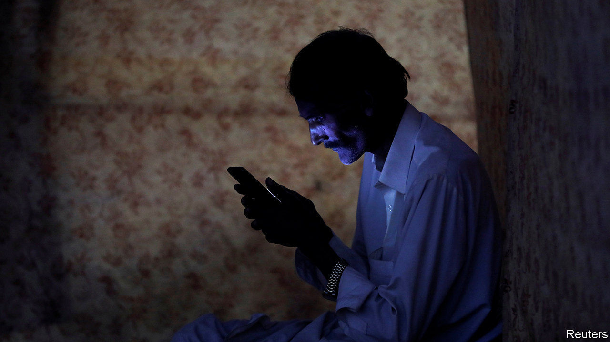
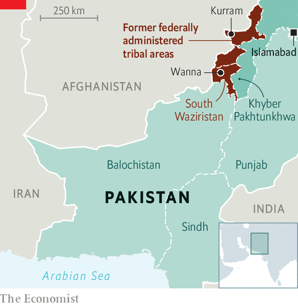

## Calls waiting

# The internet is patchy on Pakistan’s north-west frontier

> The men with the guns still call the digital shots

> Aug 22nd 2020ISLAMABAD

IMTIAZ HUSSAIN’S weekly meeting with his academic supervisor has become rather fraught. The 28-year-old postgraduate is researching Pakistan’s energy policy at one of the country’s most prestigious universities. But the internet at his home in Kurram, a district on the border with Afghanistan, keeps letting him down. Mr Hussain’s cable connection is an expensive luxury in a region where many people go without internet of any kind. Yet using it for video-calling is a struggle. “Connnectivity…drops every minute,” he complains.

Pakistan’s internet is shoddy, particularly outside its big cities. An index of “internet inclusiveness” produced by the Economist Intelligence Unit, a sister firm of this newspaper, ranks Pakistan 76th out of 100 countries, and almost last in Asia. Poor and non-existent connections have lately become a big headache for students sent home from university as a result of the pandemic, most of whom are required to keep studying remotely. Their frustrations have led to eye-catching protests in dozens of places, ranging from Balochistan province in the south of the country to Gilgit Baltistan in the north.

Internet provision in Kurram and neighbouring districts is especially bad. The border region was run at arm’s length by British colonial administrators, who viewed it as a rugged buffer against Afghanistan and saw little reason to develop it. These districts remained a backwater after independence, when they became known as the Federally Administered Tribal Areas (FATA). They became a haven for the Taliban. The people there suffered terribly during the militants’ many battles over the years with Pakistan’s army.

In 2018 FATA was merged into Khyber Pakhtunkhwa province. The idea was that making the region less of an administrative oddity would grant residents more political rights and perk up investment. But the struggles of local students to get online are just one illustration of how far there is to go. In much of the region the internet is restricted to the largest towns. Government offices and army bases get priority, say residents. Izhar Uddin, a 20-year-old studying computer science who lives in South Waziristan, says officials have offered to help students get online at government offices in Wanna, the district capital. But that is nearly 100km from his home. He has chosen instead to live with his cousin in Dera Ismail Khan, a better-connected city about three hours’ drive away.

The government of Khyber Pakhtunkhwa province, run by the Pakistan Tehreek-e-Insaf, the party of the prime minister, Imran Khan, says internet connections are a priority. But telecoms is a federal matter. Federal ministers also nurture digital dreams of putting government services online and creating apps. Few internet and mobile-network providers, however, see much profit in wiring up sparsely populated districts.

Moreover, policymakers often view internet access as a source of instability, says Usama Khilji, who researches internet rights for an NGO. That may explain the shortage of the mobile-phone signals that provide internet access in the most remote and insecure parts of the rest of the world. Security in the tribal districts has improved since the army drove out the Taliban, but the generals still call the shots. Even the existing internet connections sometimes get switched off.■

## URL

https://www.economist.com/asia/2020/08/22/the-internet-is-patchy-on-pakistans-north-west-frontier
