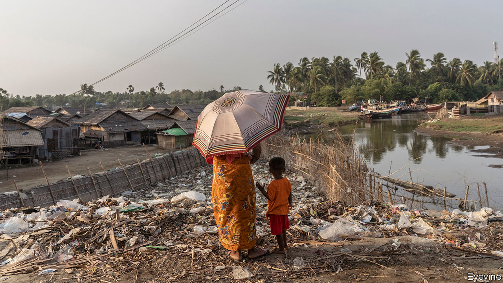

## Peace talks without peace

# Why the stalemate in Myanmar persists

> The generals are still unwilling to make concessions

> Aug 18th 2020SINGAPORE

SUSPENDED IN THE air, several feet above Aung San Suu Kyi’s head, was an image of a dove with an olive branch in its beak. Ms Suu Kyi, Myanmar’s leader, was delivering her opening remarks at the “21st Century Panglong Conference”, a series of talks designed to end the numerous ethnic insurgencies that have ravaged her country since its founding in 1948. The poster of the dove gestures towards the hope Ms Suu Kyi inspired when she was elected in 2015 that she might one day silence the guns.

That day, alas, is nowhere close. Sporadic clashes continue to occur in Kachin, Kayin and Shan states. A new conflict has since 2018 erupted in Rakhine and neighbouring Chin states, where nearly 1,000 civilians have died and at least 80,000 people been displaced. On August 19th, 230 delegates from the government, the army and ten ethnic-minority groups gathered in Naypyidaw, the capital since 2006, for a three-day peace pow-wow before a general election in November. They may have wondered, seeing that paper dove, when they will see the flesh-and-blood version.

It was never going to be easy. Ms Suu Kyi inherited the world’s longest-running civil war. Her peace process was named after the first “Panglong Conference”, convened by her father, Burma’s independence leader, in 1947. Ever since, conflict between the army and a plethora of ethnic-based forces has spluttered on in many of the country’s border regions. The peace process that Ms Suu Kyi inherited from Myanmar’s previous leader is “one of the most labyrinthine” ever, according to the Transnational Institute (TI), an international research outfit.

Thein Sein, her de facto predecessor, had drawn up a Nationwide Ceasefire Agreement (NCA), which promised a federal system. Those who signed it would graduate to the next phase: political dialogue. But the army angered the most powerful rebel outfits when it declared in 2015 that six of their number would not be permitted to sign the NCA. As a result just eight armed groups, representing 20% of Myanmar’s guerrillas, signed up. This created a complicated, two-track peace process: dialogue with NCA signatories; and bilateral ceasefire talks with non-signatories. Since Ms Suu Kyi’s ascent to power, she has been able to convince just two piffling non-signatories to commit themselves to the NCA, and has made no real progress in peace talks.

The army is not helping. She cannot force it to extend an olive branch to its foes. The constitution gives the army, or Tatmadaw, control of the ministries of defence, home and border affairs, and a quarter of the seats in parliament, so in effect it has a veto on constitutional reform. It “has not made any commitments or any real concessions to ethnic groups during the peace process,” says Tom Kramer of TI. In fact it has deliberately sabotaged peace, adds David Mathieson, an analyst, for instance by clashing with the two beefiest NCA signatories, the Karen National Union (KNU), an ethnic-Karen (or Kayin) group, and the Restoration Council of Shan State (RCSS), an ethnic-Shan group. In October 2018 both withdrew from the peace process.

Since January 2019 the Tatmadaw has also stepped up the confrontation with the Arakan Army, an ethnic-Rakhine group, one of the six prevented from signing the NCA in 2015, leading to the bloodiest fighting in Myanmar in decades. “They’ve not been pursuing peace, they’ve been pursuing conflict,” says Priscilla Clapp, who advises the Asia Society, an American think-tank. The commander-in-chief views Ms Suu Kyi as a rival, and does not want to hand her any political victories.

Moreover, the Tatmadaw has always been viscerally opposed to federalism. It is committed to the idea of Myanmar as a unitary state, dominated by the ethnic majority, the Bamar. “I don’t think they want a genuine peace,” says Naw K’nyaw Paw, the general-secretary of the Karen Women’s Organisation.

The Tatmadaw leaves Ms Suu Kyi little room to manoeuvre. Yet she has made many missteps. At first she set about jump-starting the peace process with gusto. She hoped that a deal would be the swiftest route to constitutional reform, the only way to curb the power of the army, something she longs to do. The army has said that ending hostilities is a precondition for reform. But as the scale of the challenge of brokering peace impressed itself on her, Ms Suu Kyi’s enthusiasm waned. She turned her attention to other matters.

Even as her government neglected peace negotiations, it inflamed relations with ethnic minorities. In March the government declined to give state legislatures, some of which are dominated by ethnic parties, the right to choose their chief ministers. Ms Suu Kyi has failed to acknowledge the long-standing grievances of ethnic minorities or to tackle concerns among ethnic groups about the army’s breaches of the NCA. She has not sketched a vision of what a federal union might look like. “A lot of ethnic voters feel betrayed,” says Mr Kramer. “We are disappointed in her,” says Ms Naw K’nyaw Paw.

The prospect of facing voters at the polls with nothing to show for years of peace talks has stirred Ms Suu Kyi into action. There are promising signs. In January the KNU and RCSS returned to the negotiating table, apparently reassured by the government’s willingness to tackle some of their concerns. But none of the principles likely to be agreed on at Panglong goes beyond what is already in the constitution or existing law. And as Ms Naw K’nyaw Paw says, if the process does not include every armed group, “we are wasting a lot of our time.” She suspects that the government has convened this week’s conference merely to “save face” ahead of the election. It will do nothing to stop the fighting that she laments is “always” present in Myanmar.■

## URL

https://www.economist.com/asia/2020/08/18/why-the-stalemate-in-myanmar-persists
