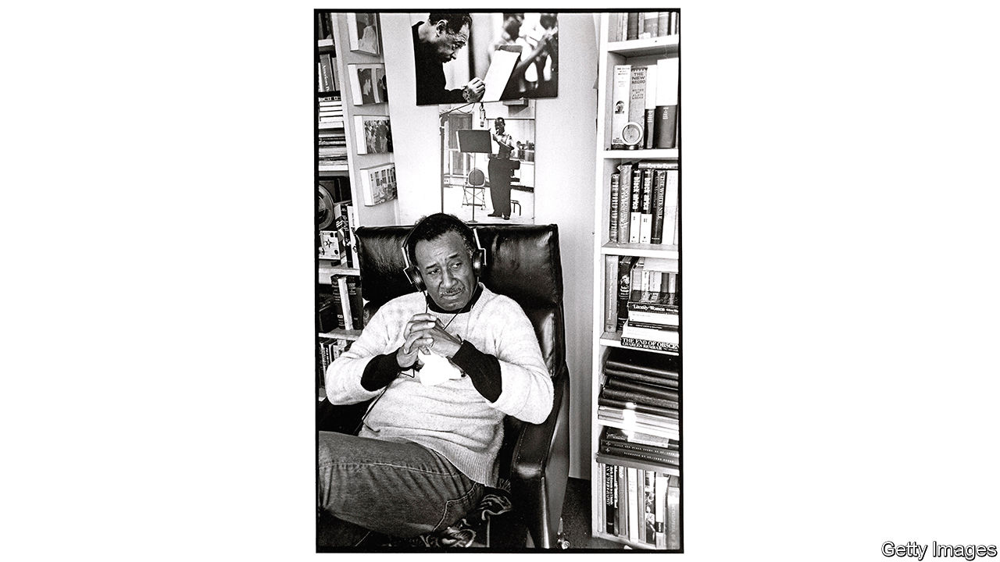

## Twentieth-century fox

# Albert Murray was a bard of America’s racial complexity

> In his essays and criticism, he insisted that black and white Americans shared a common culture

> Aug 22nd 2020WASHINGTON, DC

THE ORIGINAL sins of American race relations are as stark as they were horrific. For over two centuries, black people were enslaved. For decades afterwards they endured legal and de facto segregation, and, in the South—where Albert Murray grew up—forced labour and peonage imposed through convict-leasing and sharecropping. These brute facts bequeathed pain and injustice. But they also left a complex cultural legacy. Murray probed that complexity as deeply, seriously and joyously as any American writer.

He was a poet and novelist and—most lastingly—an essayist and critic. He wrote elegantly about art, music, literature, travel and people. He was, in Isaiah Berlin’s taxonomy, one hundred percent fox, viewing the world through many lenses (as opposed to the single perspective of the hedgehog). His life was an American hero’s journey—and his work is as urgent now as when it was first published.

Born in 1916 to an unmarried 16-year-old in Nokomis, Alabama, Murray was brought up by adoptive parents near Mobile, among survivors of the Clotilda, the last ship to bring enslaved Africans to America. He came to know—or at least know of—Cudjo Lewis, a Clotilda survivor whom Murray turned into Unka Jo Jo in his first novel, “Train Whistle Guitar” (published in 1974). He died 97 years later in Harlem, having helped create the jazz programme at New York’s Lincoln Centre, been elected to the American Academy of Arts and Letters (and of Arts and Sciences), and lived a life of the mind that should make today’s writers weep into their Twitter feeds.

At the heart of his work was a belief in the heroism of artistic struggle and expression—not as a route to fame, riches or influence, nor to express political views, but as a means to make sense of the world and an individual’s place in it. As he wrote in “Stomping the Blues” (1976), an extended explication of jazz and blues, America’s greatest native art forms, artists confront “the complexities inherent in the human situation”. For Murray, “human existence is almost always a matter of endeavour and hence also a matter of heroic action.”

At the Tuskegee Institute in Alabama he met Ralph Ellison, who, Murray noticed, had taken out many of the same books that he had. They were intellectual comrades for much of their lives, both preoccupied with the range of the American experience and the central role of black people in it. As Ellison put it, “Whatever else the true American is, he is also somehow black.” But they took inverse paths as writers. Ellison published just one novel in his lifetime, “Invisible Man”, one of America’s greatest, in 1952.

By contrast, Murray did not publish his first book, “The Omni-Americans”, until 1970, after a career in the air force that had begun during the second world war. His last, a series of interviews with Papa Jo Jones, a mercurial drummer, came out when he was 95. Both he and Ellison viewed improvisational jazz and blues musicians, able to conduct conversations without words, as the supreme artists. He mimicked their back and forth on the page: among the most joyful passages in his memoir, “South to a Very Old Place” (1971), is his perfect orchestration of a barbershop chat about race relations that he overheard during a return visit to Mobile.

This late start meant that Murray’s voice emerged fully formed. It is learned and didactic, yet playful and nuanced—and above all, highly attuned to multiplicity, and suspicious of generalisation. He rejected the claim, common among white southerners during segregation, that black and white Americans had two separate cultures. “American culture,” he wrote in “The Omni-Americans”, “even in its most rigidly segregated precincts, is patently and irrevocably composite…the so-called black and so-called white people of the United States resemble nobody else in the world so much as they resemble each other.”

Murray had an aversion to social scientists who portrayed black Americans as uniformly downtrodden. In his view, “the background experience of US Negroes includes all of the negative things that go with racism and segregation; but it also includes all of the challenging circumstances that make for ambition, integrity and transcendent achievement.” For him, the liberal tendency to find black people pitiable was a moral and aesthetic failing, which often stopped whites seeing African-American life in its full splendour and variety.

Similarly, he had little patience for black separatism, which he viewed as shallow escapism: “So far as white people are concerned, the most revolutionary, radical and devastating action any US Negro can engage in is to compete with other Americans for status, employment, total social equality and basic political power.” He regarded black Americans not as displaced Africans but as wholly and irreducibly American—not merely partakers of American culture but its creators and, as much as anyone else, its proprietors.

The literary corollary of that stance was a dislike of protest fiction. Murray approvingly quoted James Baldwin’s assessment of “Uncle Tom’s Cabin”: a book “not intended to do anything more than prove that slavery was wrong; was, in fact, perfectly horrible. This makes material for a pamphlet but it is hardly enough for a novel.” But Murray castigated Baldwin himself for failing to fulfil his promise, and for writing about Harlem’s woes without its wonders. “Sometimes he writes as if he had never heard the comedians at the Apollo Theatre,” Murray teased, chiding Baldwin for leaving material untapped. “Life in Harlem is the very stuff of romance and fiction, even as was life in Chaucer’s England, Cervantes’ Spain, Rabelais’ France.”

He seemed to esteem Thomas Mann and James Joyce highest among novelists, and, like some of theirs, his four novels are in essence coming-of-age tales—beautifully written, replete with memory and detail, but lacking his essays’ spark and thrust. Like his poems, in their richness they make an implicit argument against what he called “the folklore of white supremacy and the fakelore of black pathology”.

Those last four words are more important than they may seem. The “fakelore” is not that some black people are disadvantaged; it is that they are responsible for that disadvantage, and defined by it. Murray did not downplay whites’ role in black Americans’ plight. As he averred in “The Omni-Americans”: “The deliberate debasement of the black image has been so viciously systematic…that the scope of white malevolence is hard to exaggerate.” But he did not end in outrage or despair. The glory of the blues man, Murray wrote, is his gift for eliciting beauty from sorrow and struggle, thus becoming “an agent of affirmation and continuity in the face of adversity”.

Reading Murray now is exhilarating, as great writing always is. It is also poignant. Today America is less racially stratified than during his formative years in the early 20th century, but it remains much more so than it ought to be. Fixing that is the work of policy, which did not seem to interest Murray much as a writer. What concerned him was a proper reverence for self-definition: for judging people first as individuals, rather than members of a group.

The novels of William Faulkner were his lodestar. Faulkner’s fiction took in the struggles of African-Americans, even making them heroic. But his underlying point, for Murray, was not “that the meek shall inherit the Earth. His point was that no man could inherit the Earth, that the only thing worth inheriting is humanity.” ■

## URL

https://www.economist.com/books-and-arts/2020/08/22/albert-murray-was-a-bard-of-americas-racial-complexity
