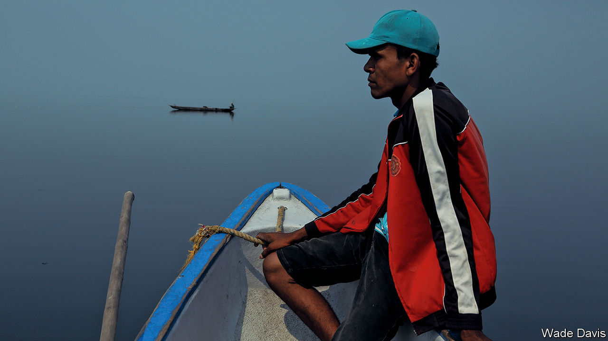

## A river and a nation

# An enchanting trip down the mighty Magdalena

> “Colombia as a nation,” writes Wade Davis, “is the gift of the river”

> Aug 22nd 2020

Magdalena: River of Dreams. By Wade Davis. Knopf; 432 pages; $30. Bodley Head; £25

FOR A COUNTRY of 50m people, Colombia has been strangely overlooked and often misunderstood. A generation ago it was a pariah nation, synonymous for outsiders with drug-trafficking and violence. Yet Colombia has gradually moved towards internal peace, disarming right-wing paramilitaries and left-wing guerrillas, while maintaining a vibrant civil society and finding a place for indigenous peoples and environmentalism in its democracy. Colombians are characterised, writes Wade Davis, not just by their resilience but also by “an enduring spirit of place, a deep love of a land that is perhaps the most bountiful on Earth, home to the greatest ecological and geographical diversity on the planet”.

Its heart and soul is the Magdalena river. It defines Colombia rather as that other great river that empties into the Caribbean, the Mississippi, does the United States. It bisects the country, from its source in a high-altitude bog not far from the southern border with Ecuador, to the vast tropical wetlands and lagoons of its lower course. Four out of five Colombians live in its drainage. For centuries it was their main transport artery. It is, too, “the wellspring of Colombian music, literature, poetry and prayer,” Mr Davis argues. “Colombia as a nation is the gift of the river. The Magdalena is the story of Colombia.”

The author and his subject make an ideal match. Mr Davis, a Canadian writer, anthropologist and explorer, fell in love with Colombia on a school trip at the age of 14, and returned often. In this book he travels the thousand-mile length of the river, on foot, horseback, by car or—often—by boat. What lifts his account far above a run-of-the-mill travelogue is that he organised some remarkable and knowledgeable companions. They start with William Vargas, a botanist who grew up on the river’s upper course and has discovered more than 100 plant species. Mr Vargas is the perfect guide to the country’s extraordinary wealth of flora and fauna.

The Magdalena’s middle course was the bloody backyard of Colombia’s long internal conflict. Its riverside towns were an internal frontier terrorised by guerrillas and paramilitaries, its waters a graveyard for victims. Mr Davis meets survivors and hears harrowing stories of horror and loss. What comes through is the determination of many to forget the past and move on. The river’s lower course, celebrated in the writing of Gabriel García Márquez, is home to many zambos (of mixed African and Amerindian descent) who have created much of Colombia’s rich musical tradition of cumbia, vallenato and tambora.

As an anthropologist, Mr Davis is sympathetic to Colombia’s indigenous cultures, and sensitive to the often tragic clash of belief systems—a theme of his previous work, “Into the Silence”, on British expeditions to the Himalayas. His prose has an incantatory timbre, which occasionally cloys but often carries the reader deep into Colombian ethnography and ecology.

For the most part, he is admirably judicious in his treatment of the country’s complex conflicts. He skilfully weaves into his journey themes and episodes of Colombian history, from the Spanish conquest to the battles of Liberals and Conservatives and the tragedy of the volcanic eruption of the Nevado del Ruiz. Twice that difficult balance eludes him, in long detours on Pablo Escobar and the fall and rise of Medellín (the city that was home to Escobar’s cartel), and on Símon Bolívar, the Venezuelan who led the struggle for independence from Spain. Here Mr Davis has nothing original to say. Like many good tourist guides, he sometimes over-embroiders: some of what he claims as uniquely Colombian applies equally to other Latin American countries.

But these are minor blemishes. “Magdalena” is a revelatory and often enchanting book, enhanced by fine photographs and good maps (though some readers might have wished for a glossary). Mr Davis also has a message. In recent decades the river has become a sewer, to the extent that it faces partial ecological death. Its cleansing and redemption could and should be a matter of national pride. ■

## URL

https://www.economist.com/books-and-arts/2020/08/22/an-enchanting-trip-down-the-mighty-magdalena
