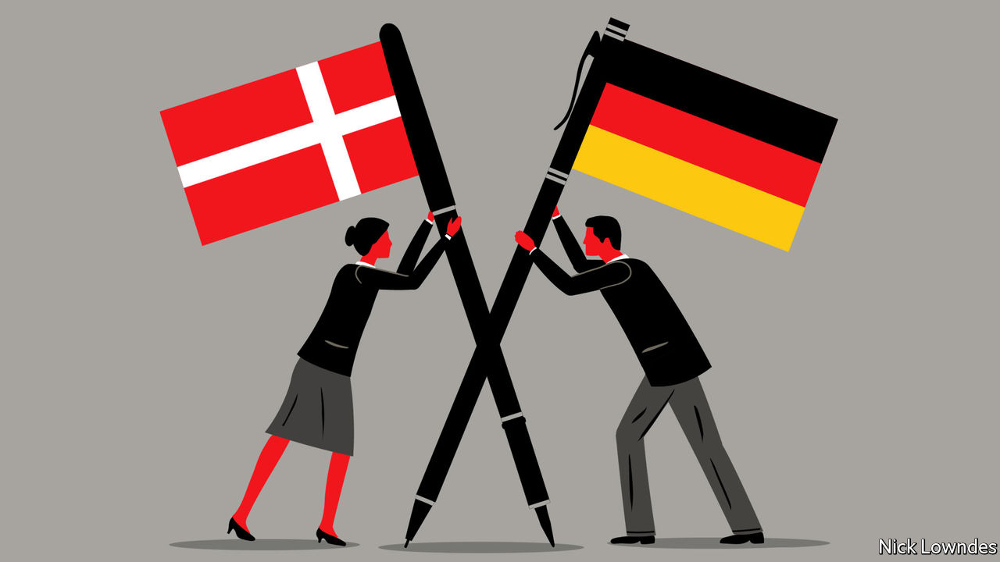

## Johnson

# How a contested region became a model for multilingual coexistence

> Schools are at the heart of the success on the German-Danish border

> Aug 22nd 2020

DIFFERING NAMES for a historical event can be an ominous sign of competing, zero-sum national memories. Not so in the case of what Germans refer to as “the plebiscite of 1920”. That round of votes, which cost Germany the territory of north Schleswig, led to what Danes call the “reunification” of their country, the centenary of which they recently celebrated. It also began a process that has turned a bloody European frontier into one of the world’s most successfully integrated and multilingual border regions.

Territory controlled by Denmark once extended deep into what is now the German state of Schleswig-Holstein. But successive defeats, especially to Prussia in 1864, saw the border pushed up the Jutland peninsula. After the first world war much of Germany (and Austria-Hungary) was hacked out to create new states or to reward winners, which left many new minorities stranded in the “wrong” country. Denmark had sat out the war, but managed to get the victors to support a plebiscite in Schleswig.

A northern zone voted convincingly to join Denmark, and a southern one to stay in Germany. The border was redrawn. But Danes remained in Germany and Germans in Denmark, fomenting bad blood. The Nazis occupied Denmark during the second world war.

The true settlement came in 1955. To join NATO, West Germany had to agree to make nice with Denmark. The Bonn and Copenhagen declarations gave generous support to both minorities: German-speakers in Denmark could go to private schools teaching in German, with the state picking up the tab; the same went for Danes in Germany. The momentum continued when Denmark joined the European Economic Community (now Union) in 1973, and when the border in effect disappeared entirely with the advent of the passport-free Schengen zone.

Schools are at the core of what became a remarkable success. A typical German school in Sonderborg in Denmark, not far from the city’s German Museum, displays the German, Danish and European flags, with the motto “Two languages, two cultures” in Danish and German. The minority-language schools are much sought after, not only by members of the minority. Parents who do not speak the schools’ language choose them for reasons of quality, says Martin Klatt, a historian at the University of Southern Denmark and a German who sent his children to a Danish-medium school in Flensburg.

Another parent who did likewise is Robert Habeck, co-leader of Germany’s Green party. He grew up in Schleswig-Holstein and picked up Danish as a student. Later he sent his four sons to Danish schools, from which they brought home customs—such as flying the Danish flag on birthdays—that he now happily adopts. Mr Habeck has a small chance of making it to the very top of German politics at the next election: he could be chancellor if a coalition emerges with two other left-wing parties.

For a leader to show such deep ties to another country would be unthinkable in many places. Germany, of course, eschewed overt nationalism after 1945. That has led to warm neighbourly relations; there was no question of Danish triumphalism when “reunification” was marked. When a leader of the populist-nationalist Danish People’s Party suggested a few years ago that he would like to see the border moved down to the Eider river, he soon clarified that he had commented with “a twinkle in my eye” and that “we have the best border co-operation anyone could hope for.”

The region is not properly bilingual. Most Germans, in particular, do not learn much Danish. Flemming Meyer, head of the ethnic Danish party in the state of Schleswig-Holstein, would like more people to take up the generous opportunities to study and practice the other tongue; he envisions a campaign under the banner “Speak our neighbours’ language!” But it can be hard to convince Germans to focus on a language with just 5.5m or so speakers. On the other side of the border the Danes, who once had fairly good German, now prefer English. The lingua franca is both a boon (being neutral) and a drawback (removing the incentives to learn an alternative).

But Mr Meyer sees relations continuing to warm. Once, Germans near the border spoke derisively of Dänenschulen, schools for Danes. Then, in a subtle shift, they became dänische Schulen, the adjective replacing the essentialising noun. Now he hears unsere dänischen Schulen, the local majority speaking proudly of “our Danish schools”.

## URL

https://www.economist.com/books-and-arts/2020/08/22/how-a-contested-region-became-a-model-for-multilingual-coexistence
