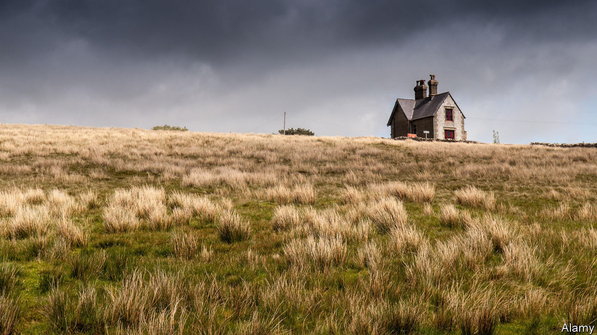

## Unmoored

# In “Sisters”, love and danger are grippingly entwined

> Daisy Johnson’s novel is an ode to sisterly devotion—and a warning

> Aug 22nd 2020

Sisters. By Daisy Johnson. Riverhead Books; 224 pages; $26. Jonathan Cape; £14.99

THE STORIES Daisy Johnson tells are at once heart-rending and hair-raising. Her prose is elegantly emotional; her plotting would make Shirley Jackson, a master of upmarket horror, proud. “Sisters”, her second novel, is a gripping, if nightmare-inducing, tale.

July and September, the siblings of the title, and their mother Sheela have left Oxford for a remote rented house on the Yorkshire moors, driven to a new life by a shadowy event for which July blames herself. That incident hovers over the novel, adding a layer of menace to the ominous atmosphere of the family’s new home. Ominous, too, is Sheela’s retreat to her bedroom; she emerges only at night, otherwise leaving her daughters to their own devices—which, in practice, means leaving September in charge of July.

Often, thrillers and horror stories rely on conflicts between love and danger. In “Sisters” the two are fused. September and July adore each other. At first their relationship seems their saving grace, but it slowly modulates from balm to threat. July loathes being separated from her sister—which puts her at constant risk, since September is domineering to the point of violence, extracting terrible oaths of loyalty and goading July to self-harm.

Ms Johnson tells most of the story from July’s perspective. When she briefly switches to Sheela’s point of view, it is no surprise to learn of the “things the teachers said about [the girls] at school: isolated, uninterested, conjoined, young for their age, sometimes moved to great cruelty.” The shock is discovering their real age.

The disjuncture between how old they are and how old they seem builds an uncanny kind of suspense: clearly, something has gone very wrong. When July finds a love interest, her feelings are a relief. But they are also a force for rupture and change. As her relationship with September is strained, July starts to remember the event that drove them from Oxford. The revelation to which Ms Johnson has stealthily progressed proves devastating. “Sisters” is an ode to sisterly love—and a warning of how destructive devotion can be.

## URL

https://www.economist.com/books-and-arts/2020/08/22/in-sisters-love-and-danger-are-grippingly-entwined
