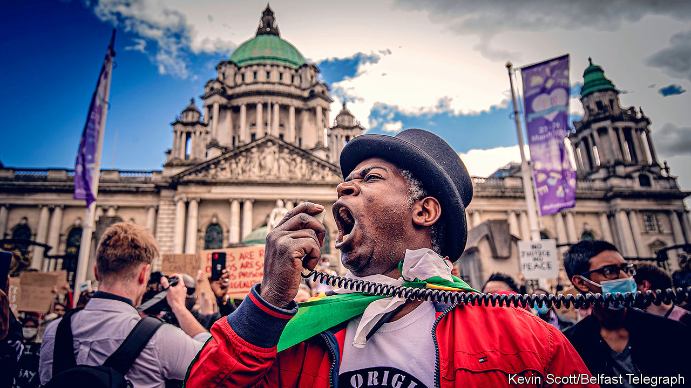

## Ethnicity and politics

# Black Lives Matter in Northern Ireland

> The province’s own brand of ethnic politics leaves no room for other sorts

> Aug 22nd 2020

THE SERIOUS CRIME ACT is mostly used against big-time gangsters, but on July 30th Tura Arutura, a musician who has choreographed some exuberant peace events, was interviewed at a police station on the ground that he might have broken that law. He was told he was suspected of “abetting an offence” by addressing a Black Lives Matter protest in Belfast on June 6th.

In theory, the Zimbabwe-born artist could be prosecuted. But he and dozens of others who received fines or summonses because of the BLM rallies are seeking a judicial review of police behaviour, arguing that officers misinterpreted the law and acted too harshly. The police say they will ponder any lessons from the review.

Northern Ireland’s government had told people, on public-health grounds, not to demonstrate and changed the law to curb the event. Those who went retort that the rallies were orderly and distanced. They point to a promise from Boris Johnson that people could join global protests against racism—and to differences in the policing of different communities.

There have been several other hygienically risky gatherings in Northern Ireland this summer, including the huge funeral of an IRA commander and bonfires at which Protestant and Catholic hotheads vented their spleen. At blazes in Derry in mid-August, images of the queen, wreaths commemorating the British war dead and Union flags were incinerated. The Police Service of Northern Ireland (PSNI) did little to restrain those events.

Northern Ireland’s citizens are not in much doubt why the police are selectively lenient. The PSNI answers to a board dominated by Sinn Fein, the Catholic nationalist party, and the pro-British, Protestant Democratic Unionists. That makes the police cautious about confronting either of the main communities, but they seem to act more independently when dealing with smaller segments of society.

The binary division in Northern Irish society is the likely explanation for one of the region’s many political peculiarities: the absence of ethnic-minority representation in its institutions. Black and ethnic-minority citizens form at least 2.2% of the population and possibly twice that, yet no member of an ethnic minority sits in the region’s 90-member assembly. Anna Lo, a Hong Kong-born centrist, retired in 2016, complaining of racism. Municipal councils are similarly all-white. If elected bodies reflected the population, at least a couple of assembly members would be from visible minorities, as would a dozen councillors. That is in contrast with the Irish republic, where an ethnic Chinese woman has just become mayor of Dublin, and the deputy head of government is half-Indian.

Apart from Mr Arutura, many other minority figures make an outsized contribution to Northern Ireland, while steering clear of a political world in which they would feel awkward. Mukesh Sharma, an ethnic Indian who built up a thriving travel business, sponsors big cultural events and plays his homeland’s music. He is a deputy lieutenant of Belfast, a ceremonial but prestigious role.

Angila Chada, another Belfast Indian, has co-founded an NGO called Springboard which helps disadvantaged people of all backgrounds to find work. But running for office has little attraction: “Going into politics would mean deals and compromises which I am unwilling to make,” she explains. One of her north Belfast neighbours, 25-year-old John McGrath, a budding solicitor of Kenyan origin, advises asylum-seekers and is a school governor. He sees little incentive to take the risks that choosing a political side in the city’s ancient feud would carry. “I can just imagine my black face being burned in a bonfire,” he says, only half in jest.■

## URL

https://www.economist.com/britain/2020/08/22/black-lives-matter-in-northern-ireland
