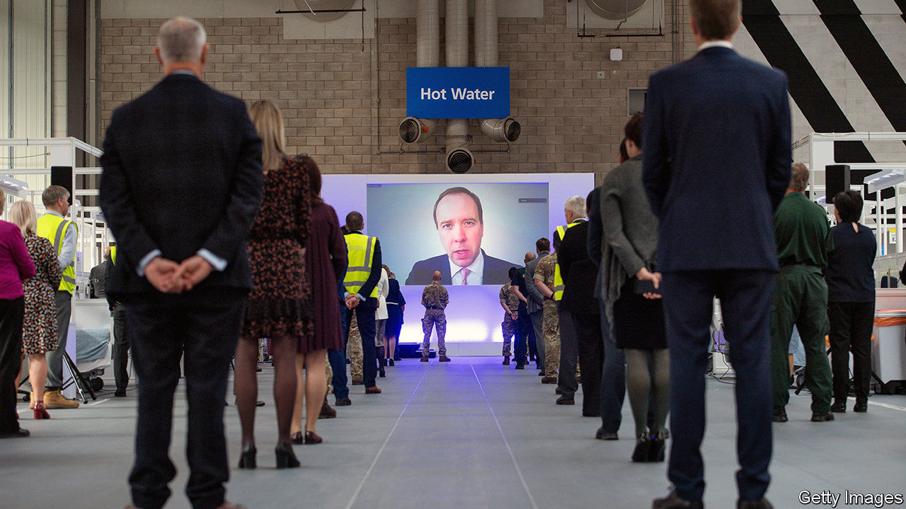

## Covid-19

# Britain’s government axes Public Health England

> A pandemic is not necessarily a great time to scrap the body charged with managing pandemics

> Aug 22nd 2020

“A STRONG, CAPABLE, co-ordinated, united and efficient public-health agency that rivals any in the world,” was the verdict of a review conducted in 2017 by representatives of some of the world’s top public-health bodies, including the president of Germany’s highly regarded Robert Koch Institute, on Public Health England (PHE). Three years later, PHE is being scrapped. Its responsibility for dealing with external threats such as infectious diseases and biological weapons will be taken over by a new organisation, the National Institute for Health Protection, which will also incorporate the Joint Biosecurity Centre, provider of expert advice on pandemics. How could this happen to an outfit held in such high regard?

PHE was created in 2013 by a merger of 129 organisations, and won those plaudits partly for managing the difficult task of bringing them all together. But the breadth of responsibilities, which included obesity and smoking reduction as well as pandemics and poisoning, cost it something in focus, and its flaws were exacerbated by an instinct to do everything itself. Its failure to outsource testing to private-sector and university labs, which could have helped boost capacity, contributed to a shortage. Its under-resourced contact-tracing system was overwhelmed by early March.

But the government is at least partly responsible for these missteps. Since Britain had plenty of warning of the pandemic, it should have provided the necessary resources for testing, tracking and tracing earlier. By the time it did, the government had lost faith with PHE, and created NHS Test and Trace to do the job, with private-sector outsourcing companies such as Serco and Sitel providing the manpower.

The decision to ditch PHE has received a mixed response. “You probably need a distinct centre for pandemic preparedness,” says Sir John Bell, regius professor of medicine at Oxford University. “We’ve had nine pandemics or close calls in the past 20 years [SARS COV-1 and avian flu twice each, MERS, swine flu, Ebola, Zika and SARS COV-2 once each]. We’ll have another nine in the next 20 years.”

But some in the public-health business argue that PHE has taken the rap for mistakes made by the Department of Health and Social Care and NHS Test and Trace. The failure to provide local authorities promptly with good data, for instance, has made managing local outbreaks unnecessarily difficult. “We have an analyst who does nothing but clean up their data when it finally comes through,” says a local-authority director of public health.

There are also questions about the nature of the change. Britain has been criticised for its centralised approach to the crisis, and Matt Hancock, the health minister, said in announcing the creation of the new agency that Germany was a model for them. But Germany’s public-health system is run by its local authorities, which the Robert Koch Institute supports by providing science and standards. The NIHP will be a large, centralised organisation, replacing the large, centralised organisation that has been axed. “This is the result of a gossamer-thin analysis of the German system, and is being done to save Hancock’s skin. What’s needed is proper local infrastructure,” says a director of public health.

Dido Harding, the organisation’s boss, who has management experience in food retail and telecoms, is not universally regarded as the right choice. “It’s the culture of amateurism,” says a health-system analyst. “The Germans would never appoint somebody like that to this job.”

The timing is also controversial. “The lesson of health reorganisations is that the cost in short-term disruption outweighs any medium- or long-term benefits,” says the analyst. “It’s an incredibly stupid move,” says a health official. “We’re in the middle of a pandemic. I’ve had four meetings in the past few days in which PHE were supposed to participate, and they didn’t turn up.” There are fears that PHE staff may be thinking more about their prospects than about covid-19. “All the people who should be focusing on the next wave will be polishing their CVs,” says the analyst. “This is management 101.”■

Editor’s note: Some of our covid-19 coverage is free for readers of The Economist Today, our daily [newsletter](https://www.economist.com/https://my.economist.com/user#newsletter). For more stories and our pandemic tracker, see our [hub](https://www.economist.com//news/2020/03/11/the-economists-coverage-of-the-coronavirus)

## URL

https://www.economist.com/britain/2020/08/22/britains-government-axes-public-health-england
