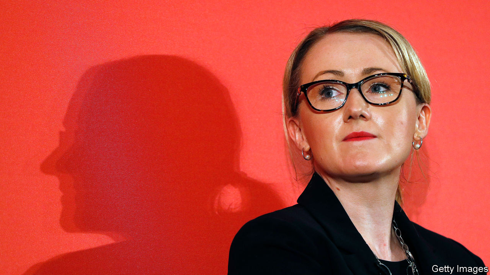

## Labour Party

# Labour’s left wing is trying a new strategy to gain influence

> Deprived of power, leftists are putting their faith in grassroots movements

> Aug 22nd 2020

SAUL ALINSKY, whose “Rules for Radicals” inspired community activists in 1970s America, is not normally a name to conjure with in Britain. But his reputation is enjoying a revival among Labour leftists. Deprived of power by Sir Keir Starmer, the party’s new leader, they think Alinsky’s tactics offer a way to regain some clout.

Sir Keir is taking a more centrist line than was generally expected. He has condemned the illegal removal of offensive statues by Black Lives Matter (BLM). He says little about left-wing economics. Claire Ainsley, his policy chief and a former adviser to Onward, a Conservative think-tank, moulds sound-bites designed not to criticise capitalism, but to appeal to a wide range of voters.

The left has a lot of support among party members, but although it is “still numerically strong…institutionally it is quite weak”, says Aaron Bastani, co-founder of Novara Media, a socialist news site. In the parliamentary party, the Socialist Campaign group, with 34 out of Labour’s 202 MPs, is small, but it is noisy and angry. “They are people who are bitter,” says a left-wing MP who has thrown in their lot with the leader, “who think that people like me will never be quite pure enough.” Sir Keir has strengthened his position within the parliamentary party by sacking his former rival, Rebecca Long-Bailey, thus depriving the left of a credible commander. He has given jobs to some left-wingers, and keeps them on a tight leash. “They can’t cough on a policy subject without approval from Keir’s office,” says a Corbyn-era advisor.

Momentum, a 40,000-strong group of activists that acted as a praetorian guard to the Corbyn leadership, has lost its raison d’être. The unions are still powerful, and Len McCluskey, general secretary of Unite, warned earlier this month that Labour shouldn’t take its donations for granted. But the argument over when children should go back to school has demonstrated that Sir Keir is prepared to stand up to them. The main teachers’ union published conditions it wanted met before going back. Sir Keir subsequently demanded that schools reopen in September, with “no ifs, no buts, no equivocations”. The union has since stayed quiet.

Socialists know they are beat. “I don’t think just ‘stay and fight’ is a particularly appealing slogan for much of the left of the party,” says James Schneider, a Momentum co-founder and Corbyn strategist. “It’s like, ‘stay and fight and, for a while, likely lose’ because the left is not going to be in the ascendancy. So we need to offer more.”

That is why talk has turned to Alinsky. Influential figures on Labour’s left want to relaunch along the lines of the grassroots movement he created in Chicago. Extinction Rebellion and BLM, which have turbocharged movements on climate change and race, provide further inspiration. Leftists want to exert public pressure on Sir Keir through protests, community projects and political education. “This is an ‘in and against the Labour Party approach’, where we occupy the corpse of the previous opportunity and continue to leverage that,” says Joe Guinan, a left-wing thinker.

Leftist bigwigs want Momentum to emulate Alinsky’s tactic of uniting communities against common enemies. Landlords will be one, says Mr Schneider. Sir Keir supports an extension of the current ban on evictions, but Labour activists want rent holidays. Mr Schneider thinks that if the left can mobilise tenants, it could force Sir Keir’s hand. Such methods, goes the argument, will reconnect Labour with working-class communities, while showing them alternatives to the status quo.

Sir Keir’s position looks unassailable. But if these plans work, an amorphous and leaderless network of media-savvy campaigns could start to challenge him. The left might look defeated, but it is working on a new rulebook for radicals. ■

## URL

https://www.economist.com/britain/2020/08/22/labours-left-wing-is-trying-a-new-strategy-to-gain-influence
