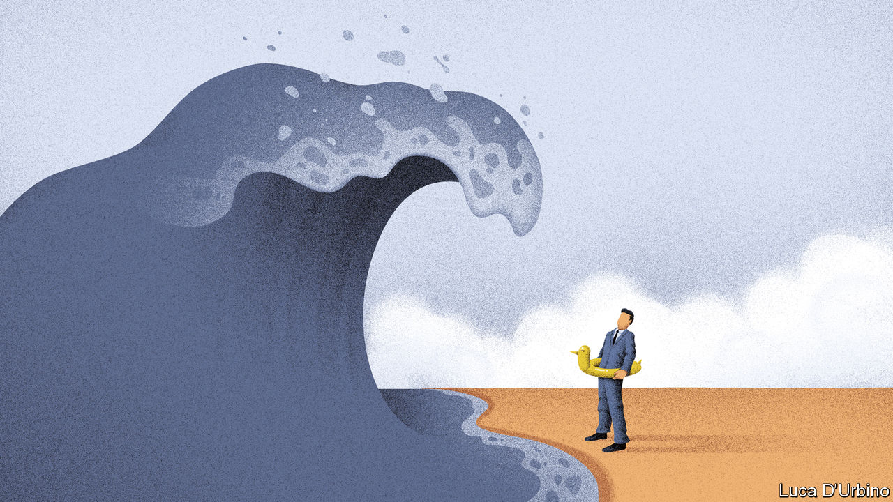
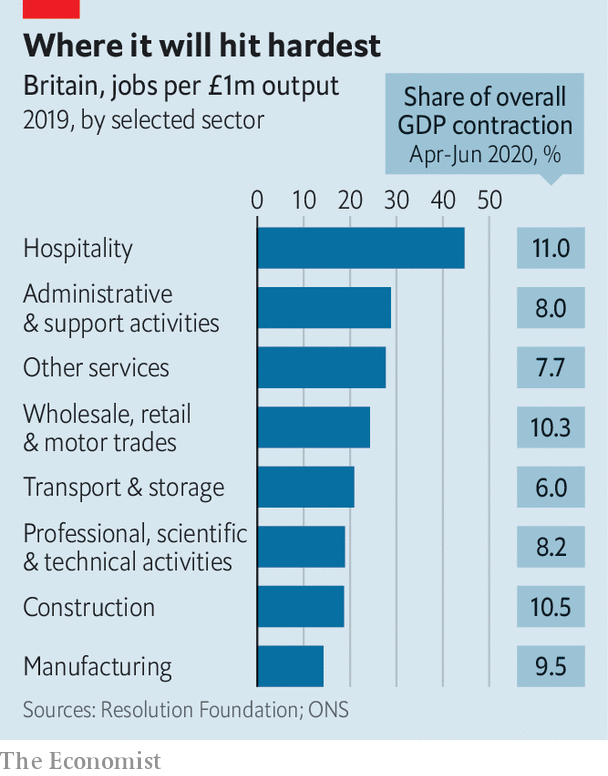
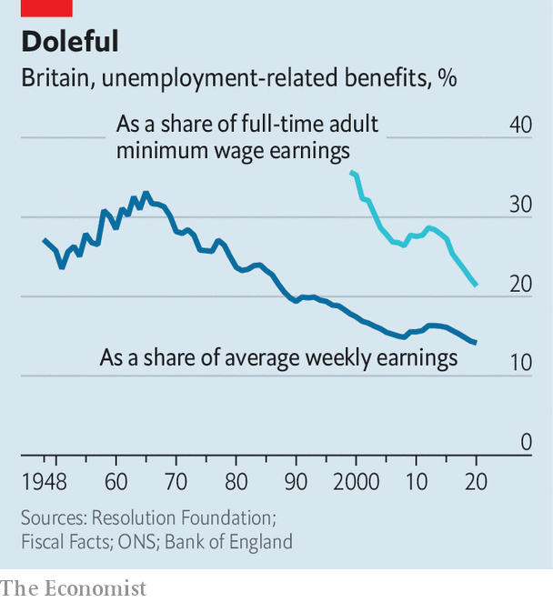

## The economy

# Mass unemployment threatens Britain

> The country is ill-prepared

> Aug 22nd 2020

“I’VE HAD members of my association claiming universal credit and they’re shocked by how low it is,” says a Tory MP. It is unusual for Conservative stalwarts to see the benefits system at close quarters: almost three decades of mostly low unemployment have reserved it for the unfortunate few. But as the furlough scheme winds down and the deepest recession for a century hits employment, the system’s weaknesses will gain new political salience.

The official unemployment rate, as of the end of June, was just 3.9%—remarkably low at any time, let alone when GDP had dropped by more than a fifth. America’s June figure was 11.1%. It has stayed low in Britain because of the furlough scheme, under which the government paid 80% of the wages of employees.

Now the sticking plaster is being torn off. The furlough scheme ends in October. This month firms had to start contributing to the cost of furloughed staff. Britain produces its unemployment figures with a two-month lag, so nobody knows what the jobless rate is now; but huge redundancies are being announced. On August 18th, Marks & Spencer announced that it would cut 7,000 jobs. Retail and hospitality are likely to bear the brunt (see chart), but white-collar jobs are going too: Accenture, a consultancy, is cutting 900 jobs—8% of its British workforce—because of a drop in demand for its services. Several law firms, including DWF and BCLP, have recently announced job cuts.

The Bank of England expects unemployment to peak at 7.5%; the Office for Budget Responsibility, the fiscal watchdog, is more pessimistic and has pencilled in a peak of around 12% followed by a relatively rapid fall. Given the scale of the hit to the economy, those numbers are relatively modest. This reflects a belief that, thanks to deregulation in the 1980s and 1990s, the British labour market is flexible.

Recent economic history appears to support this view. In the recession of the early 1980s, a 5% fall in output pushed up the unemployment rate by around seven percentage points; in the early 1990s GDP fell by closer to 2.5% and the unemployment rate rose by almost four percentage points; in the recession of 2008-09, output fell by just over 6% but the unemployment rate rose by just three percentage points. Policymakers are hoping for a similar ratio this time, with the Bank of England expecting GDP to be about 5% lower at the end of 2020 than before the crisis but with only a three and a half percentage-point rise in the unemployment rate.

Not everybody agrees. Paul Gregg, a former Treasury official now at the University of Bath, reckons that the rise in unemployment during a recession is partly the result of the degree of stress on companies, and partly the result of its distribution by sector. In the early 1990s firms had piled on debt and were suffering from the impact of high interest-rates. In 2008-09 low interest-rates and a weak exchange rate helped to sustain profit margins and raised inflation, pushing down real wages. This time round, Brexit-related uncertainty had already squeezed corporate profitability, and now demand—especially in labour-intensive sectors with low productivity and profit margins—has collapsed. Mr Gregg’s framework suggests that any fall in economic output could push up unemployment by more than the drop in GDP and that the bounce-back could take longer than many policymakers expect.

Most European countries are supporting jobs through furlough schemes and part-time work programmes. France has already extended its scheme to two years, and Germany is likely to follow. America opted for higher redundancies while offering generous support to the unemployed.

Britain will soon have neither a furlough scheme nor generous unemployment benefits. Universal credit was increased by just £20 a week at the budget in March. The replacement ratio—the percentage of their previous income that British workers receive from benefits—is among the lowest in the OECD, and lower than in the early 1990s (see chart) . A rise in unemployment will thus not only be painful for victims, but also suck spending power from the economy.

Unlike the exam-results system, which has collapsed under the strain of the crisis (see [Bagehot](https://www.economist.com//node/21791017)), the benefits system can probably cope. In April, before the furlough scheme was in place, initial claims leapt from 100,000 or so a week to over half a million. Claimants jammed phone lines and sat in digital queues. Since then the Department for Work and Pensions has redeployed 10,000 staff to processing roles, and reckons it can deal with a second upswing.

But unlike many European countries, Britain has put little effort into actively supporting getting people into work in recent years. The market has looked after itself. These days the government offices that used to help people find jobs, now known as Jobcentre Plus, monitor workers rather than give them a hand. “I spent maybe 80% of my time processing claims and payments and another 15% on stopping the most obvious cases of fraud,” says a long-serving Jobcentre staff member.

Britain’s experience of active labour-market policies has not been encouraging, but the government intends to try some. Rishi Sunak, the chancellor, has allocated £1.6bn ($2.1bn) to supporting work search and hiring job coaches and £2.1bn to a scheme to fund “high-quality jobs” for the young. Details are scarce. The only such scheme that has had much success in recent years was the Future Jobs Fund (FJF) launched in 2009, which provided young people with subsidised jobs and training. Those who took part were more likely to be in work and less likely to claim benefits after they had finished the scheme.

The DWP should be brushing up its knowledge of active labour-market policies. If mass unemployment is on the way, it’s going to need some ideas that work.■

## URL

https://www.economist.com/britain/2020/08/22/mass-unemployment-threatens-britain
