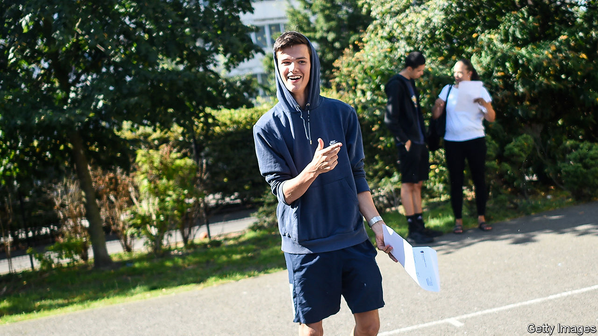

## Exams

# The A-level results U-turn

> A fiasco over grades ends happily for teenagers and universities

> Aug 22nd 2020

WE ARE ASKED to pity the young, and with reason. They have known little but austerity. Britain is run by a political party that few of them support. Brexit has crimped their freedom to live abroad; covid-19 has shut them in and eradicated the pint-pulling jobs they tend to get. But one cohort, born between late 2001 and late 2002, has just had an amazing break.

In March the government announced that A-level exams (taken at 18) and GCSEs (taken at 16) would be cancelled. Instead teachers would grade and rank pupils based on their past work. Ofqual, which oversees the exam system, would adjust the marks to bring them roughly into line with previous years.

It sounded sensible. And many teachers proved over-generous, as had been feared. They gave A* grades to 13.9% of pupils, compared with 7.7% who got that grade in 2019, and A grades to 23.8%, compared with 17.5% last year. Working-class students did especially well. Ofqual duly stepped in, lowering two-fifths of all grades after weighing students’ GCSE results and their schools’ past performance.

Many pupils felt punished by an algorithm. Some weaker students even ended up with U grades, normally given to utter failures. Others escaped being downgraded because they studied rare subjects, like music, or went to small schools (which are often private) with not enough data on past performance to allow for statistical adjustment. As Sir Jon Coles, chief executive of United Learning, a group of schools, puts it, roughly the right grades were handed out—but not to the right pupils. On August 17th the government caved, announcing that the teachers’ grades would stand.

Against fierce competition, this is the greatest humiliation yet endured by Gavin Williamson, the hapless secretary of state for education. Mr Williamson, who lost his last job after being accused of a leak (which he denies), allowed schools to close in March with no scheme for teaching remotely. His department then botched a plan to get primary children back to school, and failed to distribute enough laptops fast enough to pupils who needed them.

“The stock and credibility of the Department for Education was already quite low,” says David Laws, a former schools minister who is now at the Education Policy Institute, politely. It is now barely detectable. That is a problem. In three weeks’ time schools are supposed to reopen. The teachers’ unions, and many parents, are not convinced this is a good idea. Headteachers would find it easier to cajole everyone into the classroom if they were backed by a competent, respected department.

For universities, though, the fiasco is good news. The better ones expect a shortfall of foreign students, who pay higher tuition fees. Fearing that they would scoop up more Brits to compensate, thus robbing weaker universities, the government had capped their intake. That cap has now been removed. Lower-ranking universities now have an excellent case for demanding bail-outs. The government had been itching for a fight with universities, which it sees as complacent purveyors of often worthless qualifications, and annoyingly left-wing to boot. That will have to wait.

But the biggest winners are 18-year-olds. They have grades far better than they, or the universities that offered them places conditional on their A-level performance, could have expected. A few have even better grades than their teachers awarded: Ofqual adjusted one in 50 grades upwards, and those will stand. This year’s A-level cohort is small—732,000 pupils entered, down from 785,000 in 2017. Many will be able to go to top universities, though some will probably have to wait a year because their courses are full. The losers, if that happens, will be the following cohort, for whom there will be fewer places.

Something like this has happened before. During the turmoil of 1968, France waved many students through the baccalaureat exam. More men born in the late 1940s got degrees and landed professional jobs than in earlier or later cohorts. Even their children did better at school, says Sandra McNally, an economist at the University of Surrey who studied this episode. Degrees are not quite the ticket to middle-class life that they were. Still—to be 18. ■

Editor’s note: Some of our covid-19 coverage is free for readers of The Economist Today, our daily [newsletter](https://www.economist.com/https://my.economist.com/user#newsletter). For more stories and our pandemic tracker, see our [hub](https://www.economist.com//news/2020/03/11/the-economists-coverage-of-the-coronavirus)

## URL

https://www.economist.com/britain/2020/08/22/the-a-level-results-u-turn
