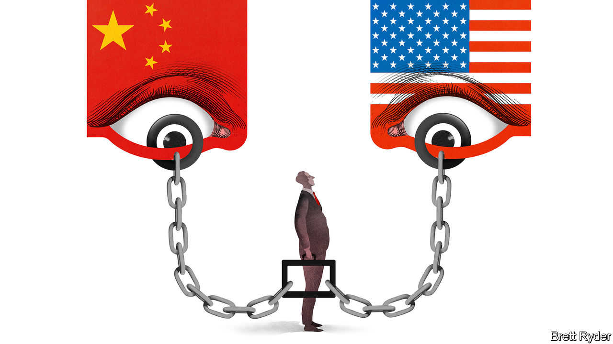

## Schumpeter

# Forced labour in China presents dilemmas for fashion brands

> Some feel they are guilty until proven innocent

> Aug 22nd 2020

THE WORLD has few more Orwellian conglomerates than the Xinjiang Production and Construction Corps (XPCC), a nearly 3m-strong paramilitary-style business in western China. It was set up in 1954 to spur an influx of demobbed soldiers from the Han majority into an area dominated by Muslim Uighurs. It retains a militia of 100,000, charged with rooting out extremism. The militiamen and others help the XPCC furnish the world with a panoply of goods. About 400,000 XPCC farmers harvest a third of China’s cotton. Others are part of Xinjiang’s tomato-exporting business. From pyjamas to passata, XPCC products penetrate global supply chains.

America’s State Department says that it also uses forced labour. In late July the US Treasury hit XPCC with sanctions, alleging a connection with human-rights abuses in Xinjiang where at least 1m Uighurs and members of other ethnic minorities have been held in detention camps. That followed a memo from President Donald Trump’s administration advising firms to sever any connection they may have with forced labour within and outside the autonomous region. Some retailers, such as PVH Corp, whose brands include Calvin Klein and Tommy Hilfiger, publicly said they would cut ties with Xinjiang, out of concern for labour practices. Supply-chain auditors for Western makers of electronics and footwear say there are numerous “red flags” indicating Uighurs may have been forcibly transferred to factories in other Chinese regions.

Assessing the treatment of workers is nothing new for big firms sourcing materials from places of poverty and repression. But in China these problems are compounded by the power of the state, the size of the economy and tensions with America. At a time when covid-19 has forced many companies to consider reducing their Chinese supply chains, concerns over Uighur forced labour have added “gasoline to the fire”, says one executive.

Western firms thus face several conundrums. How can they prove that their supply chains are free of forced labour when auditing in Xinjiang is taboo? How do they respond to labour-rights worries publicly without enraging either Beijing or Washington? And how do they ensure that overzealous scrutiny of their workplaces does not make life even worse for Uighurs? These are moral, political and social questions that businesses feel they should not have to answer alone.

Start with traceability. Xinjiang is at the heart of China’s cotton, yarn and textile industry, the world’s biggest. The region supplies 84% of the country’s cotton. Its extra-long staple variety is coveted; it produces fabric that is whiter and less knotty than other sorts, making it a favourite for dress shirts sold around the world. It contains spinning factories belonging to some of China’s most advanced shirtmakers, under contract to Western brands.

Until recently, when those brands fretted about labour conditions in Xinjiang, they sent auditors to inspect the factories. That stopped when they began to be monitored by Xinjiang authorities, “as if doing something wrong”, says one. Without audits, Xinjiang has become a black hole in the supply chain, making it almost impossible for Western firms to retain suppliers there. Furthermore, even outside Xinjiang, its cotton is a staple ingredient of Chinese yarn, where it may be mixed with other varieties, including imported stuff, and exported all over the world. Verifying the provenance of that cotton to show that none of it is from Xinjiang is “the hardest work we have ever done,” an auditor laments.

The second big problem is geopolitical. Navigating the Sino-American stand-off is getting tougher. Big international firms say that even if they reduce their dependence on supply chains within mainland China, they have no desire to pull out completely. But keeping Chinese factories, if only to supply domestic consumers, risks using tainted Xinjiang raw materials. And the Chinese government is so hostile to any criticism about human rights in Xinjiang, especially from outsiders, that Western firms must rely on Chinese suppliers to lobby on their behalf, a delicate endeavour.

In America, meanwhile, penalising the repression of Uighurs has bipartisan support that is unlikely to wane whoever wins the elections in November. But American brands feel that politicians have put them on the front line to safeguard human rights in China, without backup from Uncle Sam. They have little diplomatic support when negotiating with China, and the Twitter court of public opinion can be harsh. As one aggrieved executive puts it: “It is like the old witching days. The bar of guilt is incredibly low. The bar of innocence is extremely high.” It is easy to point fingers.

All of this leaves global firms feeling ultra-cautious—and poses a final dilemma. Averting a backlash from activists (and, potentially, consumers) requires removing Uighur employees from supply chains simply because it is so hard to prove whether they were coerced or not. Ultimately, it may necessitate breaking ties with Chinese suppliers with any links to Xinjiang—ie, most of them—even if a relationship of trust goes back decades. That can end up hurting the Uighurs, whom Western firms would gladly offer decent jobs, directly or indirectly.

Textile firms believe technology may provide an answer. Pilot programmes exist to test DNA and other things to verify the source of cotton in yarn and fabric. Patricia Jurewicz of the Responsible Sourcing Network, an NGO, says fashion brands are studying how tech firms like Apple responded to a part of America’s Dodd Frank Act of 2010 to ensure no conflict minerals from the Democratic Republic of Congo entered their supply chains.

Of course a T-shirt is cheaper than a smartphone, and traceability costs money. The ideal solution would be for the Chinese government to stop persecuting its Muslim minority. As a businessman notes, the irony is that the more heavy-handed its tactics in Xinjiang are in an attempt to preserve stability, the more economically unstable the region risks becoming. ■

## URL

https://www.economist.com/business/2020/08/22/forced-labour-in-china-presents-dilemmas-for-fashion-brands
