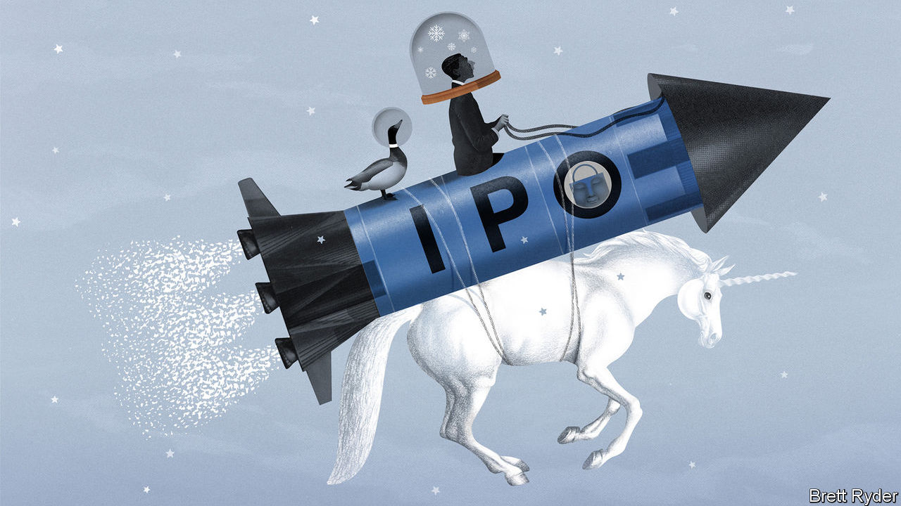
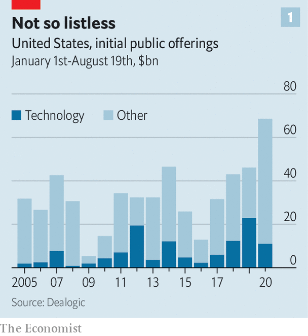
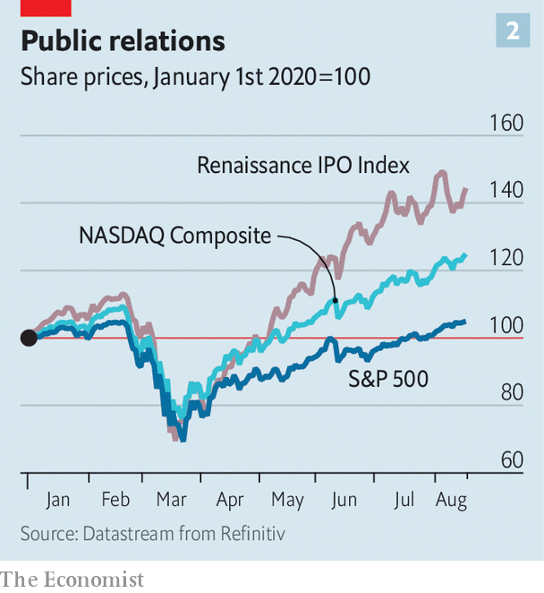
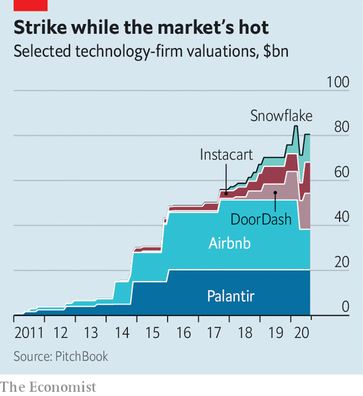

## Partying like it’s 1999

# Initial public offerings are back in Silicon Valley

> Why technology startups are keen to go public in the middle of a pandemic

> Aug 22nd 2020SAN FRANCISCO

Editor’s note: Some of our covid-19 coverage is free for readers of The Economist Today, our daily [newsletter](https://www.economist.com/https://my.economist.com/user#newsletter). For more stories and our pandemic tracker, see our [hub](https://www.economist.com//news/2020/03/11/the-economists-coverage-of-the-coronavirus)

THE IPO is dead, long live the IPO. When the pandemic hit in March, initial public offerings, particularly those by technology startups, were predicted to be among the early victims. After all, who wants to go public in a once-in-a-century crisis?

Quite a few people, it turns out. In the past couple of months IPOs, which all but dried up until late May, have come back with a vengeance in America. None of Silicon Valley’s recent and upcoming listings rivals that of Ant Group. The payments affiliate of Alibaba, an online giant, wants to raise a record $30bn in China by October, which could value the firm at around $200bn. But America’s technology startups have brought in $10bn so far this year (see chart 1)—and there is more to come. On August 19th Airbnb, which rents homes to travellers, filed for an IPO. Other privately held “unicorns” reportedly ready for public pastures include Snowflake Computing, which makes cloud software; DoorDash, which delivers food; and Instacart, which delivers groceries. Add Palantir, a cryptic data-management firm preparing for a direct sale of existing shares in public markets, and the latest combined valuation of these five is $80bn, according to Pitchbook, a data provider. Even if they float only a portion of their shares, billions-worth of fresh tech stocks will soon trade publicly.

This flurry of activity has not reached dotcom-bubble territory from the turn of the century, when dozens of startups floated each month. But there is a whiff of “irrational exuberance” in the air, detects Lise Buyer, who has watched technology stocks since the heady late 1990s and now helps startups with IPOs at Class V Group, an advisory firm. When Duck Creek, an insurance-tech company, went public on August 14th, it closed nearly 50% higher. BigCommerce, an online-shopping platform which floated a week earlier, saw its shares “pop” by more than 200%.

With the S&P 500 index of big American firms at an all-time high, never mind that covid-19 rages on, investors’ rationality is certainly up for debate (see [Buttonwood](https://www.economist.com//finance-and-economics/2020/08/19/bubble-hunting-has-become-more-art-than-science)). But for many startups, the desire to go public is perfectly rational, for two reasons.

The first has to do with the financial markets themselves. Venture capitalists who had been pouring billions into unlisted firms began to cool on frothy startups before the pandemic, after a few unicorn listings disappointed (Lyft and Uber) or collapsed (WeWork). At the same time, rock-bottom interest rates are pushing public capital to seek returns. As a result, stockmarket investors are ready to accept high valuations, says Lauren Cummings of Morgan Stanley, an investment bank and a leading underwriter of IPOs. “There is insatiable demand by public investors,” agrees Brian Feinstein of Bessemer Venture Partners, a venture-capital (VC) firm.

Startups are keen to slake it before it dissipates. Many firms are therefore dusting off listing plans that were put on hold in the wake of the ride-hailing duds and the WeWork snafu. Their case is bolstered because—and this is the second reason for startups’ listing-lust—the pandemic has been a boon for many tech firms.

The five big platforms—Alphabet’s Google, Amazon, Apple, Facebook and Microsoft—have thrived as self-isolating consumers spend more time and money online, and firms splash out on cloud-computing services to enable remote working. On August 19th Apple briefly touched a market capitalisation of $2trn, the first American company to do so. Not-so-big tech, too, has benefited, including many companies that have recently gone public.

The pandemic has highlighted and sped up a fundamental shift towards digital businesses, says Sarah Cannon of Index Ventures, a VC firm. The trend will last for decades, she predicts. Markets concur. The tech-heavy Renaissance IPO Index, which includes most listers of the past two years, is up by more than 40% since January (see chart 2). Zoom, whose videoconferencing app has become ubiquitous amid lockdowns, has seen its share price rise fourfold since floating in April 2019; it is worth $78bn. CrowdStrike, a cyber-security firm which listed in June last year, has quadrupled in value since March.

One thing the latest boom has done is highlight how unhappy startups and VC firms have grown with the current process of going public. It is cumbersome, with reams of paperwork, and can take more than a year. It is also pricey—and seen as too cosy for Wall Street. Investment banks’ fees alone eat up between 4% and 7% of a typical IPO’s proceeds, not counting lawyers and other advisers. Startups and VC firms point to big first-day pops as evidence that offerings are underpriced to give banks’ big investors a quick return. After all, those customers are regulars that must be kept sweet, whereas most startups only go public once.

Disaffection with the IPO process, combined with a renewed desire to go public, has led some firms to consider alternatives. One is a “direct listing” of the sort Palantir is pursuing, and which Spotify, a music-streaming service, and Slack, a corporate-messaging firm, have used to good effect. Asana, which sells web-based project-management software, may be another unicorn to take the direct route. Direct listings use an electronic auction by the stock exchange to get startups a fairer price for their shares than investment bankers might. But they do not allow firms to raise new money. As a result, they are an option only for cash-rich firms.

Another route that has gained prominence is the special-purpose acquisition company. These SPACs, as they are known for short, are shell firms that go public promising to buy one or more private businesses with the proceeds from the listing. The private business then fills up the listed shell through a reverse merger. SPACs have a dodgy history; many have underperformed the broader stockmarket. But the latest lot promise to fix the flaws while preserving the benefits, which include direct negotiations over the purchase price that can make deals faster and more predictable. From January to early August 60 SPACs went public, raising $22.5bn. In July Bill Ackman, a hedge-fund boss, launched a $5bn-7bn vehicle, the biggest so far.

It is unclear if Silicon Valley will embrace SPACs wholeheartedly. The biggest tech firm to have used one is Nikola, a secretive zero-emission-lorry startup which now boasts a market capitalisation of about $16bn. Many entrepreneurs and their backers would resist letting their firms be sucked up into a shell. But SPACs have a place in tech world. On August 18th Kevin Hartz, an early investor in Airbnb and Uber, launched one. Ribbit Capital, a VC firm, is reportedly planning another.

The IPO-industrial complex is not averse to direct listings or SPACs, even if they are less lucrative than the old-school ways. Bankers predict a diverse future of increasingly tailor-made flotations that, say, target specific investors and predetermine how long staff must hold on to their shares. As Greg Chamberlain of JPMorgan Chase, a bank, sums up, “Not all technology companies are the same. They have different objectives.” So long as startups want to cash in, as all ultimately do, they will need Wall Street to shepherd them through.■

## URL

https://www.economist.com/business/2020/08/22/initial-public-offerings-are-back-in-silicon-valley
